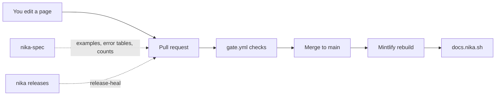

<p align="center">
  <a href="https://docs.nika.sh">
    <picture>
      <source media="(prefers-color-scheme: dark)" srcset="https://nika.sh/brand/nika-logo-dark.svg">
      
    </picture>
  </a>
</p>

<h1 align="center">nika-docs</h1>

<p align="center">
  <b>Learn to turn repeatable AI work into a file you can check, run and prove.</b><br>
  The source of <a href="https://docs.nika.sh">docs.nika.sh</a>: read it there, improve it here.
</p>

<p align="center">
  <a href="https://docs.nika.sh"></a>
  <a href="https://github.com/supernovae-st/nika-docs/actions/workflows/gate.yml"></a>
  <a href="LICENSE"></a>
</p>

<p align="center">
  <a href="https://raw.githubusercontent.com/supernovae-st/nika/main/media/gifs/full-loop.optimized.gif">
    
  </a>
</p>
<p align="center"><sub>The loop the docs teach first: compile, check, run, verify. Real CLI output, offline, answered by the <code>mock/echo</code> rehearsal model.</sub></p>

## What is Nika?

Nika turns repeatable AI work into a small file you keep. Say what you
want done, like *"every Monday, pull the action items out of my meeting
notes"*, and Nika writes it as a readable `.nika` workflow. Before
anything runs, `nika check` shows what the workflow will do, which models
and tools it uses, what it is allowed to touch and what it can cost,
without calling a model. You run it when you decide, with the model you
choose, local or cloud, and every run leaves a tamper-evident record you
can verify. One Rust binary, local-first, open source (AGPL-3.0).

| 1 · Say it | 2 · Check it | 3 · Run it | 4 · Prove it |
|:---:|:---:|:---:|:---:|
| Describe the job; Nika writes a `.nika` file | `nika check` audits it before any model is called | `nika run` with the model you choose | `nika trace verify` checks the run's record |

> [!TIP]
> **Here to learn Nika?** Everything is at **[docs.nika.sh](https://docs.nika.sh)**.
> This repository holds the source of those pages, not the engine, the
> website or a package you install. Come here to fix a typo, sharpen an
> explanation, or add a page or a video.

## Start reading

| You want to… | Read |
|---|---|
| Install Nika and get a first result | [Install Nika](https://docs.nika.sh/getting-started/installation) |
| Write a workflow by hand, line by line | [Your first workflow](https://docs.nika.sh/getting-started/first-workflow) |
| Run a workflow from your TypeScript app | [TypeScript quickstart](https://docs.nika.sh/sdk/start/quickstart) |
| Start from a ready-made job | [Examples](https://docs.nika.sh/examples/overview) |
| Keep everything on your own machine | [Local models](https://docs.nika.sh/guides/local-models) |
| Know what a workflow is allowed to touch | [Security model](https://docs.nika.sh/concepts/security) |
| Fix an error you just hit | [Troubleshooting](https://docs.nika.sh/guides/troubleshooting) |
| Look up a command, a field or an error code | [CLI](https://docs.nika.sh/reference/cli) · [Language fields](https://docs.nika.sh/reference/language/overview) · [Error codes](https://docs.nika.sh/reference/error-codes) |

## Watch it work

Every clip below also plays on the docs page that explains it, where its
caption says what is captured from the real CLI and what is illustrated.

### Nika catches the mistake before anything runs

<p align="center">
  <a href="https://raw.githubusercontent.com/supernovae-st/nika/main/media/gifs/static-check-fix.optimized.gif">
    
  </a>
</p>
<p align="center"><sub><code>nika check</code> finds two mistakes, the fix lands, and the re-check is clean. Nothing runs and no token is spent · plays on <a href="https://docs.nika.sh/guides/troubleshooting">Troubleshooting</a></sub></p>

### The file is the boundary

<p align="center">
  <a href="https://raw.githubusercontent.com/supernovae-st/nika/main/media/gifs/permits-audit.optimized.gif">
    
  </a>
</p>
<p align="center"><sub>A workflow lists what it may read, write and reach in <code>permits:</code>. The check refuses the task that reaches past it · plays on <a href="https://docs.nika.sh/concepts/security">Security model</a></sub></p>

### A request you retype every week becomes a file

<p align="center">
  <a href="https://raw.githubusercontent.com/supernovae-st/nika/main/media/gifs/chat-to-workflow.optimized.gif">
    
  </a>
</p>
<p align="center"><sub>Chat is for trying; a <code>.nika</code> file is for keeping: the same request, written once and run again · plays on <a href="https://docs.nika.sh/concepts/how-nika-compares">How Nika compares</a></sub></p>

More clips, each on the page it explains:
▶ [A workflow is a graph](https://raw.githubusercontent.com/supernovae-st/nika/main/media/gifs/dag-execution.optimized.gif) ([Workflows](https://docs.nika.sh/concepts/workflows)) ·
▶ [The audit, as you type](https://raw.githubusercontent.com/supernovae-st/nika/main/media/gifs/editor-diagnostics.optimized.gif) ([Editor setup](https://docs.nika.sh/getting-started/editors)) ·
▶ [Start from a ready-made job](https://raw.githubusercontent.com/supernovae-st/nika/main/media/gifs/workflow-gallery.optimized.gif) ([Examples](https://docs.nika.sh/examples/overview)) ·
▶ [An audit, then a run on a local model](https://raw.githubusercontent.com/supernovae-st/nika/main/media/gifs/nika-hero.optimized.gif) ([Introduction](https://docs.nika.sh/introduction)) ·
▶ [A failure planned for](https://raw.githubusercontent.com/supernovae-st/nika/main/media/gifs/on-error-recover.optimized.gif) ([Patterns](https://docs.nika.sh/guides/patterns)).

## Preview the docs on your machine

You need Node 22 (the version in `.nvmrc`; the Mintlify CLI refuses
Node 25) and Python 3 for the checks.

1. **Get the source and switch to Node 22.**

   ```bash
   git clone https://github.com/supernovae-st/nika-docs && cd nika-docs
   nvm use    # or put Homebrew's Node 22 first: export PATH="/opt/homebrew/opt/node@22/bin:$PATH"
   ```

2. **Start the preview** at <http://localhost:3000>. It follows your edits
   as you save.

   ```bash
   npx mintlify@latest dev
   ```

3. **Check your change** before you open a pull request.

   ```bash
   npx mintlify@latest broken-links        # every page parses, every link resolves
   python3 scripts/link-audit.py           # navigation, internal links, retired syntax
   python3 scripts/publication-audit.py    # nothing private, every media file reviewed
   ```

There is no `package.json`: the Mintlify CLI runs on its own through `npx`.

## How the docs are organised

`docs.json` is the map. It holds the navigation, the theme and the site
metadata, and every page must be listed in it. Each page is one `.mdx`
file.

| Tab | What readers find | Where it lives |
|---|---|---|
| Guide | Install, first workflow, guides, concepts, integrations | `introduction.mdx`, `getting-started/`, `guides/`, `concepts/`, `integrations/`, `patterns/` |
| SDK | The TypeScript SDK, local and remote | `sdk/`, `api-reference/openapi.json` |
| Examples | Runnable real-world workflows, from starters to multi-agent jobs | `examples/` |
| Architecture | Layers, invariants and decisions | `architecture/` |
| Reference | Language fields, CLI, error codes, catalogs, tool contracts | `reference/` |
| Changelog | Releases, roadmap, history | `changelog/`, `reference/timeline.mdx` |

<details>
<summary><b>The rest of the tree</b></summary>

| Path | Holds |
|---|---|
| `snippets/` | Values that pages import instead of typing them (`_canon.mdx`, `_status-snapshot.mdx`), shared blocks such as `_ecosystem.mdx`, and their data in `snippets/data/` |
| `images/` | Logos and favicon, the social cards (`og-*.png`), video posters (`posters/`) and GIFs (`gifs/`) |
| `videos/` | The clips pages embed, as WebM and MP4 |
| `scripts/` | The checks and projectors below, with their tests in `scripts/tests/` |
| `global.css` | A light styling layer on top of the Mintlify theme |
| `estate.yaml` | Where every tracked file comes from, generated by `scripts/estate.py` |
| `.github/workflows/` | `gate.yml` (the checks), `release-heal.yml` (release sync), `knowledge-freshness.yml` (spec reference freshness) |

</details>

How a change reaches the site:



## Add a video to a page

Clips are rendered in the engine repository from captured CLI output
(see [`media/`](https://github.com/supernovae-st/nika/tree/main/media)).
Never edit an export by hand: change the clip there and render it again.

1. **Copy the files.** `media/videos/NAME.webm` and `NAME.mp4` go to
   `videos/`; `media/posters/NAME.png` goes to `images/posters/`.
2. **Review them for a public audience**, then add each file's SHA-256 to
   `scripts/public-assets.json` (`sha256sum videos/NAME.* images/posters/NAME.png`).
   The publication audit refuses media it has not seen.
3. **Embed the clip next to the text it shows**, with a caption that says
   what the reader sees and what is captured or illustrated:

   ```mdx
   <video
     autoPlay
     muted
     loop
     playsInline
     controls
     className="w-full aspect-video rounded-xl"
     poster="/images/posters/NAME.png"
     aria-label="What the clip shows, in one sentence"
     alt="What the clip shows, in one sentence"
   >
     <source src="/videos/NAME.webm" type="video/webm" />
     <source src="/videos/NAME.mp4" type="video/mp4" />
   </video>
   <p className="mt-2 text-sm text-center opacity-80">**What you see, in plain words.** Why it matters. *Captured from the real CLI.*</p>
   ```

4. **Refresh the manifest and check.** Stage the files, run
   `python3 scripts/estate.py --write`, then the checks above.

> [!NOTE]
> One clip per page keeps pages light. `controls` lets a reader pause the
> loop; `aria-label` names the video for screen readers and `alt` is what
> `mint a11y` checks. Keep each file well under 20 MB, the Mintlify
> preview's limit. A page that still waits for its clip carries an MDX
> comment, `{/* motion: … */}`: `grep -rn "motion:" --include=*.mdx .`
> lists them.

## Rules that keep the docs true

- **Every page is in `docs.json`.** `scripts/link-audit.py` fails on a
  page missing from the navigation or a broken internal link.
- **Numbers are imported, never typed.** Language facts come from
  `snippets/_canon.mdx` (`import { CANON } from "/snippets/_canon.mdx"`,
  then `{CANON.builtins}`), engine facts from `snippets/_status-snapshot.mdx`
  (`{STATUS.version}`). A frontmatter `description:` cannot import, so it
  carries no counts at all.
- **Four verbs:** `infer`, `exec`, `invoke`, `agent`. Fetching a URL is the
  `nika:fetch` tool under `invoke:`, never a verb.
- **Expressions are `${{ … }}`** (CEL). The old `{{ … }}` form fails the
  audit.
- **Every workflow on a page runs on the released binary.**
  `scripts/oracle-sweep.py` judges each YAML block with the released `nika`,
  and `scripts/mdx-yaml-fix.py` applies the binary's own `--fix` to them.
- **The docs teach the current release only**, with no branches for older
  versions.
- **Everything here is public**, including pages missing from the
  navigation and the Git history. Keep private plans and internal material
  out of this repository.

<details>
<summary><b>Generated content: never edit it by hand</b></summary>

A hand edit to these is overwritten the next time they are generated.
The historical fields of the status snapshot are the exception: they are
maintained by hand, and they are not evidence about the released binary.

| What | Comes from | Regenerate with |
|---|---|---|
| `snippets/_status-snapshot.mdx`: `version`, `engineSha`, `providers`, `firstCommand`, `lastUpdated` | One verified published binary and its release metadata | `NIKA_BIN=… bash scripts/mintlify-snapshot.sh` |
| `snippets/data/releases.json` and `changelog/releases.mdx` | The published stable GitHub releases | `python3 scripts/release_catalog.py --refresh` (live parity is checked in `gate.yml`) |
| `snippets/_canon.mdx`: the language counts (verbs, builtins, providers…) | `nika-spec/canon.yaml` | `python3 scripts/canon-projectors.py --write`, in nika-spec |
| The `showcase:` and `template:` blocks in `examples/*.mdx` and `guides/templates.mdx`, the `errors-*` tables in `reference/error-codes.mdx` | nika-spec's showcase, templates and diagnostics registry | `python3 scripts/showcase-projector.py --write`, in nika-spec |
| `reference/language/**` and its navigation | `snippets/data/language-reference.json` | `python3 scripts/knowledge-mirror.py --write` |
| `reference/tools/**` and its navigation | `snippets/data/tool-reference.json` | `python3 scripts/tool-reference.py --write` |
| `estate.yaml` | The tracked files | `python3 scripts/estate.py --write` |

</details>

<details>
<summary><b>Writing style</b></summary>

- **Headings** in sentence case, never title case.
- **Voice:** direct, technical, AGPL-proud, never try-hard.
- **Vocabulary** (locked): "organ", not "module"; "admitted", not "added";
  "grew", not "shipped"; "chrysalis", not "beta". "Emerge" is kept for the
  1.0 release.
- **The butterfly** 🦋 appears once, in the closing line of
  `introduction.mdx`; never in navigation, chrome or headings.
- **Brand assets** (`images/logo-{light,dark}.svg`, `images/favicon.svg`)
  come from the Nika brand kit ([nika.sh/brand](https://nika.sh/brand/nika-logo-dark.svg),
  usage rules in [BRAND.md](https://github.com/supernovae-st/nika.sh/blob/main/BRAND.md)).
  Sync them from the kit; never retune their colors here.

</details>

## Checks

Run `lefthook install` once per clone: the main checks then run before
every push. CI (`.github/workflows/gate.yml`) runs them all on every pull
request and every push to `main`.

<details>
<summary><b>What each check catches</b></summary>

| Check | Run it | It catches |
|---|---|---|
| Links and navigation | `python3 scripts/link-audit.py` | Broken internal links, pages missing from `docs.json`, links to the retired `nika-diamond` branch, the old `{{ … }}` syntax |
| Public boundary | `python3 scripts/publication-audit.py` | Private material, unreviewed media, data files without a public contract |
| MDX parsing | `npx mintlify@latest broken-links` | Pages that do not parse, broken links |
| Workflow examples | `python3 scripts/oracle-sweep.py` | A YAML workflow on a page that the released `nika` rejects |
| CLI coverage | `python3 scripts/teach-parity.py` | A released subcommand missing from `reference/cli.mdx` |
| Counts | `python3 scripts/count-drift-gate.py` | Typed numbers that disagree with their projection, a stale first command |
| SDK contract | `python3 scripts/sdk_contract_gate.py` | Retired SDK contracts in active pages |
| File provenance | `python3 scripts/estate.py --check` | An `estate.yaml` out of step with the tracked files |
| The checks' own tests | `for t in scripts/tests/test_*.py; do python3 "$t"; done` | Regressions in the checks themselves |

`oracle-sweep`, `teach-parity` and part of `count-drift-gate` need a
`nika` binary on your `PATH` (or in `NIKA_BIN`); without one they skip and
say so.

</details>

## Deploy

The Mintlify GitHub App rebuilds [docs.nika.sh](https://docs.nika.sh) on
every push to `main`, usually in about 30 seconds. A merge alone does not
prove a page is live: open the changed page on docs.nika.sh (see
[DEPLOY.md](DEPLOY.md)).

<details>
<summary><b>How new releases reach the docs</b></summary>

`release-heal.yml` runs every hour and on demand. It verifies the release
binary, refreshes the complete release inventory and the engine snapshot,
and opens a pull request that contains only generated files. Pull requests
opened with `GITHUB_TOKEN` do not start CI on their own, so it dispatches
`gate.yml`, waits for all five jobs, and merges that exact passing commit
through normal branch protection. An API failure, a missing gate, a changed
pull request or a refused merge fails the run and leaves the proposal open.
Running again on the same generated tree reuses its branch and pull
request, without force-pushing. Nothing is published to npm.

</details>

## Contributing

Pull requests are welcome.

1. Fork the repository and branch from `main`.
2. Preview your change locally and read it on the rendered page.
3. Run `npx mintlify@latest broken-links` and `python3 scripts/link-audit.py`.
   Both must be clean; CI enforces the second.
4. Keep one `.mdx` file per page, listed in `docs.json`.
5. Follow the rules above: no hand edits to generated blocks, no typed
   counts.

[AGENTS.md](AGENTS.md) is the full contract, written for coding agents and
useful to everyone.

## Security

Found a page that teaches an unsafe command, or content injected into the
site? Email **security@supernovae.studio** with the page URL or commit, not
a public issue. [SECURITY.md](SECURITY.md) describes the process and the
response times.

<!-- city:map -->
## 🦋 The Nika family

| | Repository | What it gives you |
|---|---|---|
| 🦋 | [nika](https://github.com/supernovae-st/nika) | The engine and CLI: write, check, run and verify AI workflows |
| 📖 | **[nika-docs](https://github.com/supernovae-st/nika-docs)** | **The documentation, live at [docs.nika.sh](https://docs.nika.sh)** |
| 📜 | [nika-spec](https://github.com/supernovae-st/nika-spec) | The language specification and the suite that proves an engine follows it |
| 🧩 | [nika-vscode](https://github.com/supernovae-st/nika-vscode) | The editor extension: your workflow as a live graph, errors as you type |
| 🟦 | [nika-client](https://github.com/supernovae-st/nika-client) | Run and verify workflows from TypeScript |
| ✅ | [nika-action](https://github.com/supernovae-st/nika-action) | A GitHub Action that posts a `nika check` verdict on your pull requests |
| 🚀 | [nika-actions-starter](https://github.com/supernovae-st/nika-actions-starter) | A ready template: workflows, editor setup and CI from the first push |
| 📦 | [nika-registry](https://github.com/supernovae-st/nika-registry) | Shareable workflows, pinned and re-verified |
| 🤖 | [nika-plugins](https://github.com/supernovae-st/nika-plugins) | Teaches your coding agent (Claude Code, Codex, Cursor…) to write Nika |
| 🍺 | [homebrew-tap](https://github.com/supernovae-st/homebrew-tap) | `brew install supernovae-st/tap/nika` |
| 🐙 | [gh-nika](https://github.com/supernovae-st/gh-nika) | The Nika CLI as a GitHub CLI extension |
| 🏛️ | [nika-estate](https://github.com/supernovae-st/nika-estate) | Where each file in Nika's core repositories comes from, declared and re-checkable |
<!-- /city:map -->

## License

The documentation is licensed `AGPL-3.0-or-later`, like the engine
([LICENSE](LICENSE)). The language specification is Apache-2.0, in
[nika-spec](https://github.com/supernovae-st/nika-spec).

<p align="center">
  <sub>Start from a template: <a href="https://github.com/supernovae-st/nika-actions-starter">nika-actions-starter</a> (workflow + editor wiring + CI receipts)<br>
  Docs: <a href="https://docs.nika.sh">docs.nika.sh</a> · Engine (AGPL-3.0): <a href="https://github.com/supernovae-st/nika">nika</a> · 🦋 SuperNovae Studio · Paris</sub>
</p>
