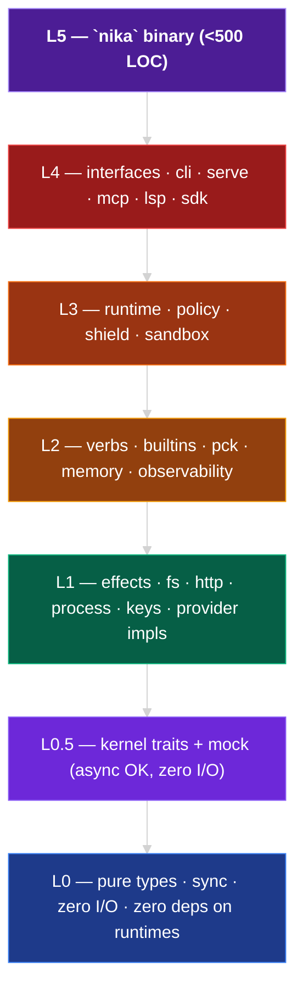

import { STATUS } from "/snippets/_status-snapshot.mdx";

Nika Diamond is {STATUS.cratesTarget} crates organized into **six layers**,
with a half-layer (**L0.5**) for trait-only crates. Every workspace-local
dependency points strictly downward. A CI script (`check-layering.sh`)
fails the build on any upward import.

<Note>
  **Canonical source:** [`docs/architecture/crate-layer-registry.md`](https://github.com/supernovae-st/nika/blob/nika-diamond/docs/architecture/crate-layer-registry.md).
  This page curates the layer model for readers; the authoritative manifest
  lives in the engine repo next to the enforcement script.
</Note>

## Mechanical sort test

Every new crate answers these questions in order. First hit wins.

<Steps>
  <Step title="Does it produce the `nika` binary?">
    → **L5** (the binary)
  </Step>
  <Step title="Does it expose a transport / UI surface (CLI, HTTP, MCP, LSP, SDK)?">
    → **L4** (interfaces)
  </Step>
  <Step title="Does it enforce runtime policy, sandboxing, or orchestration?">
    → **L3** (runtime + policy + sandbox)
  </Step>
  <Step title="Does it implement a verb or a domain service?">
    → **L2** (verbs + services)
  </Step>
  <Step title="Is it a primitive with I/O (fs, net, exec, env)?">
    → **L1** (effect impls)
  </Step>
  <Step title="None of the above?">
    → **L0** (pure, sync, zero I/O). If it's trait-only but async is OK, → **L0.5**.
  </Step>
</Steps>

## The pyramid

Arrows read "depends on". Upward arrows are forbidden — `check-layering.sh` fails on any workspace-local dep that points up.

## Layer table

| Layer | Role | Allowed I/O | Allowed deps | Example crates |
|---|---|---|---|---|
| **L0** | Pure types, lookup tables, sync-only APIs | none | (leaf) | `nika-types`, `nika-error`, `nika-catalog`, `nika-schema`, `nika-event`, `nika-binding`, `nika-transform`, `nika-pck-manifest`, `nika-catalog-codegen` |
| **L0.5** | Kernel trait definitions + companions (mock) — async OK | none (traits only) | L0 | `nika-kernel`, `nika-kernel-mock` |
| **L1** | Effect implementations — async, per-crate capability axis | declared axes only (fs / net / exec / env) | L0, L0.5 | `nika-fs`, `nika-http`, `nika-process`, `nika-git`, `nika-keys-*`, `nika-pck-registry`, `nika-pck-store`, `nika-<provider>-*` |
| **L2** | Verbs + domain services — orchestrates L1 impls behind kernel traits | via L1 traits only | L0, L0.5, L1 | `nika-pck`, `nika-verb-*`, `nika-policy`, `nika-memory`, `nika-observability`, `nika-builtin-{github,cloud,workspace}` |
| **L3** | Runtime + policy + sandbox — enforces execution contracts | via L2 | L0..L2 | `nika-runtime`, `nika-shield`, `nika-wasm-host` (v0.100), `nika-sandbox` (v0.100) |
| **L4** | Interfaces — transport / UI surfaces (libraries) | via L3 | L0..L3 | `nika-cli`, `nika-serve`, `nika-mcp`, `nika-lsp`, `nika-sdk`, `nika-catalog-verify` |
| **L5** | The binary — sole `[[bin]]` composition root | via L4 | L0..L4 | `nika` (<500 LOC) |

<Tip>
  `nika-http` is the **L1 HTTP client** (used by `fetch` / catalog sync).
  The HTTP server surface of `nika serve` lives **inline inside
  `nika-serve` L4** — no separate server crate.
</Tip>

## Admitted today (v{STATUS.version})

<CardGroup cols={2}>
  <Card title="nika-types" icon="cube" href="https://github.com/supernovae-st/nika/tree/nika-diamond/crates/nika-types">
    **L0** · Foundation value types. Leaf of the DAG.
  </Card>
  <Card title="nika-error" icon="triangle-exclamation" href="https://github.com/supernovae-st/nika/tree/nika-diamond/crates/nika-error">
    **L0** · NIKA-XXX error hierarchy + `miette` integration.
  </Card>
  <Card title="nika-catalog" icon="book" href="https://github.com/supernovae-st/nika/tree/nika-diamond/crates/nika-catalog">
    **L0** · Provider / capability TOML catalog, phf lookup.
  </Card>
  <Card title="nika-kernel" icon="circuit-board" href="https://github.com/supernovae-st/nika/tree/nika-diamond/crates/nika-kernel">
    **L0.5** · 40 ISP traits, sealed supertrait, prelude re-export hub.
  </Card>
  <Card title="nika-kernel-mock" icon="circuit-board" href="https://github.com/supernovae-st/nika/tree/nika-diamond/crates/nika-kernel-mock">
    **L0.5** · Pure-memory trait mocks for testing.
  </Card>
  <Card title="nika-catalog-verify" icon="check" href="https://github.com/supernovae-st/nika/tree/nika-diamond/crates/nika-catalog-verify">
    **L4** · Build-only catalog validation tool.
  </Card>
</CardGroup>

**WIP:** `nika-schema` (parser scaffolding, Round 4 admission gate).

## Security axes

Every L1 crate declares the capabilities it exercises in
`docs/architecture/security-axes.toml`. Reserving an axis costs nothing
today and forbids its silent later use.

<AccordionGroup>
  <Accordion title="The 12 capability axes" icon="shield">
    | Axis | Meaning |
    |---|---|
    | `reads-env` | Reads process environment variables |
    | `reads-fs` | Reads filesystem (read-only) |
    | `rw-fs` | Reads and writes filesystem |
    | `exec-shell` | Spawns subprocesses |
    | `net-egress` | Initiates outbound network connections |
    | `net-ingress` | Accepts inbound connections |
    | `spawns-thread` | Uses `std::thread::spawn` or `tokio::task::spawn_blocking` |
    | `mutates-global` | Mutates process-global state (env, CWD, signals) |
    | `panics-allowed` | Explicit opt-out from zero-panic discipline (rare) |
    | `reads-secrets` | Reads `Secret<T>` / `SecretRef` material |
    | `time-mutation` | Manipulates clocks (`MockClock`, `tokio::time::pause`) |
    | `allocator-sensitive` | Imposes allocator constraints (pre-flight for WASM v0.100) |
    | `thread-local-state` | Uses `thread_local!` / static `RefCell` (incompatible with WASM) |
  </Accordion>

  <Accordion title="How enforcement works" icon="gavel">
    Three CI vectors enforce layer discipline:

    - **`check-layering.sh`** (hygiene vector 11, P0, fail on violation): reads layer membership from `[workspace.metadata.diamond.layers]` and verifies every workspace-local dependency is equal or lower layer.
    - **`check-security-axes.sh`** (vector 12, P1): cross-checks declared axes against static analysis of the source tree.
    - **`check-no-async-in-l0.sh`** (vector 16, P1): greps `async fn` / `async {` in L0 source trees; fails on any match.
  </Accordion>
</AccordionGroup>

## Forward compatibility

- **v0.95 Nika Memory** memory crates — 1 L2 orchestrator (`nika-memory`) + 8 L1 satellites (hnsw, bm25, rrf, fsrs, rdfs-reasoner, temporal, graph-algos, autodesc). No renumber — they slot into L1 / L2 naturally.
- **v0.100 WASM** plugin host + sandbox — L3 crates alongside `nika-runtime`. No renumber.

## Anti-patterns

<Warning>
  Seven patterns that tank the layer contract. If you catch yourself writing one, stop and re-ask the mechanical sort test.
</Warning>

1. **Kitchen-sink crate** — "I'll just add this utility to `nika-error`" leads to a 10k-LOC bag-of-tricks every crate transitively pulls in. One caller = stays in the caller.
2. **Facade mega-crate** — "Re-export everything from `nika` for convenience" collapses the layer contract and tanks compile time.
3. **Upward re-exports** — an L1 crate `pub use nika_pck::...` turns its API into an L2 consumer and breaks mechanical sorting.
4. **`async` in L0** — forces a runtime choice on every L1 / L2 consumer; makes the crate unusable in build scripts.
5. **`anyhow::Error` in library code** — L5 binary only. L0..L4 uses the typed error hierarchy.
6. **`Box<dyn Error>` in public API** — hygiene vector 19 bans it. Swap to the typed error hierarchy.
7. **Runtime imports in L0** — `tokio::spawn` in `nika-error` is a layer violation even if it compiles.

## See also

- [Forward-compat invariants](/architecture/forward-compat-invariants) — the 8 patterns + 5 decisions that protect the public API
- [L0 foundation decisions](/architecture/l0-decisions) — Q1 through Q13, locked
- [12-gate admission](/architecture/admission) — how a crate earns a seat at the workspace
- [Constellation](/reference/constellation) — live map of admitted / WIP / planned crates
