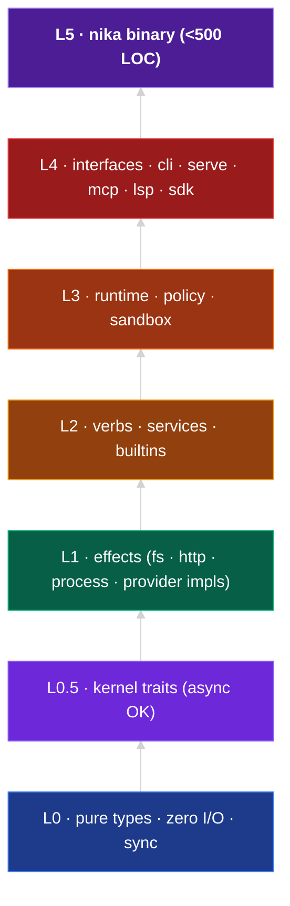

import { STATUS } from "/snippets/_status-snapshot.mdx";

Nika is a single Rust binary (`nika` at **L5**) composed of
**{STATUS.cratesTarget} crates** across six layers. Each crate has one job.
Together they parse `.nika.yaml`, resolve templates, route to providers,
execute verbs, and emit a structured event stream.

<Tip>
  **Looking for the authoritative contract?** The [Architecture tab](/architecture/layers)
  holds the curated specs:
  [Layer registry](/architecture/layers) · [Forward-compat invariants](/architecture/forward-compat-invariants)
  · [L0 decisions](/architecture/l0-decisions) · [12-gate admission](/architecture/admission).
  This page orients the concept; those pages are the contract.
</Tip>

## One binary, six layers

Arrows read "built on". The `nika` binary at L5 composes L4 interface
crates, which consume L3 runtime + policy, which orchestrate L2 verbs,
which call L1 effects through L0.5 kernel traits, which use L0
foundation types. **Upward imports are a CI hard failure.**

## Each layer answers one question

| Layer | Question | Examples |
|---|---|---|
| **L0** | What shapes does the engine use to talk about itself? | `WorkflowId`, `NikaError`, `ModelCapabilities`, `Timestamp` |
| **L0.5** | What contract does a provider / fs / clock / tool executor implement? | `Provider`, `Fs`, `Clock`, `ToolExecutor`, `MemoryStore` |
| **L1** | How do I actually call OpenAI / read a file / run a process? | `nika-provider-openai`, `nika-fs`, `nika-process`, `nika-http` |
| **L2** | How do I execute a Nika verb end-to-end? | `nika-verb-exec`, `nika-verb-infer`, `nika-verb-agent` |
| **L3** | How do I orchestrate a full workflow safely? | `nika-runtime`, `nika-shield`, `nika-sandbox` (future minors) |
| **L4** | How does a human / tool / IDE talk to Nika? | `nika-cli`, `nika-serve`, `nika-mcp`, `nika-lsp` |
| **L5** | What's the single entrypoint that wires it all? | `nika` binary (&lt;500 LOC) |

## Why layers matter

<AccordionGroup>
  <Accordion title="Mechanical sorting · no debate" icon="layer-group">
    New crate? Answer the [mechanical sort test](/architecture/layers#mechanical-sort-test)
    in under 10 seconds. No meetings, no "where should this live", no
    spiral into abstraction-first design.
  </Accordion>
  <Accordion title="Trustable L0 · no hidden I/O" icon="shield">
    L0 has **zero I/O, zero async, zero runtime deps**. Your build script
    can safely `use nika_types::*` without pulling in tokio. Property tests
    against L0 types run in milliseconds.
  </Accordion>
  <Accordion title="Swappable effects · test hermetically" icon="rotate">
    Every I/O crate implements a kernel trait with a mock twin. Unit tests
    use `nika-kernel-mock::MockClock`, `MockFs`, `MockProvider`: no
    network, no disk, no wall-clock flakiness. Invariant #27.
  </Accordion>
  <Accordion title="Capped blast radius · per-axis capabilities" icon="explosion">
    Every L1 crate declares its capability axes in
    `docs/architecture/security-axes.toml` (e.g., `net-egress` for HTTP,
    `rw-fs` for filesystem). Silent axis escalation fails CI.
    [12 axes total](/architecture/layers#security-axes).
  </Accordion>
</AccordionGroup>

## What ships at v{STATUS.version}

**{STATUS.cratesAdmitted} crates admitted** past 12 gates:

<CardGroup cols={3}>
  <Card title="nika-types" icon="cube">**L0** · Foundation value types</Card>
  <Card title="nika-error" icon="triangle-exclamation">**L0** · NIKA-XXX error infra</Card>
  <Card title="nika-catalog" icon="book">**L0** · {STATUS.providers} providers · {STATUS.capabilityRules} rules</Card>
  <Card title="nika-kernel" icon="circuit-board">**L0.5** · 40 ISP traits</Card>
  <Card title="nika-kernel-mock" icon="circuit-board">**L0.5** · Pure-memory mocks</Card>
  <Card title="nika-catalog-verify" icon="check">**L4** · Catalog validation tool</Card>
</CardGroup>

`nika-schema` (parser · analyzer · static check) is admitted and live: it is what `nika check` runs.

[Live constellation →](/reference/constellation) · [12-gate admission →](/architecture/admission)

## The build model

Every crate earns its seat through twelve gates. No exceptions, no late
fixes. One crate = one atomic commit.

<Steps>
  <Step title="SPEC → TDD → IMPL">
    Spec at `docs/crate-specs/<crate>.md` first. Tests red before
    implementation. Minimal code to green.
  </Step>
  <Step title="CLIPPY 0 → MUTATION ≥ 90%">
    Zero clippy warnings. `cargo mutants -p <crate>` kills ≥ 90% of
    generated mutants.
  </Step>
  <Step title="PROPERTY → BENCHMARKS → DOCS">
    Property tests via `proptest` where it matters (parsers, taint,
    crypto). Criterion benchmarks on hot paths. `cargo doc` clean.
  </Step>
  <Step title="CANARY → PARITY → REVIEW → COMMIT">
    End-to-end `.nika.yaml` canary. Golden diff vs legacy (Phase 5+).
    3-agent swarm review. One atomic commit with a gate checklist in the body.
  </Step>
</Steps>

[Full 12-gate spec →](/architecture/admission)

## See also

<CardGroup cols={2}>
  <Card title="Layers" icon="layer-group" href="/architecture/layers">
    Authoritative layer registry with mechanical sort test.
  </Card>
  <Card title="Forward-compat invariants" icon="shield-halved" href="/architecture/forward-compat-invariants">
    The 8 patterns that keep the public API stable across years.
  </Card>
  <Card title="L0 decisions" icon="list-check" href="/architecture/l0-decisions">
    Q1-Q13: why no proc macros in L0, why sibling sinks not god-trait.
  </Card>
  <Card title="Admission" icon="check-double" href="/architecture/admission">
    The 12 gates with rationale per gate.
  </Card>
</CardGroup>
