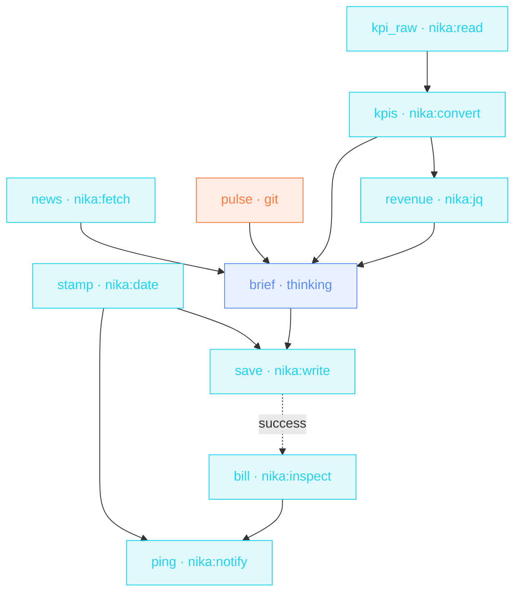

> **T4 epic · founders / executives**: the flagship. Three branches
> gather in parallel (web signal, repo pulse, the KPI sheet), jq does
> the revenue arithmetic, a thinking model writes the brief, and
> `nika:inspect view: cost` puts the run's own bill in the ping.
> A workflow that reports what it cost you is a workflow you trust on
> a schedule.

## The job

Monday needs one page: market, product, numbers, risks, the ONE
decision. Assembling it eats an hour of founder time. This file
assembles it before you wake: dated filename, summed revenue, and a
webhook ping ending in `run cost $0.14`.

## The shape

{/* showcase:dag-begin t4-ceo-monday-brief.nika.yaml */}

{/* showcase:dag-end */}

## The file

{/* showcase:begin t4-ceo-monday-brief.nika.yaml */}
```yaml t4-ceo-monday-brief.nika.yaml
nika: v1
workflow:
  id: ceo-monday-brief
  description: "news + repo pulse + KPIs → thinking synthesis → dated brief + cost ping"

model: ollama/qwen3.5:4b   # local default · the synthesis task below overrides to a stronger model

vars:
  watch_query: "AI workflow engines"
  kpi_csv: "./finance/kpis.csv"

secrets:
  founders_webhook:
    source: env
    key: FOUNDERS_WEBHOOK_URL
    egress:                       # sanction the one send · the secret IS the URL
      - to: "nika:notify"
        host_from_self: true

tasks:
  # ── branch 1 · market signal ──
  news:
    invoke:
      tool: "nika:fetch"
      args:
        url: "https://hn.algolia.com/api/v1/search?query=${{ vars.watch_query }}"
        mode: jq
        jq: ".hits[:10] | map(.title)"

  # ── branch 2 · engineering pulse ──
  pulse:
    exec:
      command: ["git", "shortlog", "-sn", "--since=1 week ago"]

  # ── branch 3 · the numbers ──
  kpi_raw:
    invoke:
      tool: "nika:read"
      args: { path: "${{ vars.kpi_csv }}" }

  kpis:
    with:
      csv: ${{ tasks.kpi_raw.output }}
    invoke:
      tool: "nika:convert"
      args:
        input: "${{ with.csv }}"
        from: csv
        to: json
        has_header: true

  revenue:
    with:
      kpis: ${{ tasks.kpis.output }}
    invoke:
      tool: "nika:jq"
      args:
        input: "${{ with.kpis }}"
        expression: "map(.weekly_revenue | tonumber) | add"

  # ── synthesis · with a thinking budget ──
  brief:
    with:                              # the three branches join here · four value edges
      news: ${{ tasks.news.output }}
      pulse: ${{ tasks.pulse.output }}
      kpis: ${{ tasks.kpis.output }}
      revenue: ${{ tasks.revenue.output }}
    infer:
      model: anthropic/claude-sonnet-4-6   # per-task override · thinking budget
      prompt: |
        Market signal · ${{ with.news }}
        Engineering pulse · ${{ with.pulse }}
        KPIs · ${{ with.kpis }}
        Revenue (summed) · ${{ with.revenue }}

        Write my Monday brief · 5 sections · market · product ·
        numbers · risks · the ONE decision this week needs.
      thinking:
        enabled: true
        budget_tokens: 10000

  stamp:
    invoke:
      tool: "nika:date"
      args: { op: now }
    output:
      day: ".[:10]"                  # nika:date returns the ISO string itself · slice YYYY-MM-DD

  save:
    with:
      day: ${{ tasks.stamp.day }}
      brief: ${{ tasks.brief.output }}
    invoke:
      tool: "nika:write"
      args:
        path: "./briefs/${{ with.day }}-monday.md"
        content: "${{ with.brief }}"
        create_dirs: true

  # ── the run reports its own bill ──
  bill:
    after:
      save: success                # state, no data · read the meter once the brief landed
    invoke:
      tool: "nika:inspect"
      args: { view: cost }

  ping:
    with:
      day: ${{ tasks.stamp.day }}    # hoisted once · the body AND the cleanup below read this binding
      cost: ${{ tasks.bill.output.total_usd }}
    invoke:
      tool: "nika:notify"
      args:
        channel: webhook
        target: "${{ secrets.founders_webhook }}"
        message: "Monday brief ready · briefs/${{ with.day }}-monday.md · run cost $${{ with.cost }}"
        severity: info
    on_finally:
      - invoke:
          tool: "nika:emit"
          args:
            event_type: "brief.monday.run"
            payload:
              day: "${{ with.day }}"   # the parent's own binding · cleanup never reads a sibling task

outputs:
  brief: ${{ tasks.brief.output }}
  cost_usd: ${{ tasks.bill.output.total_usd }}
```
{/* showcase:end */}

## How it works

<Steps>
  <Step title="Three branches, zero coordination code">
    News (HN API through `mode: jq`), engineering pulse (`git shortlog`)
    and the KPI sheet (read → convert → jq `add`) run concurrently. The
    revenue sum is jq arithmetic: deterministic, not model-guessed.
  </Step>
  <Step title="Dates come from a builtin">
    `nika:date` + the `.iso[:10]` binding stamp the filename
    `briefs/2026-06-15-monday.md`. Never let a model guess the date.
  </Step>
  <Step title="The run reports its own bill">
    `nika:inspect view: cost` returns `{total_usd, by_task, by_provider}`.
    The ping interpolates it. Cost-aware automation is automation you
    can leave running.
  </Step>
</Steps>

## Constructs you just used

| Construct | Where | Reference |
|---|---|---|
| 3-branch parallel gather | `news` · `pulse` · `kpi_raw` | [Workflows](/concepts/workflows) |
| jq arithmetic (`add`) | `revenue` | [Builtins](/reference/builtins) |
| `nika:inspect view: cost` | `bill` | [Builtins](/reference/builtins) |
| `output:` binding on a builtin | `stamp` | [Bindings](/concepts/bindings) |

## Make it yours

- Add a fourth branch: support sentiment from [Support triage](/examples/support-triage)'s board file.
- Keep a budget: follow `bill` with `nika:assert` on `total_usd < 1`. The brief refuses to overspend.
- Archive the history: the dated files under `briefs/` are already your decision journal.

<Card title="Back to all examples" icon="rocket" href="/examples/overview">
  You've climbed the whole ladder, starter to epic. Time to write
  yours.
</Card>
