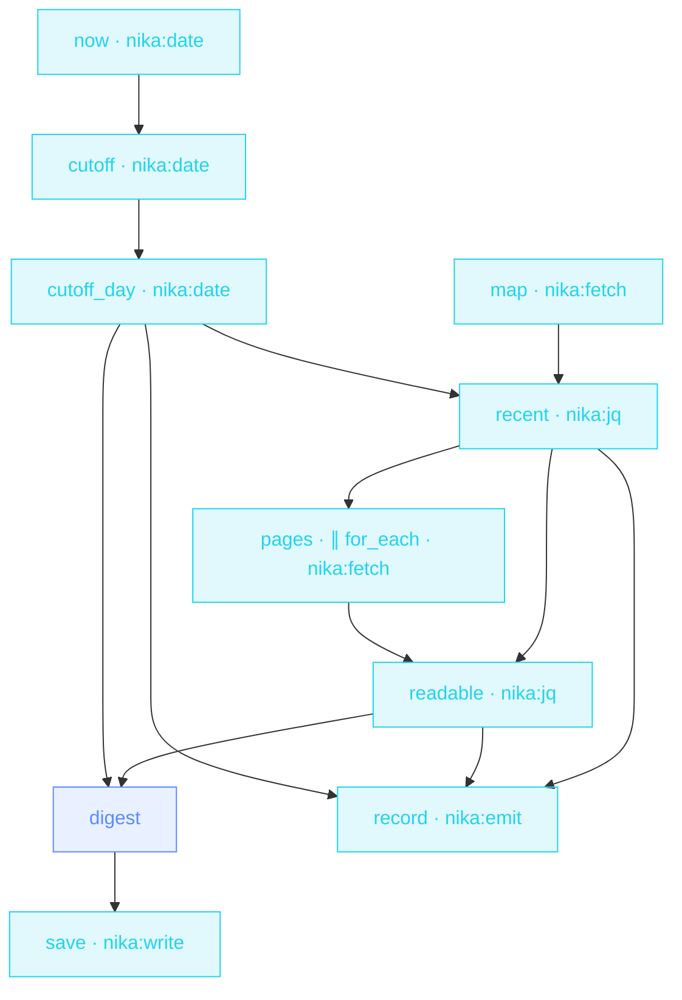

> **T3 fan-out · strategy / product marketing**: the flagship
> `for_each`. The number of pages is decided at RUNTIME by the
> competitor's sitemap; `max_parallel` keeps the crawl polite,
> `fail_fast: false` keeps one dead page from killing the radar,
> `retry:` absorbs the flaky web.

## The job

Monday 8am: what did they ship? Instead of 40 tabs, the sitemap is
mapped, the 8 freshest pages are read concurrently, and one brief tells
you what it signals. Every page that survives lands in the fan-in; every
page that doesn't is reported, not fatal.

## The shape

{/* showcase:dag-begin competitor-radar.nika.yaml */}

{/* showcase:dag-end */}

## The file

{/* showcase:begin competitor-radar.nika.yaml */}
```yaml competitor-radar.nika.yaml
nika: v1
workflow:
  id: competitor-radar
  description: "competitor watch · their sitemap says what shipped or changed this week → parallel page reads → one Monday brief"

model: ollama/qwen3.5:4b   # local · zero key · swap for anthropic/claude-sonnet-4-6 for a sharper read

run:
  clock: system            # `pages` declares a `timeout:` · name the clock it rides

inputs:
  sitemap_url:
    type: string
    default: "https://nika.sh/sitemap.xml"
    description: "Whose sitemap to read · must agree with the host in permits.net.http"
  window_days:
    type: integer
    default: 7
    description: "How far back « recently » reaches"
  max_pages:
    type: integer
    default: 6
    description: "Politeness cap · the fan-out never exceeds this many fetches"

permits:
  tools: ["nika:date", "nika:emit", "nika:fetch", "nika:jq", "nika:write"]
  net:
    # ONE host covers BOTH fetches, and that is a claim worth being explicit
    # about: `map` reads the sitemap, then `pages` fetches whatever `.loc`
    # values came back — runtime URLs this file never sees. A sitemap is
    # single-host by protocol, so the site's own host is the honest wall: if
    # their sitemap ever points somewhere else, that fetch is refused instead
    # of followed. Change `inputs.sitemap_url` and this line changes with it.
    http: ["nika.sh"]
  fs:
    # ONE file, named exactly, because the path IS a literal — there is no
    # uuid or date in it, so there is nothing for a wildcard to stand in for.
    # A bound is only as wide as the uncertainty it has to cover.
    #
    # `create_dirs: true` below makes the missing `./radar/` without needing
    # a grant of its own: measured, with only this line, the directory is
    # created and the brief lands. (Builtins that take an `output_dir:`
    # instead — `nika:image_generate` and family — are the opposite case:
    # `check` judges the directory ARGUMENT while the run gates each final
    # file path, so those need the directory AND its children. The bound
    # follows what the builtin names.)
    write: ["./radar/competitor-brief.md"]

tasks:
  # ── how far back does « recently » reach ───────────────────────────
  # Three date ops rather than a hardcoded string, because a radar that ships
  # with a date baked in is wrong the day after you write it. `format` to
  # %Y-%m-%d puts the cutoff in the same shape sitemaps use for `lastmod`,
  # which is what makes the string comparison below sound.
  now:
    invoke:
      tool: "nika:date"
      args: { op: now }

  cutoff:
    with:
      now: ${{ tasks.now.output }}
    invoke:
      tool: "nika:date"
      args:
        op: subtract
        base: "${{ with.now }}"
        duration: "${{ inputs.window_days }}d"

  cutoff_day:
    with:
      cutoff: ${{ tasks.cutoff.output }}
    invoke:
      tool: "nika:date"
      args:
        op: format
        input: "${{ with.cutoff }}"
        format: "%Y-%m-%d"

  # ── what they publish, and when it last moved ──────────────────────
  map:
    invoke:
      tool: "nika:fetch"
      args:
        url: "${{ inputs.sitemap_url }}"
        mode: sitemap                  # → [{loc, lastmod, changefreq, priority}, …]

  # `lastmod` is optional in the sitemap protocol, so `// ""` sends an entry
  # without one outside the window instead of crashing the filter. Newest
  # first, then the politeness cap — the fan-out width is decided here and
  # nowhere else.
  recent:
    with:
      entries: ${{ tasks.map.output }}
      cutoff: ${{ tasks.cutoff_day.output }}
    invoke:
      tool: "nika:jq"
      args:
        input: { entries: "${{ with.entries }}", cutoff: "${{ with.cutoff }}" }
        expression: >-
          .cutoff as $c
          | .entries
          | map(select((.lastmod // "") >= $c))
          | sort_by(.lastmod) | reverse
          | .[:${{ inputs.max_pages }}]
          | map(.loc)

  # ── read them all at once ──────────────────────────────────────────
  pages:
    with:
      urls: ${{ tasks.recent.output }}
    for_each: ${{ with.urls }}
    max_parallel: 4                    # be a good guest · four in flight, no more
    fail_fast: false                   # one dead page must not kill the radar
    on_error:
      recover: null                    # that page yields null at its index · the batch lives
    timeout: "30s"                     # somebody else's server, somebody else's bad day
    retry:
      max_attempts: 3
      backoff_strategy: exponential
      jitter: true                     # a swarm that retries in lockstep is a small DDoS
    invoke:
      tool: "nika:fetch"
      args:
        url: "${{ item }}"
        mode: article                  # readability extraction · the prose, not the chrome

  # ── the fan-in · a for_each output is an array in ITEM ORDER ───────
  # which is what lets `transpose` put each page's text back beside its own
  # URL. The `select` is where the pages that never answered leave.
  readable:
    with:
      urls: ${{ tasks.recent.output }}
      pages: ${{ tasks.pages.output }}
    invoke:
      tool: "nika:jq"
      args:
        input: ["${{ with.urls }}", "${{ with.pages }}"]
        expression: >-
          transpose
          | map(select(.[1] != null))
          | map({ url: .[0], text: .[1] })

  digest:
    with:
      readable: ${{ tasks.readable.output }}
      cutoff: ${{ tasks.cutoff_day.output }}
    when: ${{ size(with.readable) > 0 }}   # a quiet week costs nothing
    infer:
      max_tokens: 1500                     # one page · a ceiling, not a hope
      prompt: |
        These are the pages a competitor published or changed since
        ${{ with.cutoff }} ·
        ${{ with.readable }}
        Write the Monday brief · what they shipped · what it signals · what
        we should watch. One page, plain words, no filler.

  save:
    with:
      digest: ${{ tasks.digest.output }}
    when: ${{ with.digest != null && size(with.digest) > 0 }}   # skipped (null) or an EMPTY answer · gate on the VALUE, both ways
    invoke:
      tool: "nika:write"
      args:
        path: "./radar/competitor-brief.md"
        content: "${{ with.digest }}"
        create_dirs: true

  # The « it is ready » signal, as a LOCAL journal event. No webhook, no
  # secret, no host: the brief is on disk and the event says so. A radar that
  # needed an outbound credential to tell you it had finished would be a
  # strictly larger blast radius for no extra information.
  record:
    with:
      urls: ${{ tasks.recent.output }}
      readable: ${{ tasks.readable.output }}
      cutoff: ${{ tasks.cutoff_day.output }}
    invoke:
      tool: "nika:emit"
      args:
        event_type: "competitor.radar.scan"
        payload:
          since: ${{ with.cutoff }}
          selected: ${{ with.urls }}
          read_ok: ${{ with.readable }}

outputs:
  since:
    value: ${{ tasks.cutoff_day.output }}
    description: "The computed window start · what « recently » meant on this run"
  pages:
    value: ${{ tasks.recent.output }}
    description: "The URLs the sitemap said had changed inside that window"
  brief:
    value: ${{ tasks.digest.output }}
    description: "The Monday brief · null when the week was quiet"
```
{/* showcase:end */}

## How it works

<Steps>
  <Step title="The collection is computed, not hardcoded">
    The URL list crosses the boundary
    (`map_recent: ${{ tasks.map.recent }}` in `with:`), then
    `for_each: ${{ with.map_recent }}` fans out: eight URLs this week,
    three next week. The DAG doesn't change.
  </Step>
  <Step title="Resilience is per-iteration">
    `retry:` (exponential + jitter) and `timeout: "30s"` apply to EACH
    page fetch. `fail_fast: false` collects errors instead of aborting
    the batch.
  </Step>
  <Step title="The fan-in is just a reference">
    `${{ tasks.pages.output }}` is the ARRAY of per-page outputs, in
    input order. One prompt consumes the whole crawl.
  </Step>
</Steps>

## Constructs you just used

| Construct | Where | Reference |
|---|---|---|
| `for_each` over a binding | `pages` | [Workflows](/concepts/workflows) |
| `max_parallel` + `fail_fast` | `pages` | [Workflows](/concepts/workflows) |
| per-iteration `retry:` + `timeout:` | `pages` | [Error model](/reference/error-codes) |
| `${{ item }}` loop-local | `pages.args.url` | [Bindings](/concepts/bindings) |

## Make it yours

- Track THREE competitors: lift the sitemap URL into a list and nest the pattern, or run the workflow per competitor and merge the briefs.
- Filter the sitemap by date with a sharper jq binding before fanning out.
- Schedule it for Monday 07:30 from your host's cron. The brief is on your desk before standup.

<Card title="Next · Localization factory" icon="language" href="/examples/localization-factory">
  Chained fan-outs and the jq `transpose` zip: the whole docs tree,
  translated.
</Card>
