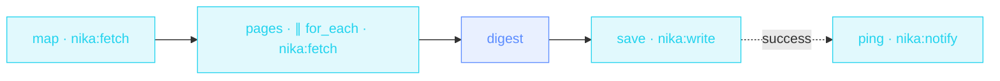

> **T3 fan-out · strategy / product marketing**: the flagship
> `for_each`. The number of pages is decided at RUNTIME by the
> competitor's sitemap; `max_parallel` keeps the crawl polite,
> `fail_fast: false` keeps one dead page from killing the radar,
> `retry:` absorbs the flaky web.

## The job

Monday 8am: what did they ship? Instead of 40 tabs, the sitemap is
mapped, the 8 freshest pages are read concurrently, and one brief tells
you what it signals. Every page that survives lands in the fan-in; every
page that doesn't is reported, not fatal.

## The shape

{/* showcase:dag-begin t3-competitor-radar.nika.yaml */}

{/* showcase:dag-end */}

## The file

{/* showcase:begin t3-competitor-radar.nika.yaml */}
```yaml t3-competitor-radar.nika.yaml
nika: v1
workflow:
  id: competitor-radar
  description: "Sitemap → parallel page reads → one competitive brief + ping"

model: ollama/qwen3.5:4b   # local · zero key · swap for anthropic/claude-sonnet-4-6

vars:
  competitor_sitemap: "https://competitor.example.com/sitemap.xml"

secrets:
  team_webhook:
    source: env
    key: TEAM_WEBHOOK_URL
    egress:                       # sanction the one send · the secret IS the URL
      - to: "nika:notify"
        host_from_self: true

tasks:
  map:
    invoke:
      tool: "nika:fetch"
      args:
        url: "${{ vars.competitor_sitemap }}"
        mode: sitemap
    output:
      recent: ".[:8] | map(.loc)"     # sitemap = the root array of {loc, …} · cap at 8, keep the URLs

  pages:
    with:
      map_recent: ${{ tasks.map.recent }}
    for_each: ${{ with.map_recent }}
    max_parallel: 4                    # be polite · 4 fetches in flight max
    fail_fast: false                   # one dead page must not kill the radar
    on_error:
      recover: null                    # a dead page yields null at its index · the radar lives
    timeout: "30s"
    retry:
      max_attempts: 3
      backoff_strategy: exponential
      jitter: true
    invoke:
      tool: "nika:fetch"
      args:
        url: "${{ item }}"
        mode: article

  digest:
    with:
      pages: ${{ tasks.pages.output }}
    infer:
      prompt: |
        These are the pages a competitor published recently ·
        ${{ with.pages }}
        Write the Monday brief · what they shipped · what it signals ·
        what we should watch. One page, plain words.

  save:
    with:
      digest: ${{ tasks.digest.output }}
    invoke:
      tool: "nika:write"
      args:
        path: "./radar/competitor-brief.md"
        content: "${{ with.digest }}"
        create_dirs: true

  ping:
    after:
      save: succeeded
    invoke:
      tool: "nika:notify"
      args:
        channel: webhook
        target: "${{ secrets.team_webhook }}"
        message: "Competitor radar is ready · ./radar/competitor-brief.md"
        severity: info

outputs:
  brief: ${{ tasks.digest.output }}
```
{/* showcase:end */}

## How it works

<Steps>
  <Step title="The collection is computed, not hardcoded">
    The URL list crosses the boundary
    (`map_recent: ${{ tasks.map.recent }}` in `with:`), then
    `for_each: ${{ with.map_recent }}` fans out: eight URLs this week,
    three next week. The DAG doesn't change.
  </Step>
  <Step title="Resilience is per-iteration">
    `retry:` (exponential + jitter) and `timeout: "30s"` apply to EACH
    page fetch. `fail_fast: false` collects errors instead of aborting
    the batch.
  </Step>
  <Step title="The fan-in is just a reference">
    `${{ tasks.pages.output }}` is the ARRAY of per-page outputs, in
    input order. One prompt consumes the whole crawl.
  </Step>
</Steps>

## Constructs you just used

| Construct | Where | Reference |
|---|---|---|
| `for_each` over a binding | `pages` | [Workflows](/concepts/workflows) |
| `max_parallel` + `fail_fast` | `pages` | [Workflows](/concepts/workflows) |
| per-iteration `retry:` + `timeout:` | `pages` | [Error model](/reference/error-codes) |
| `${{ item }}` loop-local | `pages.args.url` | [Bindings](/concepts/bindings) |

## Make it yours

- Track THREE competitors: lift the sitemap URL into a list and nest the pattern, or run the workflow per competitor and merge the briefs.
- Filter the sitemap by date with a sharper jq binding before fanning out.
- Schedule it for Monday 07:30 from your host's cron. The brief is on your desk before standup.

<Card title="Next · Localization factory" icon="language" href="/examples/localization-factory">
  Chained fan-outs and the jq `transpose` zip: the whole docs tree,
  translated.
</Card>
