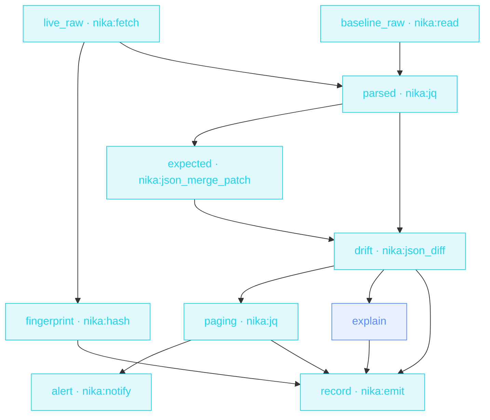

> **T3 · SRE / platform**: the deterministic-core pattern at its
> sharpest. Approved overrides merge into the baseline (RFC 7396), the
> live config diffs against THAT (RFC 6902), blake3 fingerprints the
> evidence, and the LLM's only job is explaining the patch to a human
> at 3am.

## The job

« Did anyone change prod config without telling us? » Pure-diff
monitors page you for every sanctioned change too: alert fatigue. This
sentinel knows what was approved: it reconstructs the EXPECTED state
first, so the diff contains only the drift nobody signed off on.

## The shape

{/* showcase:dag-begin config-drift-sentinel.nika.yaml */}

{/* showcase:dag-end */}

## The file

{/* showcase:begin config-drift-sentinel.nika.yaml */}
```yaml config-drift-sentinel.nika.yaml
nika: v1
workflow:
  id: config-drift-sentinel
  description: "live config vs sanctioned baseline → typed drift → triaged, explained alert"

# A NON-thinking seat, deliberately. Measured with qwen3.5:4b: `explain`'s
# 600-token ceiling was spent entirely inside the think block, the run stayed
# green, and the journal's `explanation` field recorded EMPTY — the engine
# flags it (« a thinking model may have spent the budget inside its think
# block »). llama3.2:3b answers the three bullets inside the same ceiling.
model: ollama/llama3.2:3b   # local · zero key · swap for any catalog provider (explain is cheap)

inputs:
  config_url:
    type: string
    default: "https://api.internal.example.com/v1/config"
    description: "The live-config endpoint · the placeholder resolves nowhere, which is what makes the default run a rehearsal"

const:
  # The committed rehearsal baseline. Point this at your real intended state
  # and change `permits.fs.read` in the same edit — a permit is a literal you
  # can read, it cannot interpolate a const (`NIKA-AUTH-007`).
  baseline_path: "./examples/fixtures/config-baseline.json"

  # Sanctioned drift · an RFC 7396 merge patch applied to the baseline before
  # the diff. `{}` means « nothing is pre-approved ».
  #
  # This is a BARE LITERAL, deliberately. A typed constant is `{ type, value }`
  # and nothing else: an object missing either key is read as a literal object
  # (`01-envelope.md:273`). Writing `{ type: object, default: {} }` here would
  # declare nothing — `${{ const.approved_overrides }}` would resolve to that
  # whole three-key map. Measured, with `{ replicas: 6 }` as the baseline:
  #   {"default":{},"description":"…","replicas":6,"type":"object"}
  # No error, no warning. The sentinel would just spend every morning diffing
  # prod against a config nobody ever intended.
  approved_overrides: {}

  # An RFC 6902 patch path starting with one of these can take the service
  # down. Everything else is recorded and read in the morning. The list lives
  # here, in the file, instead of inside a prompt: paging policy is reviewable.
  paging_prefixes: ["/replicas", "/feature_flags", "/upstreams", "/limits"]

secrets:
  oncall_webhook:
    source: env
    key: ONCALL_WEBHOOK_URL
    egress:                       # sanction the one send · the secret IS the URL
      - to: "nika:notify"
        host_from_self: true

permits:
  tools: ["nika:emit", "nika:fetch", "nika:hash", "nika:jq", "nika:json_diff", "nika:json_merge_patch", "nika:notify", "nika:read"]
  net:
    # TWO hosts, two different jobs.
    #
    # `host_from_self:` above sanctions the FLOW (this secret may be the URL)
    # — it does not grant the capability. The webhook host stays unknown at
    # check time, so it is judged at RUN against this list: name the
    # escalation host here or the page is refused mid-run, after the drift
    # has already been found. Measured, all three cases · with the host
    # absent, or with some other host named, `check` is green and the run
    # dies `NIKA-SEC-004 · <host> resolves outside the declared net.http
    # boundary`; with it named, the permit clears and the send goes out.
    http:
      - "api.internal.example.com"   # the config endpoint this sentinel polls
      - "hooks.slack.com"            # where the page goes · swap for your own
  fs:
    # Read-only by design: a drift sentinel OBSERVES prod, it never edits it.
    # There is no `write:` key at all, so every path on this machine is denied
    # for writes — the baseline is the one file this workflow may open.
    read: ["./examples/fixtures/config-baseline.json"]

tasks:
  # ── what prod says it is · as BYTES ────────────────────────────────
  # `mode: raw` keeps the response as the string the server sent, which is
  # what `fingerprint` hashes below. The recovery value is that same string:
  # a real HTTP body, one benign step off the baseline (log_level info →
  # debug), so the triage downstream has something honest to triage. Point
  # `--var config_url=` at a live endpoint and this branch never runs.
  live_raw:
    on_error:
      recover: '{"service":"checkout-api","replicas":6,"log_level":"debug","feature_flags":{"beta_ui":false,"instant_refunds":true,"queue_v2":false},"limits":{"request_timeout_ms":2500,"max_body_bytes":1048576},"upstreams":{"ledger":"https://ledger.internal.example.com","risk":"https://risk.internal.example.com"}}'
    retry:
      max_attempts: 3
      backoff_strategy: exponential
    invoke:
      tool: "nika:fetch"
      args:
        url: "${{ inputs.config_url }}"
        mode: raw

  # ── what prod is supposed to be · also bytes ───────────────────────
  baseline_raw:
    invoke:
      tool: "nika:read"              # returns a STRING · a file is text until you parse it
      args: { path: "${{ const.baseline_path }}" }

  # Provenance over the exact response bytes, taken BEFORE the parse: two
  # different JSON texts that mean the same thing hash differently, and that
  # is the point — this attests the artifact, not the interpretation.
  # `nika:hash` requires `content:` to be a string; handing it the parsed
  # object fails `NIKA-BUILTIN-HASH-001` at run while `check` stays green.
  fingerprint:
    with:
      raw: ${{ tasks.live_raw.output }}
    invoke:
      tool: "nika:hash"
      args:
        algo: blake3
        content: "${{ with.raw }}"
        encoding: hex

  # ── text becomes data, in one place ────────────────────────────────
  # Both sides are parsed together so the « where did this stop being a
  # string » question has exactly one answer in this file. `json_merge_patch`
  # and `json_diff` take OBJECTS: feeding either one the raw string fails
  # `NIKA-BUILTIN-JSON_MERGE_PATCH-001` at run, and `check` cannot see it
  # coming — the type only exists once the tool has run.
  parsed:
    with:
      live: ${{ tasks.live_raw.output }}
      baseline: ${{ tasks.baseline_raw.output }}
    invoke:
      tool: "nika:jq"
      args:
        input: { live: "${{ with.live }}", baseline: "${{ with.baseline }}" }
        expression: "{ live: (.live | fromjson), baseline: (.baseline | fromjson) }"

  expected:
    with:
      baseline: ${{ tasks.parsed.output.baseline }}
    invoke:
      tool: "nika:json_merge_patch"     # RFC 7396 · objects merge, null deletes
      args:
        target: "${{ with.baseline }}"
        patch: "${{ const.approved_overrides }}"

  # ── the difference, as data ────────────────────────────────────────
  drift:
    with:
      expected: ${{ tasks.expected.output }}
      live: ${{ tasks.parsed.output.live }}
    invoke:
      tool: "nika:json_diff"            # RFC 6902 · [{op, path, value}, …]
      args:
        before: "${{ with.expected }}"
        after: "${{ with.live }}"

  # ── triage · which of those operations is worth a phone call ───────
  # `any($p[]; …)` is true when the operation's path starts with any prefix.
  # A log_level change survives the diff and dies right here, which is the
  # difference between a sentinel people keep and one they mute.
  paging:
    with:
      patch: ${{ tasks.drift.output }}
    invoke:
      tool: "nika:jq"
      args:
        input: { patch: "${{ with.patch }}", prefixes: "${{ const.paging_prefixes }}" }
        expression: >-
          .prefixes as $p
          | .patch
          | map(select(.path as $path | any($p[]; . as $pre | $path | startswith($pre))))

  explain:
    with:
      patch: ${{ tasks.drift.output }}
    when: ${{ size(with.patch) > 0 }}   # a clean scan spends nothing
    on_error:
      recover: "(explanation unavailable · the model call failed · the raw patch is attached)"
    infer:
      max_tokens: 600                   # three bullets · a ceiling, not a hope
      prompt: |
        This RFC 6902 patch is UNSANCTIONED config drift in production ·
        ${{ with.patch }}
        Explain in 3 bullets · what changed · likely blast radius · first check.

  # ── the page carries the FACT · never the payload ──────────────────
  #
  # All three trifecta legs are structural here: the baseline is a private
  # read, the live config is untrusted ingress, and the webhook is external
  # egress. Interpolating the diff — or the explanation derived from it —
  # into this message would be a realized flow: someone who can move prod
  # config could shape the diff until it echoes baseline values out through
  # the webhook. So the page says THAT drift happened and where to look; the
  # drift itself goes to the journal below, which never leaves the machine.
  # `when:` may still read the patch — a gate decides, it does not transmit.
  alert:
    with:
      paging: ${{ tasks.paging.output }}
    when: ${{ size(with.paging) > 0 }}
    invoke:
      tool: "nika:notify"
      args:
        channel: webhook
        target: "${{ secrets.oncall_webhook }}"
        message: "Unsanctioned config drift on a paging path · details in the config.drift.scan journal event"
        severity: critical

  # `nika:emit` is a LOCAL event · it needs no `net:` grant because nothing
  # leaves the machine. The full patch, the provenance fingerprint and the
  # explanation land here, where whoever answers the page reads them. On a
  # clean scan `explain` is gated off and resolves null — the scan is still
  # recorded, which is how you prove the sentinel ran at all.
  record:
    with:
      patch: ${{ tasks.drift.output }}
      paging: ${{ tasks.paging.output }}
      live_hash: ${{ tasks.fingerprint.output }}
      explanation: ${{ tasks.explain.output }}
    invoke:
      tool: "nika:emit"
      args:
        event_type: "config.drift.scan"
        payload:
          patch: ${{ with.patch }}
          paging: ${{ with.paging }}
          live_hash: ${{ with.live_hash }}
          explanation: ${{ with.explanation }}

outputs:
  drift:
    value: ${{ tasks.drift.output }}
    description: "RFC 6902 operations · empty when prod matches the sanctioned state"
  paging:
    value: ${{ tasks.paging.output }}
    description: "The subset of those operations that is worth a phone call"
  live_hash:
    value: ${{ tasks.fingerprint.output }}
    description: "blake3 of the exact response bytes · the provenance receipt"
```
{/* showcase:end */}

## How it works

<Steps>
  <Step title="RFC 7396 reconstructs the sanctioned state">
    `nika:json_merge_patch` applies the approved overrides to the
    baseline: `null` deletes a key, exactly per the RFC. This is the
    builtin jq's recursive merge can't replace.
  </Step>
  <Step title="RFC 6902 names what actually changed">
    `nika:json_diff` returns a standard JSON Patch: machine-readable
    operations, not a text diff. Empty patch = healthy prod = total
    silence.
  </Step>
  <Step title="Evidence travels with the alert">
    The blake3 fingerprint of the live config rides in the alert AND in
    the `nika:emit` journal event. When you investigate later, you know
    exactly which state fired.
  </Step>
</Steps>

## Constructs you just used

| Construct | Where | Reference |
|---|---|---|
| `nika:json_merge_patch` (RFC 7396) | `expected` | [Builtins](/reference/builtins) |
| `nika:json_diff` (RFC 6902) | `drift` | [Builtins](/reference/builtins) |
| `nika:hash` blake3 | `fingerprint` | [Builtins](/reference/builtins) |
| `nika:emit` machine events | `record` | [Events](/concepts/events) |

## Make it yours

- Run it every 15 minutes from your scheduler; the `record` event stream becomes your drift history.
- Watch N services: lift the URL + baseline into a list and `for_each` the whole sentinel body.
- Auto-remediate the SAFE class: a `when:` branch that opens a revert PR via your MCP git server.

<Card title="Next · PR review fan-out" icon="code-pull-request" href="/examples/pr-review-fanout">
  One read-only agent per changed file: the swarm pattern, with a
  deterministic grep sweep beside it.
</Card>
