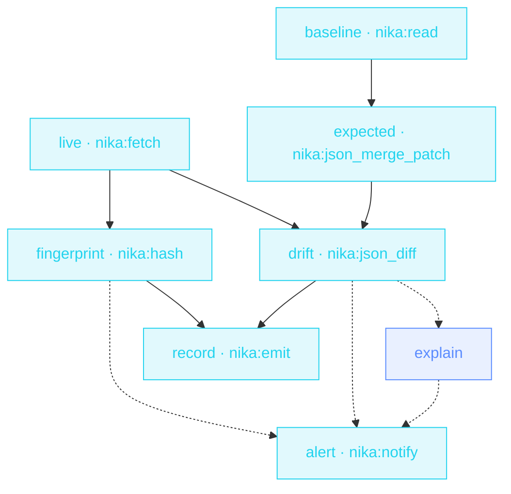

> **T3 · SRE / platform** — the deterministic-core pattern at its
> sharpest. Approved overrides merge into the baseline (RFC 7396), the
> live config diffs against THAT (RFC 6902), blake3 fingerprints the
> evidence — and the LLM's only job is explaining the patch to a human
> at 3am.

## The job

« Did anyone change prod config without telling us? » Pure-diff
monitors page you for every sanctioned change too — alert fatigue. This
sentinel knows what was approved: it reconstructs the EXPECTED state
first, so the diff contains only the drift nobody signed off on.

## The shape

{/* showcase:dag-begin t3-config-drift-sentinel.nika.yaml */}

{/* showcase:dag-end */}

## The file

{/* showcase:begin t3-config-drift-sentinel.nika.yaml */}
```yaml t3-config-drift-sentinel.nika.yaml
nika: v1
workflow: config-drift-sentinel
description: "live config vs sanctioned baseline → typed drift → explained alert"

model: mock/echo            # swap for anthropic/claude-haiku-4-5 — explain is cheap

vars:
  config_url: "https://api.internal.example.com/v1/config"
  baseline_path: "./ops/config-baseline.json"
  approved_overrides:
    type: object
    description: "Sanctioned config overrides (RFC 7396 merge-patch shape)"

secrets:
  oncall_webhook:
    source: env
    key: ONCALL_WEBHOOK_URL
    egress:                       # sanction the one send · the secret IS the URL
      - to: "nika:notify"
        host_from_self: true

tasks:
  - id: live
    invoke:
      tool: "nika:fetch"
      args:
        url: "${{ vars.config_url }}"
        mode: jq
        jq: "."
    retry:
      max_attempts: 3
      backoff_strategy: exponential

  - id: baseline
    invoke:
      tool: "nika:read"
      args: { path: "${{ vars.baseline_path }}" }

  - id: expected
    depends_on: [baseline]
    invoke:
      tool: "nika:json_merge_patch"
      args:
        target: "${{ tasks.baseline.output }}"
        patch: "${{ vars.approved_overrides }}"

  - id: drift
    depends_on: [expected, live]
    invoke:
      tool: "nika:json_diff"
      args:
        before: "${{ tasks.expected.output }}"
        after: "${{ tasks.live.output }}"

  - id: fingerprint
    depends_on: [live]
    invoke:
      tool: "nika:hash"
      args:
        algo: blake3
        content: "${{ tasks.live.output }}"
        encoding: hex

  - id: explain
    depends_on: [drift]
    when: ${{ size(tasks.drift.output) > 0 }}
    on_error:
      recover: "(explanation unavailable — model call failed · the raw patch is attached)"
    infer:
      prompt: |
        This RFC 6902 patch is UNSANCTIONED config drift in production ·
        ${{ tasks.drift.output }}
        Explain in 3 bullets · what changed · likely blast radius · first check.

  - id: alert
    depends_on: [explain, drift, fingerprint]
    when: ${{ size(tasks.drift.output) > 0 }}
    invoke:
      tool: "nika:notify"
      args:
        channel: webhook
        target: "${{ secrets.oncall_webhook }}"
        message: "Config drift detected · ${{ tasks.explain.output }} · live config blake3 ${{ tasks.fingerprint.output }}"
        severity: critical

  - id: record
    depends_on: [drift, fingerprint]
    invoke:
      tool: "nika:emit"
      args:
        event_type: "config.drift.scan"
        payload:
          patch: "${{ tasks.drift.output }}"
          live_hash: "${{ tasks.fingerprint.output }}"

outputs:
  drift:
    value: ${{ tasks.drift.output }}
    type: array
    description: "RFC 6902 operations · empty when prod matches the sanctioned state"
```
{/* showcase:end */}

## How it works

<Steps>
  <Step title="RFC 7396 reconstructs the sanctioned state">
    `nika:json_merge_patch` applies the approved overrides to the
    baseline — `null` deletes a key, exactly per the RFC. This is the
    builtin jq's recursive merge can't replace.
  </Step>
  <Step title="RFC 6902 names what actually changed">
    `nika:json_diff` returns a standard JSON Patch — machine-readable
    operations, not a text diff. Empty patch = healthy prod = total
    silence.
  </Step>
  <Step title="Evidence travels with the alert">
    The blake3 fingerprint of the live config rides in the alert AND in
    the `nika:emit` journal event — when you investigate later, you know
    exactly which state fired.
  </Step>
</Steps>

## Constructs you just used

| Construct | Where | Reference |
|---|---|---|
| `nika:json_merge_patch` (RFC 7396) | `expected` | [Builtins](/reference/builtins) |
| `nika:json_diff` (RFC 6902) | `drift` | [Builtins](/reference/builtins) |
| `nika:hash` blake3 | `fingerprint` | [Builtins](/reference/builtins) |
| `nika:emit` machine events | `record` | [Events](/concepts/events) |

## Make it yours

- Run it every 15 minutes from your scheduler; the `record` event stream becomes your drift history.
- Watch N services: lift the URL + baseline into a list and `for_each` the whole sentinel body.
- Auto-remediate the SAFE class: a `when:` branch that opens a revert PR via your MCP git server.

<Card title="Next · PR review fan-out" icon="code-pull-request" href="/examples/pr-review-fanout">
  One read-only agent per changed file — the swarm pattern, with a
  deterministic grep sweep beside it.
</Card>
