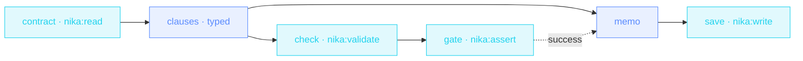

> **T2 chain · legal / compliance**: `model: ollama/llama3.2:3b` at the
> envelope means **every** model call in this file runs on your own
> hardware. For a contract, that's not a preference. It's the
> requirement. Belt-and-braces: `schema:` at infer time, `nika:validate`
> after, `nika:assert` as the hard gate.

## The job

Outside counsel takes a week. Pasting the contract into a cloud chatbot
takes your confidentiality with it. This workflow extracts every
risk-bearing clause (verbatim quotes, typed risk levels) locally,
re-validates the extraction, and refuses to write the memo if the data
doesn't hold.

## The shape

{/* showcase:dag-begin contract-guard.nika.yaml */}

{/* showcase:dag-end */}

## The file

{/* showcase:begin contract-guard.nika.yaml */}
```yaml contract-guard.nika.yaml
nika: contract-guard

# Local · the whole review runs offline, zero cloud. Also a NON-thinking
# model on purpose: a thinking model can spend the whole `max_tokens` budget
# in its think block and return before the JSON (engine#428).
model: ollama/llama3.2:3b

inputs:
  contract_path:
    type: string
    default: "examples/fixtures/contract.md"
    description: "Path to the contract (markdown or plain text)"
permits:
  tools: ["nika:assert", "nika:read", "nika:validate", "nika:write"]
  fs:
    # `permits:` cannot interpolate (NIKA-AUTH-007), so this literal does not
    # follow `inputs.contract_path` around: passing --var without editing this
    # line is refused at run with NIKA-SEC-004. Deliberate — a reviewer can
    # see every file this workflow may open by reading four words.
    read: ["examples/fixtures/contract.md"]
    write: ["out/risk-memo.md"]

tasks:
  contract:
    invoke:
      tool: "nika:read"
      args: { path: "${{ inputs.contract_path }}" }

  clauses:
    with:
      contract: ${{ tasks.contract.output }}
    infer:
      max_tokens: 1600
      prompt: |
        Extract every risk-bearing clause from this contract ·
        ${{ with.contract }}
        Quote each clause verbatim · classify its risk.
      schema:
        type: object
        additionalProperties: false
        required: [clauses]
        properties:
          clauses:
            type: array
            items:
              type: object
              additionalProperties: false
              required: [quote, type, risk]
              properties:
                quote: { type: string }
                type: { type: string, enum: [liability, termination, ip, payment, data, other] }
                risk: { type: string, enum: [low, medium, high] }

  check:
    with:
      clauses: ${{ tasks.clauses.output }}
    invoke:
      tool: "nika:validate"
      args:
        data: "${{ with.clauses }}"
        format: json
        schema:
          type: object
          required: [clauses]
          properties:
            clauses:
              type: array
              minItems: 1        # an empty extraction is a FAILED extraction

  gate:
    with:
      extraction_ok: ${{ tasks.check.output.valid == true }}   # the whole condition crosses as ONE boundary expression
    invoke:
      tool: "nika:assert"
      args:
        condition: "${{ with.extraction_ok }}"
        message: "Clause extraction failed the schema gate: refusing to write the memo"

  memo:
    with:
      clauses: ${{ tasks.clauses.output.clauses }}
    after:
      gate: success              # state, no data · the assert passed or the memo is cancelled
    infer:
      max_tokens: 1200
      prompt: |
        Write a one-page risk memo from these clauses ·
        ${{ with.clauses }}
        Order by risk · high first · cite the quoted text.

  save:
    with:
      memo: ${{ tasks.memo.output }}
    invoke:
      tool: "nika:write"
      args:
        path: out/risk-memo.md
        content: "${{ with.memo }}"
        create_dirs: true

outputs:
  clauses:
    value: ${{ tasks.clauses.output.clauses }}
    description: "Typed risk-bearing clauses, verbatim quotes"
  memo: ${{ tasks.memo.output }}
```
{/* showcase:end */}

## How it works

<Steps>
  <Step title="Sovereignty is one line">
    The envelope `model:` points at Ollama. Same file, same schema, same
    everything, just no cloud. Swap back to a cloud provider for
    non-sensitive documents; the workflow doesn't change shape.
  </Step>
  <Step title="validate re-checks what schema promised">
    `nika:validate` runs the extraction against a second, stricter
    schema (`minItems: 1`) and returns `{valid, errors}`: belt and
    braces for legal-grade output.
  </Step>
  <Step title="assert is the fail-fast guard">
    `when:` skips; `nika:assert` FAILS. A memo built on a bad extraction
    is worse than no memo, so the gate throws, loudly.
  </Step>
</Steps>

## Constructs you just used

| Construct | Where | Reference |
|---|---|---|
| local provider (`ollama/…`) | envelope `model:` | [Providers](/concepts/providers) |
| `nika:validate` | `check` | [Builtins](/reference/builtins) |
| `nika:assert` vs `when:` | `gate` | [Builtins](/reference/builtins) |
| verbatim-quote schema | `clauses` | [The 4 verbs](/concepts/verbs) |

## Make it yours

- Compare against your clause playbook: `nika:read` the playbook + a second `infer` that flags deviations.
- Batch a folder of NDAs: `nika:glob` + `for_each` ([Localization factory](/examples/localization-factory) shows the chained fan-out).
- HR version: same shape over candidate agreements or policy docs. Sensitive data, local model, typed findings.

<Card title="Level up · T3 fan-out" icon="satellite-dish" href="/examples/competitor-radar">
  Next tier: collections the workflow discovers at runtime, processed in
  parallel with retry and a leash.
</Card>
