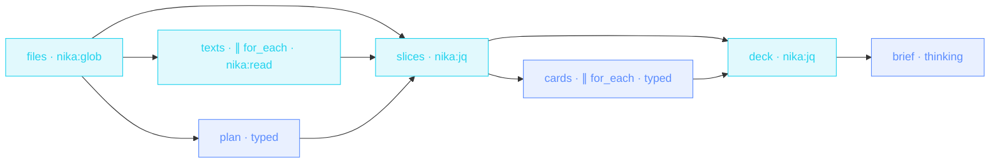

> **T4 epic · research / any corpus one window cannot hold**: context
> folding. A fast pass plans a focus per file **from the paths alone**,
> each document is carded in its **own fresh window**, jq assembles and
> ranks the deck, a thinking pass answers from the cards. No model
> window ever holds two documents.

## The job

« What do these forty documents actually establish? » is either one
giant prompt that rots halfway through, or it is this pipeline: the
corpus stays in the dataflow, each model call sees one slice, and the
synthesis reads a deck of typed cards it can actually hold.

## The shape

{/* showcase:dag-begin corpus-digest.nika.yaml */}

{/* showcase:dag-end */}

## The file

{/* showcase:begin corpus-digest.nika.yaml */}
```yaml corpus-digest.nika.yaml
nika: corpus-digest

run:
  clock: system   # the `timeout:` deadlines below ride the wall clock · said out loud (see 03)

# The house local seat. The embedded catalog marks qwen3.5:4b as a
# non-reasoning model, so this workflow declares no `thinking:` block.
# Its generous output ceilings leave room for complete typed forms.
# One resident seat also spares the model-swap
# thrash of per-task overrides on a single GPU (measured: alternating two
# seats sent every stage cold and timed the synthesis out).
model: ollama/qwen3.5:4b   # local · zero key · `--model mock/echo` rehearses the whole file

inputs:
  question:
    type: string
    default: "What do these documents establish, and where do they disagree?"
    description: "The question the brief must answer · free text (--var question=…)"

const:
  # The committed rehearsal tree — two small markdown files. Point this at
  # your real corpus and change `permits.fs.read` in the same edit.
  corpus_root: "./examples/fixtures/docs"

permits:
  # Read-only by construction: no `nika:write`, no `fs.write`, no network.
  # The digest's product is its typed `outputs:` — this file cannot touch
  # anything, which is exactly what you want from a tool that reads your
  # documents.
  tools: ["nika:glob", "nika:jq", "nika:read"]
  fs:
    # `nika:glob` opens the ROOT of its pattern, so the bound covers the
    # directory and everything under it (see localization-factory for the
    # long version of this note).
    read: ["./examples/fixtures/docs/**"]

tasks:
  # ── the corpus is discovered, never declared ────────────────────────
  files:
    invoke:
      tool: "nika:glob"
      args:
        pattern: "${{ const.corpus_root }}/**/*.md"

  # ── plan · a focus per file, from the MAP, never the territory ─────
  # The planner sees paths, not contents: filenames are cheap tokens and
  # they are enough to divide the work. Nothing the model says here can
  # read a file, and nothing it says below can name one.
  plan:
    with:
      question: ${{ inputs.question }}
      files: ${{ tasks.files.output }}
    timeout: "8m"                # a local seat may be slow · bounded, not instant
    infer:
      max_tokens: 6000           # the form plus margin, not hope
      prompt: |
        Assign one focus of 3 to 8 words to each file path. The focuses
        serve this question: ${{ with.question }}
        Paths · ${{ with.files }}
        Return the assignments only.
      schema:
        # `additionalProperties: false` on every object node — the plan is
        # read by jq below, so its shape is a promise, not a hope.
        type: object
        additionalProperties: false
        required: [assignments]
        properties:
          assignments:
            type: array
            items:
              type: object
              additionalProperties: false
              required: [path, focus]
              properties:
                path: { type: string }
                focus: { type: string }

  # ── read every file · disk wave, no model in sight ─────────────────
  texts:
    with:
      files: ${{ tasks.files.output }}
    for_each:
      items: ${{ with.files }}
      max_parallel: 8              # local disk · the only cost is file handles
    invoke:
      tool: "nika:read"
      args: { path: "${{ item }}" }

  # ── the join · discovered path + planned focus + text ──────────────
  # The glob list is the spine: `texts` is index-aligned with `files`, so
  # transpose pairs them, and the plan joins BY PATH through a lookup
  # table. A path the planner invented matches nothing; a file the planner
  # skipped falls back to the question itself. Model output steers focus —
  # it never steers which files exist or get read.
  slices:
    with:
      files: ${{ tasks.files.output }}
      texts: ${{ tasks.texts.output }}
      assignments: ${{ tasks.plan.output.assignments }}
      question: ${{ inputs.question }}
    invoke:
      tool: "nika:jq"
      args:
        input: ["${{ with.files }}", "${{ with.texts }}", "${{ with.assignments }}"]
        expression: >-
          . as [$files, $texts, $plan]
          | ($plan | map({ key: .path, value: .focus }) | from_entries) as $focus
          | [$files, $texts] | transpose
          | map({ path: .[0], focus: ($focus[.[0]] // "${{ with.question }}"), text: .[1] })

  # ── card each document · one FRESH window per slice ────────────────
  # This is the fold. Each iteration's prompt holds exactly one document
  # and its focus — never a sibling, never the history. Ten documents cost
  # ten small windows, not one window ten documents deep.
  cards:
    with:
      slices: ${{ tasks.slices.output }}
    for_each:
      items: ${{ with.slices }}
      max_parallel: 3              # rate-limit the provider, not the disk
      fail_fast: false             # finish the batch · one bad doc is not a batch failure
    timeout: "8m"                # per ITERATION · same reasoning as `plan`
    on_error:
      recover: null              # null holds the index open so the zip below stays aligned
    infer:
      max_tokens: 6000           # a complete card plus margin
      prompt: |
        Fill the card for ONE document. Claims are one sentence each,
        quotes are verbatim and short, relevance is 0 to 5 for the focus.
        Return the card only.
        Focus · ${{ item.focus }}
        Document (${{ item.path }}) ·
        ${{ item.text }}
      schema:
        # No `path` in the card: the model summarizes, it does not get to
        # say which file it was reading. Identity is re-attached by
        # transpose below — deterministically.
        type: object
        additionalProperties: false
        required: [claims, quotes, relevance]
        properties:
          claims:
            type: array
            items: { type: string }
          quotes:
            type: array
            items: { type: string }
          relevance:
            type: integer

  # ── the deck · deterministic merge, rank, and prune ────────────────
  # jq decides; the model explained. Failed cards leave by VALUE (the
  # nulls `recover:` held in place), the rest are re-keyed to their path
  # and sorted by the model's own relevance score — but the SORT is ours.
  deck:
    with:
      slices: ${{ tasks.slices.output }}
      cards: ${{ tasks.cards.output }}
    invoke:
      tool: "nika:jq"
      args:
        input: ["${{ with.slices }}", "${{ with.cards }}"]
        expression: >-
          transpose
          | map(select(.[1] != null))
          | map({ path: .[0].path, claims: .[1].claims, quotes: .[1].quotes, relevance: .[1].relevance })
          | sort_by(-.relevance)

  # ── the brief · the synthesis reads the deck, never the corpus ─────
  brief:
    with:
      question: ${{ inputs.question }}
      deck: ${{ tasks.deck.output }}
    # The synthesis only runs on a NON-EMPTY deck. `recover: null` above
    # keeps a failed card from aborting the batch — but if EVERY card
    # died, an ungated brief would synthesize from nothing and sound
    # confident doing it. The gate turns that silent hazard into a
    # visible skip.
    when: ${{ size(with.deck) > 0 }}
    timeout: "12m"               # judgment gets patience · still bounded
    infer:
      max_tokens: 8000           # enough room to reconcile the full deck
      prompt: |
        Question · ${{ with.question }}
        Deck of source cards · ${{ with.deck }}
        Answer the question from the cards alone. Cite the `path` of every
        card you lean on. Where cards disagree, say so — do not resolve a
        conflict the sources did not resolve.

# Both the brief and the deck, so the fold is inspectable: the deck is
# everything the synthesis was allowed to see. Read with `--output json`.
outputs:
  brief: ${{ tasks.brief.output }}
  deck:
    value: ${{ tasks.deck.output }}
    description: "The ranked cards the brief was written from · one per document that survived"
  files:
    value: ${{ tasks.files.output }}
    description: "Every path the glob discovered · the spine of the fold"
```
{/* showcase:end */}

## How it works

<Steps>
  <Step title="The window never scales with the corpus">
    Ten documents cost ten small windows plus one deck-sized synthesis,
    not one window ten documents deep. The fold is the point: adding a
    file adds an iteration, it never grows a prompt.
  </Step>
  <Step title="The model plans the focus, the filesystem stays the authority">
    The planner sees paths, never contents, and its assignments join the
    glob list **by path** in jq. A hallucinated path joins nothing and
    drives nothing; a skipped file falls back to the question itself.
  </Step>
  <Step title="A card cannot be misfiled">
    The card schema has no `path` field on purpose: the model summarizes,
    transpose re-attaches identity deterministically. The deck the
    synthesis reads is everything it was allowed to see, and the typed
    `outputs:` expose that deck for inspection.
  </Step>
</Steps>

## Constructs you just used

| Construct | Where | Reference |
|---|---|---|
| `for_each` over a planned collection | `cards` | [YAML syntax](/reference/yaml-syntax) |
| join-by-key in `nika:jq` (`from_entries`) | `slices` | [Builtins](/reference/builtins) |
| `fail_fast: false` + `recover: null` fan-in | `cards` → `deck` | [YAML syntax · `on_error`](/reference/yaml-syntax) |
| typed synthesis over the filtered deck | `brief` | [The 4 verbs](/concepts/verbs) |

## Make it yours

- Point `const.corpus_root` and the matching `permits.fs.read` entry at
  your real folder · the two move together (`NIKA-AUTH-007`).
- Chunk instead of file-split: for documents that are each too big for a
  window, add a jq task that slices `texts` into sections and fan out
  over the sections · the fold works at any grain.
- Feed the deck onward: the typed `outputs:` make this callable, so a
  parent workflow can consume `{brief, deck}` as a contract · pair it
  with [Deep research brief](/examples/deep-research-brief) to digest
  what the agent fetched.

<Card title="Next · Deep research brief" icon="microscope" href="/examples/deep-research-brief">
  The same plan-then-execute skeleton with an agent middle: when the
  work needs judgment calls between fetches, the loop earns its place.
</Card>
