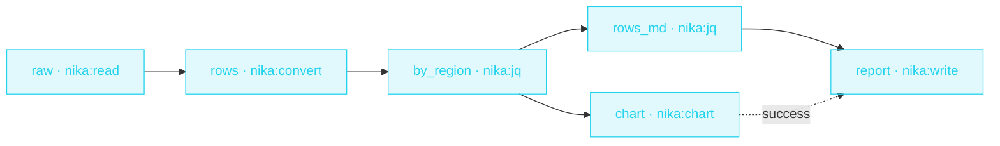

> **T2 chain · data → picture**: `nika:read` loads the CSV,
> `nika:convert` types it into rows, `nika:jq` aggregates by region,
> `nika:chart` renders the bar chart as a real image, and `nika:write`
> assembles the markdown report around it. Five tasks, zero model
> calls — the whole pipeline is deterministic data plumbing.

## The job

The Monday deck needs one chart and one table, and the ritual is
always the same: open the sheet, pivot, screenshot, paste. This
workflow replaces the ritual with a file — drop the CSV, run once,
and the report (chart image + aggregate table) is on disk, identical
every time the data is identical.

## The shape

{/* showcase:dag-begin csv-chart-report.nika.yaml */}

{/* showcase:dag-end */}

## The file

{/* showcase:begin csv-chart-report.nika.yaml */}
```yaml csv-chart-report.nika.yaml
nika: csv-chart-report

const:
  sales_csv: "examples/fixtures/sales.csv" # columns · region,revenue (revenue a plain number)

permits:
  exec: false
  tools: ["nika:chart", "nika:convert", "nika:jq", "nika:read", "nika:write"]
  fs:
    # The one CSV this reads, named exactly. `data/**` would have granted a
    # whole tree to a workflow that opens a single file.
    read: ["examples/fixtures/sales.csv"]
    # Two artifacts land here — the SVG and the report page. `**` because the
    # chart and the report are written by two different builtins into the
    # same tree, and both are covered by one honest entry.
    write: ["out/**"]

tasks:
  raw:
    invoke:
      tool: "nika:read"
      args: { path: "${{ const.sales_csv }}" }

  rows:
    with:
      raw: ${{ tasks.raw.output }}
    invoke:
      tool: "nika:convert"
      args:
        input: "${{ with.raw }}"
        from: csv
        to: json
        has_header: true

  # Sum revenue per region · a deterministic reduce, no model.
  by_region:
    with:
      rows: ${{ tasks.rows.output }}
    invoke:
      tool: "nika:jq"
      args:
        input: "${{ with.rows }}"
        expression: 'group_by(.region) | map({ region: .[0].region, revenue: (map(.revenue | tonumber) | add) })'

  # The picture · one SVG, its sha lands in the trace.
  chart:
    with:
      by_region: ${{ tasks.by_region.output }}
    invoke:
      tool: "nika:chart"
      args:
        data: "${{ with.by_region }}"
        semantics: { region: category, revenue: usd }
        chart: { type: bar, x: region, y: revenue, title: "Revenue by region" }
        out: out/revenue-by-region.svg

  # The rows as MARKDOWN · a report renders lines, never a JSON blob
  # (region names are user data — the esc guards a `|` in them).
  rows_md:
    with:
      by_region: ${{ tasks.by_region.output }}
    invoke:
      tool: "nika:jq"
      args:
        input: "${{ with.by_region }}"
        expression: >-
          def esc: tostring | gsub("\\|"; "\\|") | gsub("\n"; " ");
          map("| \(.region | esc) | \(.revenue) |") | join("\n")

  # The page · the report references the picture beside it.
  report:
    with:
      rows_md: ${{ tasks.rows_md.output }}
    after:
      chart: success
    invoke:
      tool: "nika:write"
      args:
        path: out/revenue-report.md
        content: |
          # Revenue by region

          

          | region | revenue |
          | --- | --- |
          ${{ with.rows_md }}

          *Generated offline by [nika](https://nika.sh) · the chart's sha is in the run trace (`nika trace verify`).*

outputs:
  by_region:
    value: ${{ tasks.by_region.output }}
    description: "Per-region revenue totals · the chart + report render from this"
```
{/* showcase:end */}

## What this file teaches

- **`nika:convert` is the typed seam** — CSV text becomes structured
  rows once, at one task, and everything downstream works on data,
  not strings. The jq aggregation reads fields, never re-parses.
- **A chart is an artifact, not a side effect** — `nika:chart` returns
  a rendered image the report links by path. Re-running with the same
  CSV produces the same bytes: the chart can live in git, and a diff
  on it means the *data* moved.
- **No model, no bill, no network** — `nika check` shows an empty cost
  interval, and the run works on a plane. Determinism is the feature:
  this is the workflow you trust in a cron.

## Run it

```bash
nika try csv-chart-report      # see it work · offline · nothing written
nika new csv-chart-report      # take it · the sample CSV lands beside it
nika run csv-chart-report.nika.yaml
open out/revenue-report.md
```

Swap the bundled sample for your own export by pointing
`const.sales_csv` at it — the aggregation key and the chart spec are
the only two lines to adapt.
