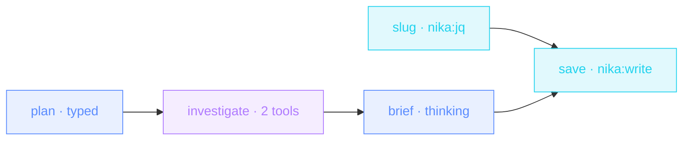

> **T4 epic · research / consulting / VC**: plan-then-execute. A fast
> model writes the plan, an agent works the web **under explicit
> budgets**, a thinking model synthesizes. Three stages, three different
> cost profiles, every intermediate on disk.

## The job

« Get me up to speed on X by Thursday » is two days of tabs, or it's
this pipeline: four sharp queries planned, researched with verbatim
quotes and source tracking, synthesized into an executive brief that
separates what's true from what's contested.

## The shape

{/* showcase:dag-begin deep-research-brief.nika.yaml */}

{/* showcase:dag-end */}

## The file

{/* showcase:begin deep-research-brief.nika.yaml */}
```yaml deep-research-brief.nika.yaml
nika: v1
workflow:
  id: deep-research-brief
  description: "plan → budgeted research agent → thinking synthesis → brief on disk"

model: ollama/qwen3.5:4b   # local · zero key · `--model mock/echo` rehearses the whole file

vars:
  topic:
    type: string
    default: "local-first AI runtimes"
    description: "What to research · free text (--var topic=…), and it never touches a path directly"

permits:
  tools: ["nika:done", "nika:fetch", "nika:jq", "nika:write"]
  net:
    # There is no `*` here and there never will be: `net.http` entries are exact
    # host names. An agent told to « research the web » therefore cannot — the
    # corpus it may reach is a decision taken HERE, before the loop starts,
    # rather than discovered afterwards in a trace. Add the sources you actually
    # trust; the agent's fetch is judged against this list at RUN, and `check`
    # cannot see it coming because the agent chooses its own URLs.
    http:
      - "arxiv.org"
      - "export.arxiv.org"
      - "en.wikipedia.org"
      - "hn.algolia.com"
  fs:
    # One brief per topic, written DIRECTLY in ./research/. `*` matches a single
    # segment and never crosses `/`, so even a slug that somehow kept a slash is
    # refused rather than steered into a subtree — `./research/**` would let it
    # through. The slug task below makes that doubly hard; the wall makes it
    # impossible, and only one of the two is a guarantee.
    write: ["./research/*.md"]

tasks:
  # The topic is free text — « Local-First AI Runtimes: a survey/2026 » — and it
  # ends up in a filename. Deriving the slug in jq keeps that arithmetic out of
  # the model AND out of the path: the expression is total, so there is no input
  # for which it returns something containing a separator.
  slug:
    invoke:
      tool: "nika:jq"
      args:
        input: "${{ vars.topic }}"
        expression: 'ascii_downcase | gsub("[^a-z0-9]+"; "-") | gsub("^-|-$"; "")'

  plan:
    infer:
      max_tokens: 400              # planning is short · cap it and the cost report is a ceiling
      prompt: "Break '${{ vars.topic }}' into 4 sharp research queries · no overlap."
      schema:
        # `additionalProperties: false` on every object node — without it the
        # shape is a suggestion and each provider answers with a slightly
        # different object. `plan.output.queries` is read below, so it has to be
        # a promise, not a hope.
        type: object
        additionalProperties: false
        required: [queries]
        properties:
          queries:
            type: array
            items: { type: string }

  investigate:
    with:
      queries: ${{ tasks.plan.output.queries }}
    agent:
      system: |
        You are a rigorous researcher. Work the queries one by one · fetch
        sources · keep verbatim quotes · note what each source actually
        supports, and what it does not. If a fetch is refused, record that the
        source was out of bounds rather than substituting another.
        Call nika:done when the plan is exhausted.
      prompt: "Research plan · ${{ with.queries }}"
      tools:
        # Every id here must also appear in `permits.tools` above — `check`
        # refuses the mismatch statically (NIKA-SEC-004 · agent tool … is
        # outside permits.tools). Note what is NOT granted: `nika:write`. The
        # agent's product is the typed object it returns, so it never needs a
        # file of its own, and the workflow keeps the only pen in the room.
        - "nika:fetch"                 # the corpus named in permits.net.http
        - "nika:done"                  # the loop-completion sentinel
      max_turns: 25                    # the leash · a loop that cannot end is a bill
      max_tokens_total: 150000         # and the second leash, in tokens
      schema:
        type: object
        additionalProperties: false
        required: [findings, sources]
        properties:
          findings:
            type: array
            items: { type: string }
          sources:
            type: array
            items: { type: string }

  brief:
    with:
      findings: ${{ tasks.investigate.output.findings }}
      sources: ${{ tasks.investigate.output.sources }}
    infer:
      max_tokens: 2000
      prompt: |
        Findings · ${{ with.findings }}
        Sources · ${{ with.sources }}
        Write the executive brief · what's true · what's contested · what it
        means · what to do. Two pages max. Anything the sources do not support
        goes in « contested », never in « true ».
      thinking:
        # A reasoning budget, honoured by seats that support extended thinking
        # and ignored by the ones that do not — declaring it never fails a run.
        enabled: true
        budget_tokens: 8000

  save:
    with:
      slug: ${{ tasks.slug.output }}
      brief: ${{ tasks.brief.output }}
    invoke:
      tool: "nika:write"
      args:
        path: "./research/${{ with.slug }}.md"
        content: "${{ with.brief }}"
        create_dirs: true

outputs:
  brief: ${{ tasks.brief.output }}
  sources:
    value: ${{ tasks.investigate.output.sources }}
    description: "Every source the agent actually used"
  slug:
    value: ${{ tasks.slug.output }}
    description: "The filename stem the brief landed under · ./research/<slug>.md"
```
{/* showcase:end */}

## How it works

<Steps>
  <Step title="Right model, right stage">
    Planning is a haiku-class job (`model:` override on the task);
    synthesis gets a `thinking:` budget. The envelope default covers the
    middle. One file, three cost profiles.
  </Step>
  <Step title="The agent has a leash">
    `max_turns: 25` + `max_tokens_total: 150000` bound the loop;
    `nika:done` lets it exit cleanly when the plan is exhausted. The
    final message must match the schema: findings AND sources.
  </Step>
  <Step title="Callable by other workflows">
    The typed `outputs:` (`brief`, `sources`) make this a building
    block: a parent workflow can consume the contract without parsing
    prose.
  </Step>
</Steps>

## Constructs you just used

| Construct | Where | Reference |
|---|---|---|
| per-task `model:` override | `plan` | [Providers](/concepts/providers) |
| agent budgets + `nika:done` | `investigate` | [The 4 verbs](/concepts/verbs) |
| `thinking:` | `brief` | [The 4 verbs](/concepts/verbs) |
| typed `outputs:` | envelope tail | [YAML syntax](/reference/yaml-syntax) |

## Make it yours

- Force source-grounding harder: have `brief` cite `${{ tasks.investigate.output.sources }}` inline per claim.
- Competitive variant: seed `plan` with [Competitor radar](/examples/competitor-radar)'s digest instead of a bare topic.
- Weekly cadence: pair with your scheduler and diff this week's brief against last week's with `nika:json_diff`.

<Card title="Next · Incident war room" icon="fire-extinguisher" href="/examples/incident-war-room">
  Parallel evidence gathering, a settle-and-recheck loop, and a
  postmortem that refuses to claim recovery it can't prove.
</Card>
