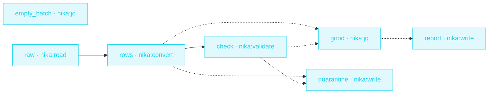

> **T2 chain · data engineering** — the `on_error: recover:` example.
> The difference between « re-run the whole night » and « fix three
> rows tomorrow morning » is one block: bad data is **data**, not an
> exception.

## The job

The nightly batch dies at row 14,203 and the whole pipeline dies with
it. Here the malformed-CSV case recovers to an empty batch, the schema
gate splits good from bad, rejects land in a quarantine file with
their validation errors, and the good rows aggregate per currency —
in jq, deterministically.

## The shape

{/* showcase:dag-begin t2-etl-quarantine.nika.yaml */}

{/* showcase:dag-end */}

## The file

{/* showcase:begin t2-etl-quarantine.nika.yaml */}
```yaml t2-etl-quarantine.nika.yaml
nika: v1
workflow: etl-quarantine
description: "CSV batch → schema gate → quarantine the bad · aggregate the good"

vars:
  batch_csv: "./data/incoming/orders.csv"

tasks:
  # A deterministic empty fallback · the recover target when parsing dies.
  - id: empty_batch
    invoke:
      tool: "nika:jq"
      args: { input: [], expression: "." }

  - id: raw
    invoke:
      tool: "nika:read"
      args: { path: "${{ vars.batch_csv }}" }

  - id: rows
    depends_on: [raw]
    invoke:
      tool: "nika:convert"
      args:
        input: "${{ tasks.raw.output }}"
        from: csv
        to: json
        has_header: true
    on_error:
      recover: ${{ tasks.empty_batch.output }}    # malformed CSV → empty batch · pipeline lives

  - id: check
    depends_on: [rows]
    invoke:
      tool: "nika:validate"
      args:
        data: "${{ tasks.rows.output }}"
        format: json
        schema:
          type: array
          items:
            type: object
            required: [order_id, amount, currency]
            properties:
              order_id: { type: string }
              amount: { type: string }
              currency: { type: string, enum: [EUR, USD, GBP] }

  - id: good
    depends_on: [rows, check]
    when: ${{ tasks.check.output.valid == true }}
    invoke:
      tool: "nika:jq"
      args:
        input: "${{ tasks.rows.output }}"
        expression: 'group_by(.currency) | map({currency: .[0].currency, orders: length, total: (map(.amount | tonumber) | add)})'

  - id: quarantine
    depends_on: [rows, check]
    when: ${{ tasks.check.output.valid == false }}
    invoke:
      tool: "nika:write"
      args:
        path: "./data/quarantine/orders-rejected.json"
        content: "${{ tasks.check.output.errors }}"
        create_dirs: true

  - id: report
    depends_on: [good]
    when: ${{ tasks.good.output != null && size(tasks.good.output) > 0 }}   # good is SKIPPED (null) on the quarantine path · guard before size()
    invoke:
      tool: "nika:write"
      args:
        path: "./data/reports/daily-totals.json"
        content: "${{ tasks.good.output }}"
        create_dirs: true

outputs:
  totals:
    value: ${{ tasks.good.output }}
    type: array
    description: "Per-currency order totals · empty when the batch was quarantined"
```
{/* showcase:end */}

## How it works

<Steps>
  <Step title="recover: is the safety net">
    `on_error: recover: ${{ tasks.empty_batch.output }}` — when the
    CSV won't parse, the task yields the fallback instead of failing.
    Downstream sees an empty batch, not a dead pipeline.
  </Step>
  <Step title="The gate splits, when: routes">
    `nika:validate` returns `{valid, errors}` · two `when:` branches
    route the run — good rows aggregate, bad batches quarantine WITH
    their error report.
  </Step>
  <Step title="jq does the accounting">
    `group_by(.currency)` + `add` — totals are arithmetic, not model
    output. No LLM call anywhere in this workflow.
  </Step>
</Steps>

## Constructs you just used

| Construct | Where | Reference |
|---|---|---|
| `on_error: recover:` | `rows` | [Error model](/reference/error-codes) |
| `nika:validate` gate | `check` | [Builtins](/reference/builtins) |
| `when:` branch routing | `good` · `quarantine` | [Workflows](/concepts/workflows) |
| jq aggregation | `good` | [Builtins](/reference/builtins) |

## Make it yours

- Add a `nika:notify` task on the quarantine branch — data-quality alerts only when something was actually rejected.
- Chain [Release notes](/examples/release-notes)' pattern to post the daily totals to your team channel.
- Validate against your real row schema — the gate is just JSON Schema.

<Card title="Next · Release radar" icon="signal" href="/examples/release-radar">
  The feed-mode example — RSS/Atom parsed natively, diffed against
  last run's state.
</Card>
