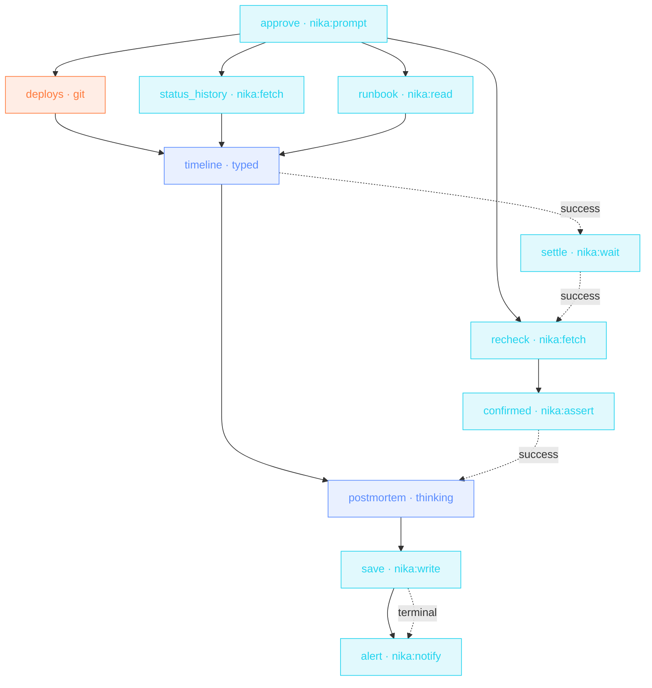

> **T4 epic · SRE / on-call**: three evidence sources gathered in
> parallel, a typed timeline, then the honest part: `nika:wait` a settle
> window, re-poll the status API, and `nika:assert` refuses to draft a
> « resolved » postmortem while prod still burns. `on_finally:` files
> the journal event and the ping NO MATTER WHAT.

## The job

The hour after an incident is logs, Slack archaeology and a postmortem
nobody wants to start. This pipeline assembles the evidence, rebuilds
the timeline as typed events, proves recovery, and leaves a draft
(summary, impact, hypotheses, actions) in the incidents folder before
the retro is scheduled.

## The shape

{/* showcase:dag-begin incident-war-room.nika.yaml */}

{/* showcase:dag-end */}

## The file

{/* showcase:begin incident-war-room.nika.yaml */}
```yaml incident-war-room.nika.yaml
nika: incident-war-room

model: ollama/qwen3.5:4b   # local · zero key · `--model mock/echo` rehearses the whole file

inputs:
  alert:
    type: bool
    default: false
    description: "Ping on-call when the run settles. OFF by default so a rehearsal touches no webhook."
  settle:
    type: string
    default: "30s"
    description: "How long to let the fix propagate before the confirming re-poll"
  status_url:
    type: string
    default: "https://status.internal.example.com/v1/services/checkout-api"
    description: "The service status endpoint · polled twice"

const:
  service: "checkout-api"
  log_window: "90 minutes ago"
  runbook: "./examples/fixtures/checkout-api-runbook.md"

secrets:
  oncall_webhook:
    source: env
    key: ONCALL_WEBHOOK_URL
    egress:                       # sanction the one send · the secret IS the URL
      - to: "nika:notify"
        host_from_self: true
permits:
  exec: ["git"]
  tools: ["nika:assert", "nika:fetch", "nika:notify", "nika:prompt", "nika:read", "nika:wait", "nika:write"]
  net:
    http:
      # The status host is judged here even though the URL arrives as an input:
      # an input moves the ARGUMENT, never the wall. Point --var status_url at
      # another host and the poll is refused NIKA-SEC-004 until you name it here.
      - "status.internal.example.com"
      # `host_from_self:` above sanctions the FLOW (the secret may be the URL) —
      # it does not grant the capability. The host stays unknown at check, so it
      # is judged at RUN against this bound: name the escalation host here or the
      # send is refused mid-run, after the tokens are already spent.
      - "hooks.slack.com"         # swap for wherever ONCALL_WEBHOOK_URL points
  fs:
    # The write path is built from `const.service`, so it is pinned before the
    # run starts — but `check` reads straight past a const embedded in a longer
    # string, so it is not declared for you. Written out literally, because a
    # permit bound IS the wall and cannot interpolate (NIKA-AUTH-007).
    read: ["./examples/fixtures/checkout-api-runbook.md"]
    write: ["./incidents/checkout-api-postmortem.md"]

tasks:
  # ── the human gate · FIRST, before any evidence is gathered ──
  #
  # All three trifecta legs are live here: a private read (the runbook),
  # untrusted ingress (the status endpoint), and external egress (git, the
  # status host, the write, the webhook). NEP-0002 requires a blocking human
  # gate that DOMINATES every path to every egress-capable task, so it belongs
  # at the root — a gate placed later cannot dominate, because the gathered
  # evidence reaches the postmortem along its own data edge.
  #
  # On-call is already at the keyboard during an incident, so one confirmation
  # up front costs nothing and authorizes the whole envelope at once.
  approve:
    invoke:
      # blocking · no `default:` · a gate with a default is not a gate, and the
      # checker agrees in both directions: add `default:` here and NIKA-SEC-009
      # fires instead, because a defaulted prompt no longer dominates anything.
      # The [headless-prompt] hint is the price of a real gate — pay it here.
      # Pauses the run (exit 4) — resume with
      #   nika run <file> --resume <trace> --answer approve=true
      tool: "nika:prompt"
      args:
        message: |
          Incident war-room for ${{ const.service }} will:
            · read git history for the last ${{ const.log_window }}
            · poll ${{ inputs.status_url }} (twice, ${{ inputs.settle }} apart)
            · read ${{ const.runbook }}
            · write ./incidents/${{ const.service }}-postmortem.md
            · ping the on-call webhook (armed: ${{ inputs.alert }})

          Proceed? [yes/no]

  # ── the gather wave · all three run in parallel, one per verb ──

  # « What shipped just before it broke? » is the first question of every
  # incident, and the runbook says so out loud.
  deploys:
    with:
      go: ${{ tasks.approve.output }}
    when: ${{ with.go == true }}
    exec:
      command: ["git", "--no-pager", "log", "--oneline", "--since=${{ const.log_window }}"]
    on_error:
      # Missing evidence is EVIDENCE. The stand-in is labelled so the timeline
      # below is told the deploy log was unreadable and cannot quietly invent a
      # release that never happened.
      recover: "(deploy log unavailable · git could not be read here)"

  status_history:
    with:
      go: ${{ tasks.approve.output }}
    when: ${{ with.go == true }}
    invoke:
      tool: "nika:fetch"
      args:
        url: "${{ inputs.status_url }}"
        mode: jq
        jq: ".history"
    retry:
      # A status page mid-incident is exactly the endpoint that flaps. Retry is
      # safe here because a GET is idempotent — the checker warns [retry-effects]
      # when you retry something that is not.
      max_attempts: 3
      backoff_strategy: exponential
      jitter: true
    on_error:
      recover: []                 # offline · no history to reconstruct from

  runbook:
    with:
      go: ${{ tasks.approve.output }}
    when: ${{ with.go == true }}
    invoke:
      tool: "nika:read"
      args: { path: "${{ const.runbook }}" }

  # ── reconstruct · a TYPED timeline, not a paragraph ──
  timeline:
    with:                               # three value edges · the wave joins here
      deploys: ${{ tasks.deploys.output }}
      history: ${{ tasks.status_history.output }}
      runbook: ${{ tasks.runbook.output }}
    when: ${{ with.runbook != null && size(with.runbook) > 0 }}   # « no » at the gate (null) or an empty answer · nothing to reconstruct
    infer:
      max_tokens: 1500
      prompt: |
        Deploys in the window ·
        ${{ with.deploys }}
        Status history · ${{ with.history }}
        Runbook · ${{ with.runbook }}

        Reconstruct the incident timeline as events. Every event cites the
        evidence it came from; if a source says it is unavailable, say the
        timeline is incomplete rather than filling the gap.
      schema:
        # `additionalProperties: false` on EVERY object node — without it the
        # shape is a suggestion and each provider returns a slightly different
        # object. A typed timeline is the whole point of this task.
        type: object
        additionalProperties: false
        required: [events]
        properties:
          events:
            type: array
            items:
              type: object
              additionalProperties: false
              required: [at, what, evidence]
              properties:
                at: { type: string }
                what: { type: string }
                evidence: { type: string }

  # ── settle, then confirm recovery before claiming it ──
  settle:
    after:
      timeline: success              # state, no data · wait only once there is something to confirm
    invoke:
      tool: "nika:wait"
      args: { duration: "${{ inputs.settle }}" }

  recheck:
    after:
      settle: success
    with:
      go: ${{ tasks.approve.output }}   # the second network touch re-reads the decision too
    when: ${{ with.go == true }}
    invoke:
      tool: "nika:fetch"
      args:
        url: "${{ inputs.status_url }}"
        mode: jq
        jq: ".current.state"
    on_error:
      # The rehearsal's stand-in says the service came back, so the green path
      # is the one you see offline. Point --var status_url at a real endpoint
      # and anything other than « operational » blocks the draft below — that
      # refusal is the designed path, not a bug in the file.
      recover: "operational"

  confirmed:
    with:
      recovered: ${{ tasks.recheck.output == 'operational' }}   # the whole check crosses as ONE boundary expression
    invoke:
      tool: "nika:assert"
      args:
        condition: "${{ with.recovered }}"
        message: "Service is NOT back to operational: postmortem draft blocked"

  # ── the draft · only after recovery is proven ──
  postmortem:
    with:
      events: ${{ tasks.timeline.output }}
    after:
      confirmed: success             # state, no data · recovery proven or no draft
    infer:
      max_tokens: 2000
      prompt: |
        Timeline · ${{ with.events }}
        Write the postmortem draft · summary · impact · root-cause
        hypotheses · 3 follow-up actions with owners left blank.
      thinking:
        # A reasoning budget, honoured by seats that support extended thinking
        # and ignored by the ones that do not — declaring it never fails a run.
        enabled: true
        budget_tokens: 4000

  save:
    with:
      postmortem: ${{ tasks.postmortem.output }}
    invoke:
      tool: "nika:write"
      args:
        path: "./incidents/${{ const.service }}-postmortem.md"
        content: "${{ with.postmortem }}"
        create_dirs: true

  # ── the record · lands on EVERY outcome, including the refused one ──
  #
  # `after: {save: terminal}` admits all four settled states, so this task runs
  # when the draft lands AND when `confirmed` refused it and `save` was
  # cancelled — which is precisely the outcome on-call needs to hear about.
  # It rides `terminal`, not `unwind`: cleanup errors are LOGGED and DO
  # NOT PROPAGATE (03 §unwind · best-effort lane), so a webhook that dies
  # on that edge dies in silence — measured, the run stays green with nothing
  # sent. An alert you cannot trust to fail loudly is not an alert.
  alert:
    after:
      save: terminal
    with:
      armed: ${{ inputs.alert }}
      outcome: ${{ tasks.save.status }}   # observe WHAT happened · same pass-set as the after edge
    when: ${{ with.armed == true }}       # OFF by default · a rehearsal touches no webhook
    invoke:
      tool: "nika:notify"
      args:
        channel: webhook
        target: "${{ secrets.oncall_webhook }}"
        message: "${{ const.service }} war-room settled · postmortem draft ${{ with.outcome }}"
        severity: warning

outputs:
  timeline:
    value: ${{ tasks.timeline.output }}
    description: "The reconstructed, typed incident timeline"
  postmortem: ${{ tasks.postmortem.output }}
```
{/* showcase:end */}

## How it works

<Steps>
  <Step title="Evidence gathers in one wave">
    `logs` (structured capture), `status_history` (with retry: status
    pages flap during incidents) and `runbook` share no deps: one
    parallel wave, three sources.
  </Step>
  <Step title="Settle, recheck, PROVE">
    `nika:wait duration: 60s` gives the system a settle window, the
    re-poll reads `.current.state`, and the assert fails the run,
    loudly, if it isn't `operational`. No optimistic postmortems.
  </Step>
  <Step title="on_finally always reports">
    Whether `save` success, failed or timed out, the `nika:emit`
    journal event and the on-call ping fire. Cleanup hooks are
    best-effort and never mask the main outcome.
  </Step>
</Steps>

## Constructs you just used

| Construct | Where | Reference |
|---|---|---|
| `capture: structured` | `logs` | [The 4 verbs](/concepts/verbs) |
| `nika:wait` | `settle` | [Builtins](/reference/builtins) |
| `nika:assert` recovery gate | `confirmed` | [Builtins](/reference/builtins) |
| `on_finally:` | `save` | [Workflows](/concepts/workflows) |

## Make it yours

- Pull the incident channel export as a fourth evidence source and let the timeline cite humans, not just machines.
- Auto-file the retro: `nika:fetch method: POST` to your calendar/issue API with `${{ tasks.timeline.output.events[0].at }}` as the anchor.
- Track MTTR over time: the `on_finally` event stream is already your dataset.

<Card title="Next · CEO Monday brief" icon="briefcase" href="/examples/ceo-monday-brief">
  The closer: a three-branch gather, jq arithmetic, a thinking
  synthesis, and a run that reports its own bill.
</Card>
