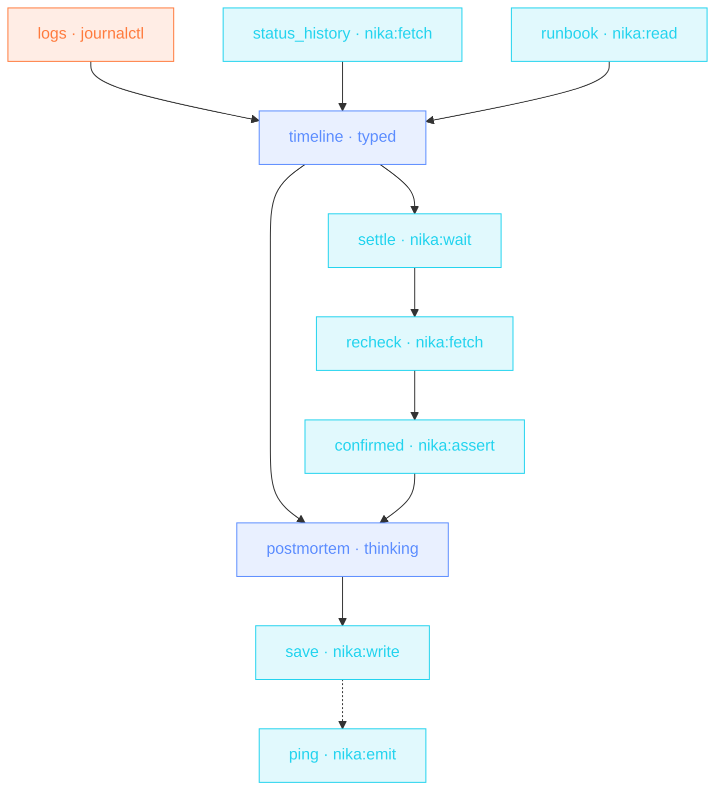

> **T4 epic · SRE / on-call** — three evidence sources gathered in
> parallel, a typed timeline, then the honest part: `nika:wait` a settle
> window, re-poll the status API, and `nika:assert` refuses to draft a
> « resolved » postmortem while prod still burns. `on_finally:` files
> the journal event and the ping NO MATTER WHAT.

## The job

The hour after an incident is logs, Slack archaeology and a postmortem
nobody wants to start. This pipeline assembles the evidence, rebuilds
the timeline as typed events, proves recovery, and leaves a draft —
summary, impact, hypotheses, actions — in the incidents folder before
the retro is scheduled.

## The shape

{/* showcase:dag-begin t4-incident-war-room.nika.yaml */}

{/* showcase:dag-end */}

## The file

{/* showcase:begin t4-incident-war-room.nika.yaml */}
```yaml t4-incident-war-room.nika.yaml
nika: v1
workflow: incident-war-room
description: "parallel evidence → typed timeline → settle + recheck → postmortem draft"

model: anthropic/claude-sonnet-4-6

vars:
  service: "checkout-api"
  status_url: "https://status.internal.example.com/v1/services/checkout-api"
  log_window: "90 minutes ago"

secrets:
  oncall_webhook:
    source: env
    key: ONCALL_WEBHOOK_URL

tasks:
  # ── the gather wave · all three run in parallel ──
  - id: logs
    exec:
      command: "journalctl -u ${{ vars.service }} --since '${{ vars.log_window }}' --no-pager"
      capture: structured

  - id: status_history
    invoke:
      tool: "nika:fetch"
      args:
        url: "${{ vars.status_url }}"
        mode: jq
        jq: ".history"
    retry:
      max_attempts: 4
      backoff_strategy: exponential
      jitter: true

  - id: runbook
    invoke:
      tool: "nika:read"
      args: { path: "./runbooks/${{ vars.service }}.md" }

  # ── reconstruct · typed timeline ──
  - id: timeline
    depends_on: [logs, status_history, runbook]
    infer:
      prompt: |
        Service logs ·
        ${{ tasks.logs.output.stdout }}
        Status history · ${{ tasks.status_history.output }}
        Runbook · ${{ tasks.runbook.output }}

        Reconstruct the incident timeline as events.
      schema:
        type: object
        required: [events]
        properties:
          events:
            type: array
            items:
              type: object
              required: [at, what]
              properties:
                at: { type: string }
                what: { type: string }
                evidence: { type: string }

  # ── settle, then confirm recovery before claiming it ──
  - id: settle
    depends_on: [timeline]
    invoke:
      tool: "nika:wait"
      args: { duration: "60s" }

  - id: recheck
    depends_on: [settle]
    invoke:
      tool: "nika:fetch"
      args:
        url: "${{ vars.status_url }}"
        mode: jq
        jq: ".current.state"

  - id: confirmed
    depends_on: [recheck]
    invoke:
      tool: "nika:assert"
      args:
        condition: "${{ tasks.recheck.output == 'operational' }}"
        message: "Service is NOT back to operational — postmortem draft blocked"

  # ── the draft · only after recovery is proven ──
  - id: postmortem
    depends_on: [timeline, confirmed]
    infer:
      prompt: |
        Timeline · ${{ tasks.timeline.output.events }}
        Write the postmortem draft · summary · impact · root-cause
        hypotheses · 3 follow-up actions with owners left blank.
      thinking:
        enabled: true
        budget_tokens: 6000

  - id: save
    depends_on: [postmortem]
    invoke:
      tool: "nika:write"
      args:
        path: "./incidents/${{ vars.service }}-postmortem.md"
        content: "${{ tasks.postmortem.output }}"
        create_dirs: true

  # the always-pattern · the on-call ping fires on EVERY outcome —
  # including the designed failure path (recovery NOT confirmed → the
  # assert fails → save never starts → this still runs · when: true
  # replaces the default gate · 03 §Task states).
  - id: ping
    depends_on: [save]
    when: true
    invoke:
      tool: "nika:emit"
      args:
        event_type: "incident.postmortem.drafted"
        payload:
          service: "${{ vars.service }}"
          status: "${{ tasks.save.status }}"
    on_finally:
      - invoke:
          tool: "nika:notify"
          args:
            channel: webhook
            target: "${{ secrets.oncall_webhook }}"
            message: "Postmortem draft run finished for ${{ vars.service }} · ${{ tasks.save.status }}"
            severity: info

outputs:
  events:
    value: ${{ tasks.timeline.output.events }}
    type: array
    description: "The reconstructed, typed incident timeline"
  postmortem: ${{ tasks.postmortem.output }}
```
{/* showcase:end */}

## How it works

<Steps>
  <Step title="Evidence gathers in one wave">
    `logs` (structured capture), `status_history` (with retry — status
    pages flap during incidents) and `runbook` share no deps: one
    parallel wave, three sources.
  </Step>
  <Step title="Settle, recheck, PROVE">
    `nika:wait duration: 60s` gives the system a settle window, the
    re-poll reads `.current.state`, and the assert fails the run —
    loudly — if it isn't `operational`. No optimistic postmortems.
  </Step>
  <Step title="on_finally always reports">
    Whether `save` succeeded, failed or timed out, the `nika:emit`
    journal event and the on-call ping fire. Cleanup hooks are
    best-effort and never mask the main outcome.
  </Step>
</Steps>

## Constructs you just used

| Construct | Where | Reference |
|---|---|---|
| `capture: structured` | `logs` | [The 4 verbs](/concepts/verbs) |
| `nika:wait` | `settle` | [Builtins](/reference/builtins) |
| `nika:assert` recovery gate | `confirmed` | [Builtins](/reference/builtins) |
| `on_finally:` | `save` | [Workflows](/concepts/workflows) |

## Make it yours

- Pull the incident channel export as a fourth evidence source and let the timeline cite humans, not just machines.
- Auto-file the retro: `nika:fetch method: POST` to your calendar/issue API with `${{ tasks.timeline.output.events[0].at }}` as the anchor.
- Track MTTR over time: the `on_finally` event stream is already your dataset.

<Card title="Next · CEO Monday brief" icon="briefcase" href="/examples/ceo-monday-brief">
  The closer: a three-branch gather, jq arithmetic, a thinking
  synthesis — and a run that reports its own bill.
</Card>
