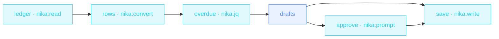

> **T2 chain · finance / freelance**: the human-in-the-loop example.
> `nika:prompt` blocks the workflow until someone answers; the
> drafting is automated, the **sending decision never is**.

## The job

Friday: open the ledger, find who's late, write polite-but-firm
reminders, don't send the awkward one to the client who paid this
morning. This file filters the CSV deterministically (jq, not an LLM
guessing at numbers), drafts every reminder, then stops and asks you.

## The shape

{/* showcase:dag-begin invoice-chaser.nika.yaml */}

{/* showcase:dag-end */}

## The file

{/* showcase:begin invoice-chaser.nika.yaml */}
```yaml invoice-chaser.nika.yaml
nika: v1
workflow:
  id: invoice-chaser
  description: "Ledger CSV → overdue filter → drafted reminders → human gate → drafts file"

model: ollama/qwen3.5:4b   # local · zero key · swap for groq/llama-3.3-70b (drafting is a fast-model job)

vars:
  ledger_csv: "examples/fixtures/invoices.csv"
permits:
  tools: ["nika:convert", "nika:jq", "nika:prompt", "nika:read", "nika:write"]
  fs:
    # Two files, both spelled out — `const.ledger_csv` in, the drafts file
    # out. A const is baked in and a run cannot move it, so the boundary is
    # exact: no glob, and nothing else on disk is reachable either way.
    read: ["examples/fixtures/invoices.csv"]
    write: ["out/reminders-to-send.md"]

tasks:
  ledger:
    invoke:
      tool: "nika:read"
      args: { path: "${{ vars.ledger_csv }}" }

  rows:
    with:
      csv: ${{ tasks.ledger.output }}
    invoke:
      tool: "nika:convert"
      args:
        input: "${{ with.csv }}"
        from: csv
        to: json
        has_header: true

  overdue:
    with:
      rows: ${{ tasks.rows.output }}
    invoke:
      tool: "nika:jq"
      args:
        input: "${{ with.rows }}"
        expression: 'map(select(.status == "overdue"))'

  drafts:
    with:
      overdue: ${{ tasks.overdue.output }}
    when: ${{ size(with.overdue) > 0 }}
    infer:
      max_tokens: 900       # a ceiling makes the cost report a number, not UNBOUNDED
      prompt: |
        Draft one short, polite payment reminder per overdue invoice ·
        ${{ with.overdue }}
        Markdown · one section per client · firm but warm.

  approve:
    with:
      drafts: ${{ tasks.drafts.output }}
    when: ${{ with.drafts != null }}   # nothing drafted · nothing to approve
    invoke:
      tool: "nika:prompt"
      args:
        message: "Save the reminder drafts for sending?"
        default: false

  save:
    with:
      drafts: ${{ tasks.drafts.output }}
      approved: ${{ tasks.approve.output }}
    when: ${{ with.drafts != null && with.approved == true }}   # zero overdue → drafts skipped (null) · don't write nothing
    invoke:
      tool: "nika:write"
      args:
        path: out/reminders-to-send.md
        create_dirs: true
        content: "${{ with.drafts }}"

outputs:
  overdue:
    value: ${{ tasks.overdue.output }}
    description: "The overdue rows the reminders were drafted for"
```
{/* showcase:end */}

## How it works

<Steps>
  <Step title="Data work is jq work">
    CSV → JSON via `nika:convert`, then `map(select(.status == "overdue"))`
    in `nika:jq`. No model touches the numbers: deterministic, free,
    auditable.
  </Step>
  <Step title="size() gates the whole tail">
    The list crosses the boundary (`overdue: ${{ tasks.overdue.output }}`
    in `with:`), then `when: ${{ size(with.overdue) > 0 }}` is the
    canonical empty-check. No overdue invoices → the rest of the file
    skips (and value edges pass the skip along as `null`).
  </Step>
  <Step title="The approval gate">
    `nika:prompt` blocks until answered (CI can use `default:`). The
    save binds the verdict (`approved: ${{ tasks.approve.output }}`)
    and runs only `when: ${{ with.drafts != null && with.approved == true }}`.
  </Step>
</Steps>

## Constructs you just used

| Construct | Where | Reference |
|---|---|---|
| `nika:convert` from/to | `rows` | [Builtins](/reference/builtins) |
| `nika:jq` filtering | `overdue` | [Builtins](/reference/builtins) |
| CEL `size()` | `drafts.when` | [Workflows](/concepts/workflows) |
| `nika:prompt` human gate | `approve` | [Builtins](/reference/builtins) |

## Make it yours

- Per-client emails instead of one file: `for_each` over the overdue rows ([fan-out tier](/examples/competitor-radar)).
- Escalate 60-days-late differently: a second jq filter + a sterner prompt.
- Wire the approved drafts to your mail API with `nika:fetch method: POST`.

<Card title="Next · Support triage" icon="headset" href="/examples/support-triage">
  Classify a whole queue in one schema-typed call, then let jq slice the
  urgent ones out.
</Card>
