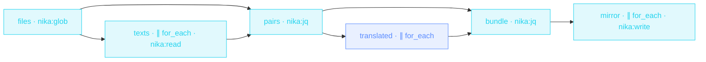

> **T3 fan-out · product / content / i18n**: three chained fan-outs
> (read-all → translate-all → write-all) with jq `transpose` zipping
> paths back to texts between stages. The masterclass file for
> collections.

## The job

« Can we have the docs in French? » is weeks of copy-paste, or it's this
file: glob finds every markdown file, the texts are read and translated
in parallel (rate-limited so the provider doesn't choke), and the mirror
tree appears under `i18n/fr/` with the original paths preserved.

## The shape

{/* showcase:dag-begin t3-localization-factory.nika.yaml */}

{/* showcase:dag-end */}

## The file

{/* showcase:begin t3-localization-factory.nika.yaml */}
```yaml t3-localization-factory.nika.yaml
nika: v1
workflow: localization-factory
description: "glob docs → parallel read → parallel translate → mirror tree"

model: ollama/llama3.2:3b   # local default · swap for mistral/mistral-large (EU model for EU locales)

vars:
  lang: "fr"
  source_glob: "./docs/**/*.md"

tasks:
  - id: files
    invoke:
      tool: "nika:glob"
      args:
        pattern: "${{ vars.source_glob }}"
        exclude: ["**/node_modules/**"]

  - id: texts
    depends_on: [files]
    for_each: ${{ tasks.files.output }}
    max_parallel: 8
    invoke:
      tool: "nika:read"
      args: { path: "${{ item }}" }

  - id: pairs
    depends_on: [files, texts]
    invoke:
      tool: "nika:jq"
      args:
        input: ["${{ tasks.files.output }}", "${{ tasks.texts.output }}"]
        expression: "transpose | map({path: .[0], text: .[1]})"

  - id: translated
    depends_on: [pairs]
    for_each: ${{ tasks.pairs.output }}
    max_parallel: 3                    # rate-limit the provider
    fail_fast: false                   # finish the batch · a failed file yields null at its index
    on_error:
      recover: null                    # null keeps the transpose zip aligned (order preserved)
    infer:
      prompt: |
        Translate to ${{ vars.lang }} · keep markdown structure, code blocks
        untouched, and the original tone ·
        ${{ item.text }}

  - id: bundle
    depends_on: [pairs, translated]
    invoke:
      tool: "nika:jq"
      args:
        input: ["${{ tasks.pairs.output }}", "${{ tasks.translated.output }}"]
        expression: "transpose | map(select(.[1] != null)) | map({path: .[0].path, text: .[1]})"

  - id: mirror
    depends_on: [bundle]
    for_each: ${{ tasks.bundle.output }}
    max_parallel: 8
    invoke:
      tool: "nika:write"
      args:
        path: "./i18n/${{ vars.lang }}/${{ item.path }}"
        content: "${{ item.text }}"
        create_dirs: true

outputs:
  files:
    value: ${{ tasks.files.output }}
    type: array
    description: "Every source file that was mirrored"
```
{/* showcase:end */}

## How it works

<Steps>
  <Step title="The filesystem is the collection">
    `nika:glob` returns the file list at runtime: add a doc tomorrow,
    it's in the next run. `exclude:` keeps `node_modules` out.
  </Step>
  <Step title="transpose zips parallel arrays">
    Two fan-outs produce two aligned arrays (paths, texts). The jq
    `transpose | map({path: .[0], text: .[1]})` zip turns them into
    `[{path, text}]`, and `${{ item.path }}` works, because loop-locals
    are full objects.
  </Step>
  <Step title="The mirror tree comes out the other end">
    The final fan-out writes `./i18n/fr/<original path>` with
    `create_dirs: true`. Path templating is plain `${{ }}` interpolation
    inside a string.
  </Step>
</Steps>

## Constructs you just used

| Construct | Where | Reference |
|---|---|---|
| `nika:glob` + `exclude` | `files` | [Builtins](/reference/builtins) |
| chained `for_each` stages | `texts` → `translated` → `mirror` | [Workflows](/concepts/workflows) |
| jq `transpose` zip | `pairs` · `bundle` | [Builtins](/reference/builtins) |
| `${{ item.path }}` object locals | `mirror` | [Bindings](/concepts/bindings) |

## Make it yours

- All your locales: wrap the lang in a list and run per locale, or lift `vars.lang` to a typed required input and call the workflow per language.
- Glossary discipline: interpolate your terminology table into the translate prompt so product names never drift.
- Only what changed: replace `glob` with `exec: git diff --name-only` and translate the delta ([PR review fan-out](/examples/pr-review-fanout) starts the same way).

<Card title="Next · Config drift sentinel" icon="shield-halved" href="/examples/config-drift-sentinel">
  RFC 7396 merge-patch + RFC 6902 diff: jq decides, the model only
  explains.
</Card>
