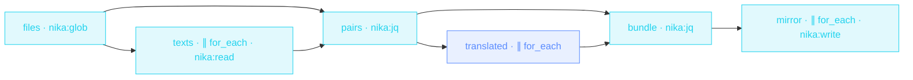

> **T3 fan-out · product / content / i18n**: three chained fan-outs
> (read-all → translate-all → write-all) with jq `transpose` zipping
> paths back to texts between stages. The masterclass file for
> collections.

## The job

« Can we have the docs in French? » is weeks of copy-paste, or it's this
file: glob finds every markdown file, the texts are read and translated
in parallel (rate-limited so the provider doesn't choke), and the mirror
tree appears under `i18n/fr/` with the original paths preserved.

## The shape

{/* showcase:dag-begin localization-factory.nika.yaml */}

{/* showcase:dag-end */}

## The file

{/* showcase:begin localization-factory.nika.yaml */}
```yaml localization-factory.nika.yaml
nika: v1
workflow:
  id: localization-factory
  description: "glob docs → parallel read → parallel translate → mirror tree"

model: ollama/qwen3.5:4b   # local default · swap for mistral/mistral-large (EU model for EU locales)

vars:
  lang: "fr"
  # The committed rehearsal tree. Point this at ./docs (or wherever yours
  # lives) and change `permits.fs.read` to match, in the same edit.
  source_root: "./examples/fixtures/docs"

permits:
  tools: ["nika:glob", "nika:jq", "nika:read", "nika:write"]
  fs:
    # `nika:glob` opens the ROOT of its pattern, so the bound has to cover
    # the directory AND everything under it — `**` does both (it matches the
    # dir itself and any descendant at any depth). A bound naming only the
    # `.md` files refuses the glob before it lists anything:
    # `NIKA-SEC-004 · ./examples/…/docs resolves outside permits.fs.read`.
    read: ["./examples/fixtures/docs/**"]
    # The mirror is as deep as the source tree, so this one earns its `**`:
    # every locale lands under ./i18n/ and nothing lands outside it. Naming
    # the locale (`./i18n/fr/**`) would be tighter but would have to be
    # re-edited for every value of `const.lang` — the bound is the tree the
    # factory owns.
    write: ["./i18n/**"]

tasks:
  # ── the collection is discovered, never declared ────────────────────
  files:
    invoke:
      tool: "nika:glob"
      args:
        pattern: "${{ vars.source_root }}/**/*.md"
        exclude: ["**/node_modules/**"]

  # ── stage 1 · read every file, 8 at a time ─────────────────────────
  texts:
    with:
      files: ${{ tasks.files.output }}
    for_each: ${{ with.files }}
    max_parallel: 8                    # local disk · the only cost is file handles
    invoke:
      tool: "nika:read"
      args: { path: "${{ item }}" }

  # ── the zip · path + text, and the source root comes off ───────────
  # `texts` is an array in the SAME ORDER as `files`, so transpose pairs
  # them index-for-index. `ltrimstr` makes each path relative to the source
  # root — that stripped path is what the mirror tree is built from.
  pairs:
    with:
      files: ${{ tasks.files.output }}
      texts: ${{ tasks.texts.output }}
    invoke:
      tool: "nika:jq"
      args:
        input: ["${{ with.files }}", "${{ with.texts }}"]
        expression: >-
          transpose
          | map({ path: (.[0] | ltrimstr("${{ vars.source_root }}/")), text: .[1] })

  # ── stage 2 · translate every file, 3 at a time ────────────────────
  translated:
    with:
      pairs: ${{ tasks.pairs.output }}
    for_each: ${{ with.pairs }}
    max_parallel: 3                    # rate-limit the provider, not the disk
    fail_fast: false                   # finish the batch · one bad file is not a batch failure
    on_error:
      recover: null                    # null holds the index open so the zip below stays aligned
    infer:
      max_tokens: 4000                 # a doc page, not a book · the cost ceiling is a real number
      prompt: |
        Translate to ${{ vars.lang }} · keep the markdown structure, leave
        code blocks untouched, and keep the original tone ·
        ${{ item.text }}

  # ── the fan-in · drop the files that failed, keep their paths ──────
  # Second transpose, same law: `translated` is index-aligned with `pairs`
  # because `recover: null` filled the failures in place. `select(.[1] !=
  # null)` is where a failed translation leaves the batch — by VALUE, after
  # the fact, not by aborting the fan-out.
  bundle:
    with:
      pairs: ${{ tasks.pairs.output }}
      translated: ${{ tasks.translated.output }}
    invoke:
      tool: "nika:jq"
      args:
        input: ["${{ with.pairs }}", "${{ with.translated }}"]
        expression: >-
          transpose
          | map(select(.[1] != null))
          | map({ path: .[0].path, text: .[1] })

  # ── stage 3 · write the mirror ─────────────────────────────────────
  mirror:
    with:
      bundle: ${{ tasks.bundle.output }}
    for_each: ${{ with.bundle }}
    max_parallel: 8
    invoke:
      tool: "nika:write"
      args:
        path: "./i18n/${{ vars.lang }}/${{ item.path }}"
        content: "${{ item.text }}"
        create_dirs: true              # the mirror's subdirectories do not exist yet

outputs:
  translated:
    value: ${{ tasks.bundle.output }}
    description: "Every file that made it through, as {path, text} · the mirror's manifest"
```
{/* showcase:end */}

## How it works

<Steps>
  <Step title="The filesystem is the collection">
    `nika:glob` returns the file list at runtime: add a doc tomorrow,
    it's in the next run. `exclude:` keeps `node_modules` out.
  </Step>
  <Step title="transpose zips parallel arrays">
    Two fan-outs produce two aligned arrays (paths, texts). The jq
    `transpose | map({path: .[0], text: .[1]})` zip turns them into
    `[{path, text}]`, and `${{ item.path }}` works, because loop-locals
    are full objects.
  </Step>
  <Step title="The mirror tree comes out the other end">
    The final fan-out writes `./i18n/fr/<original path>` with
    `create_dirs: true`. Path templating is plain `${{ }}` interpolation
    inside a string.
  </Step>
</Steps>

## Constructs you just used

| Construct | Where | Reference |
|---|---|---|
| `nika:glob` + `exclude` | `files` | [Builtins](/reference/builtins) |
| chained `for_each` stages | `texts` → `translated` → `mirror` | [Workflows](/concepts/workflows) |
| jq `transpose` zip | `pairs` · `bundle` | [Builtins](/reference/builtins) |
| `${{ item.path }}` object locals | `mirror` | [Bindings](/concepts/bindings) |

## Make it yours

- All your locales: wrap the lang in a list and run per locale, or lift `const.lang` to a typed required input and call the workflow per language.
- Glossary discipline: interpolate your terminology table into the translate prompt so product names never drift.
- Only what changed: replace `glob` with `exec: git diff --name-only` and translate the delta ([PR review fan-out](/examples/pr-review-fanout) starts the same way).

<Card title="Next · Config drift sentinel" icon="shield-halved" href="/examples/config-drift-sentinel">
  RFC 7396 merge-patch + RFC 6902 diff: jq decides, the model only
  explains.
</Card>
