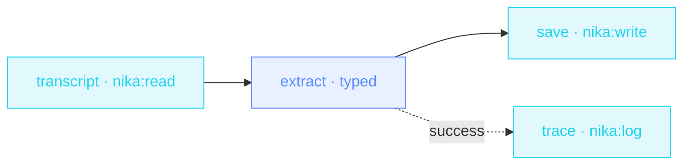

> **T1 starter · every office job**: the first example with
> `infer.schema:`. The model doesn't get to answer in prose. It returns
> the JSON shape you declared, or the engine rejects it.

## The job

The meeting ended an hour ago and nobody remembers who owns what. The
transcript is sitting in a file. This workflow extracts every action
item as `{owner, task, due}`: typed, validated, importable by whatever
tracker you use.

## The shape

{/* showcase:dag-begin meeting-actions.nika.yaml */}

{/* showcase:dag-end */}

## The file

{/* showcase:begin meeting-actions.nika.yaml */}
```yaml meeting-actions.nika.yaml
nika: v1
workflow:
  id: meeting-actions
  description: "Transcript → typed action items {owner, task, due}"

# A NON-thinking local model, deliberately: a thinking model can spend the
# whole `max_tokens` budget in its think block and return before the JSON
# (engine#428). Schema showcases pick a model that answers directly.
model: ollama/llama3.2:3b

inputs:
  transcript_path:
    type: string
    default: "examples/fixtures/meeting-transcript.txt"
    description: "Path to the raw meeting transcript"
permits:
  tools: ["nika:log", "nika:read", "nika:write"]
  fs:
    # The sample transcript, named as a LITERAL. `permits:` cannot interpolate
    # (NIKA-AUTH-007), so this line does not follow `inputs.transcript_path`
    # around: pointing the var at your own file means editing this entry too,
    # or the read is refused at run with NIKA-SEC-004. That is the wall doing
    # its job — a boundary you can read is a boundary a reviewer can check.
    read: ["examples/fixtures/meeting-transcript.txt"]
    write: ["out/action-items.json"]

tasks:
  transcript:
    invoke:
      tool: "nika:read"
      args: { path: "${{ inputs.transcript_path }}" }

  extract:
    with:
      transcript: ${{ tasks.transcript.output }}
    infer:
      max_tokens: 900                  # a ceiling makes the cost report a number, not UNBOUNDED
      prompt: |
        Extract every action item from this meeting transcript ·
        ${{ with.transcript }}
        One entry per commitment somebody actually made. `due` only when a
        date or deadline was stated — never invent one.
      schema:                          # the contract the model must satisfy
        type: object
        additionalProperties: false
        required: [actions]
        properties:
          actions:
            type: array
            items:
              type: object
              additionalProperties: false
              required: [owner, task]
              properties:
                owner: { type: string }
                task: { type: string }
                due: { type: string }

  save:
    with:
      extract_actions: ${{ tasks.extract.output.actions }}
    invoke:
      tool: "nika:write"
      args:
        # `.json` content is ONE interpolation of a real value — the engine
        # serializes it. Typing `{ "actions": ${{ … }} }` by hand emits
        # unquoted fields and the artifact stops being JSON.
        path: out/action-items.json
        content: "${{ with.extract_actions }}"
        create_dirs: true

  trace:
    after:
      extract: success
    invoke:
      tool: "nika:log"
      args:
        level: info
        message: "Action items extracted to out/action-items.json"

outputs:
  actions:
    value: ${{ tasks.extract.output.actions }}
    description: "Typed action items, tracker-ready"
```
{/* showcase:end */}

## How it works

<Steps>
  <Step title="A required, typed input">
    `transcript_path` is declared with `type: string · required: true`:
    the engine validates inputs before any task runs, and the workflow
    becomes callable with a real contract.
  </Step>
  <Step title="The schema IS the contract">
    `infer.schema:` is standard JSON Schema. The model must return a
    matching object. On violation the engine rejects (and may retry).
    Downstream tasks index into it directly: `${{ tasks.extract.output.actions }}`.
  </Step>
  <Step title="Two consumers, no extra ceremony">
    `save` writes the JSON, `trace` logs a human-readable line. Both
    depend on `extract`, both run in parallel.
  </Step>
</Steps>

## Constructs you just used

| Construct | Where | Reference |
|---|---|---|
| typed `inputs:` | `transcript_path` | [YAML syntax](/reference/yaml-syntax) |
| `infer.schema:` | `extract` | [The 4 verbs](/concepts/verbs) |
| schema-path indexing | `save.args.content` | [Bindings](/concepts/bindings) |
| `nika:log` | `trace` | [Builtins](/reference/builtins) |

## Make it yours

- Add `due` to the `required:` list if your team always sets deadlines.
- Chain a `nika:notify` task that posts each owner their items.
- Swap the transcript file for a `nika:fetch` of your meeting tool's export API. The schema doesn't change.

<Card title="Next · Price watch" icon="tag" href="/examples/price-watch">
  The next starter has zero model calls: pure tools, bindings and one
  CEL comparison.
</Card>
