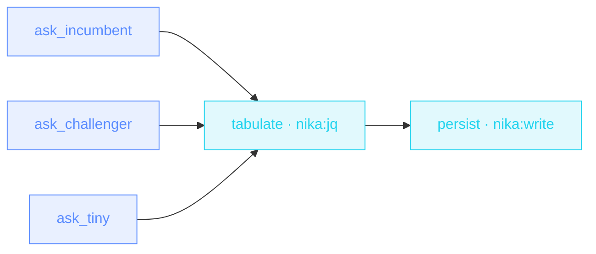

> **T2 diamond · engineering / model selection**: three `infer.model:`
> seats fan out the SAME question in parallel; a `nika:jq` fan-in builds
> a markdown table from measured facts — each answer's latency comes
> from `tasks.X.duration_ms`, the run's own clock. No judge model, no
> scores: the table states facts, the quality call stays yours.

## The job

Picking a default model by vibes is how you end up paying for quality
you don't need — or shipping answers a smaller model would have matched.
This workflow is the bench you run BEFORE deciding: same prompt, three
seats, one report on disk that you can diff run over run.

## The shape

{/* showcase:dag-begin model-bench.nika.yaml */}

{/* showcase:dag-end */}

## The file

{/* showcase:begin model-bench.nika.yaml */}
```yaml model-bench.nika.yaml
nika: v1
workflow:
  id: model-bench
  description: "One question → three local models → a measured comparison table"

model: ollama/qwen3.5:4b # the house default · contenders below pick their own seats

const:
  question:
    # A TYPED constant is `{ type, value }` — both keys, exactly those two.
    # `{ type, default }` is not a declaration at all (01-envelope.md §const:
    # an object missing either key is a bare literal object), so the prompt
    # below would receive the whole `{type, default}` map instead of the
    # question. Measured: the model gets a JSON blob and the bench is junk.
    type: string
    value: "Explain, in five lines, why a workflow should be audited before it runs."
permits:
  tools: ["nika:jq", "nika:write"]
  fs: { write: ["out/model-bench.md"] }

tasks:
  ask_incumbent:
    infer:
      model: ollama/qwen2.5:14b # the quality bar · the seat to beat
      prompt: "${{ const.question }}"
      max_tokens: 600

  ask_challenger:
    infer:
      model: ollama/llama3.2:3b # another family · same size class
      prompt: "${{ const.question }}"
      max_tokens: 600

  ask_tiny:
    infer:
      model: ollama/qwen2.5:0.5b # the "is small enough?" probe
      prompt: "${{ const.question }}"
      max_tokens: 600

  tabulate:
    with:
      ask_incumbent_duration_ms: ${{ tasks.ask_incumbent.duration_ms }}
      ask_incumbent: ${{ tasks.ask_incumbent.output }}
      ask_challenger_duration_ms: ${{ tasks.ask_challenger.duration_ms }}
      ask_challenger: ${{ tasks.ask_challenger.output }}
      ask_tiny_duration_ms: ${{ tasks.ask_tiny.duration_ms }}
      ask_tiny: ${{ tasks.ask_tiny.output }}
    invoke:
      tool: "nika:jq"
      args:
        input:
          - model: "ollama/qwen2.5:14b"
            ms: "${{ with.ask_incumbent_duration_ms }}"
            answer: "${{ with.ask_incumbent }}"
          - model: "ollama/llama3.2:3b"
            ms: "${{ with.ask_challenger_duration_ms }}"
            answer: "${{ with.ask_challenger }}"
          - model: "ollama/qwen2.5:0.5b"
            ms: "${{ with.ask_tiny_duration_ms }}"
            answer: "${{ with.ask_tiny }}"
        expression: >-
          "| model | latency | chars | answer (first 160) |\n|---|---|---|---|\n"
          + (map("| " + .model + " | "
               + (if .ms == null then "cached" else (.ms | tostring) + "ms" end) + " | "
               + (.answer | length | tostring) + " | "
               + (.answer | gsub("\n"; " ") | .[0:160]) + " |")
             | join("\n"))

  persist:
    with:
      tabulate: ${{ tasks.tabulate.output }}
    invoke:
      tool: "nika:write"
      args:
        path: out/model-bench.md
        create_dirs: true
        content: |
          # Model bench — same question, measured

          ${{ with.tabulate }}

          Facts only: latency from the run's clock, length in characters.
          The answers are side by side — the quality call is yours.

outputs:
  table:
    value: ${{ tasks.tabulate.output }}
    description: "The measured comparison table · latency + length per seat"
```
{/* showcase:end */}

## Two findings the bench surfaced on its own authoring run

Both were caught live while writing this example — they are what the
bench is FOR:

1. **A thinking model with a bounded `max_tokens` can return an empty
   answer** — it spends the whole budget reasoning before a single
   output token. The row reads `0 chars`: that is a bench *result*, not
   a bug. Seat `ollama/qwen3.5:4b` and reproduce it on your machine.
2. **On a `--resume`, rehydrated rows say `cached`** — a latency that
   was not re-measured is never re-printed as a fresh number. The
   report stays honest across resumes.

## Run it

```bash
ollama pull qwen2.5:14b llama3.2:3b qwen2.5:0.5b   # or swap the seats
git clone https://github.com/supernovae-st/nika-spec && cd nika-spec
nika run examples/showcase/t2-model-bench.nika.yaml
cat bench/model-bench.md
```

<Note>
  This workflow is newer than the currently shipped engine pack:
  `nika examples run showcase/t2-model-bench` says `unknown example`
  until the next engine tag re-vendors the pack. Until then, run it
  from the spec checkout as above — the file is the same one the pack
  will embed, sha-pinned in the spec manifest.
</Note>

The first call to each model pays its load time — run the bench twice
and read the warm numbers. Swap any seat for `mistral/…`,
`anthropic/…` or `openai/…` to bench a cloud contender against your
local incumbents (the cost column of `nika check` starts telling the
price story the moment a priced model enters).
