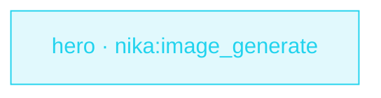

> **T1 starter · marketing / content**: one task is the whole media
> pipeline. Generated images land **on disk** under a declared boundary —
> outputs carry paths and sha256 hashes, never image bytes.

## The job

Every landing page, blog post and QR campaign needs an OG image, and
someone ends up producing them one by one in a chat window. This workflow
turns that into a step: creative brief in, rendered variants + a
provenance manifest out, ready for the site build to pick up.

## The shape

{/* showcase:dag-begin t1-og-images.nika.yaml */}

{/* showcase:dag-end */}

## The file

{/* showcase:begin t1-og-images.nika.yaml */}
```yaml t1-og-images.nika.yaml
nika: v1
workflow: og-images
description: "Generate the launch OG hero image set into ./assets/og"

permits:
  fs: { write: ["./assets/og/**"] }   # the ONLY place assets may land
  tools: ["nika:image_generate"]

tasks:
  - id: hero
    invoke:
      tool: "nika:image_generate"
      args:
        provider: mock                # offline + deterministic · flip to gemini/openai to render for real
        prompt: "OG hero — a monarch butterfly over a deep-blue nebula, editorial photo, negative space left"
        aspect_ratio: "16:9"          # exact WxH is an openai gpt-image-2 feature · gemini folds to a size class
        n: 2                          # two variants to A/B
        output_dir: "./assets/og"
        filename_prefix: "launch-hero"
        metadata: { campaign: "launch", page_slug: "home" }

outputs:
  paths: ${{ tasks.hero.output.images }}
  manifest: ${{ tasks.hero.output.manifest_path }}
```
{/* showcase:end */}

## Why it reads like that

- **`provider: mock` first** — it renders real, decodable PNGs offline,
  deterministically, with zero keys: the pipeline is testable in CI as-is.
  Production is a one-line flip to `gemini` (`GEMINI_API_KEY`) or `openai`
  (`OPENAI_API_KEY`); the keys are engine-configured, never workflow args.
- **`permits.fs.write` is the contract** — `./assets/og/**` is the ONLY
  place assets may land; a templated `output_dir` that escapes it fails
  `NIKA-SEC-004` before any byte is written. `nika check --infer-permits`
  writes this block for you.
- **assets, not blobs** — `tasks.hero.output.images` is a list of
  `{ path, filename, width, height, sha256, … }` entries, and a
  `*.manifest.json` lands beside the files (request echo · hashes ·
  usage · your `metadata:` fields). Base64 never rides outputs, logs or
  traces.
- **`n: 2` for A/B** — OpenAI renders n natively; Gemini runs n
  sequential calls (documented); mock renders n distinct deterministic
  variants.

## Run it

```sh
nika examples run showcase/t1-og-images        # offline · mock renders real PNGs
ls assets/og/                                  # variants + the provenance manifest
```

Flip the provider line and re-run when you want real renders — the rest
of the file does not change.
