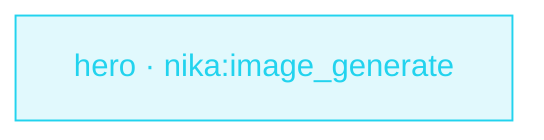

> **T1 starter · the native media path**: no provider curl, no helper
> script — `nika:image_generate` renders the card, the manifest carries
> the provenance, and the typed outputs stay the callable contract.

## The job

Every page needs an Open-Graph card and nobody wants to hand-run a
design tool for each one. This workflow turns a page list into rendered
OG images on disk — deterministic filenames, hashes in the manifest.

## The shape

{/* showcase:dag-begin t1-og-images.nika.yaml */}

{/* showcase:dag-end */}

## The workflow

{/* showcase:begin t1-og-images.nika.yaml */}
```yaml t1-og-images.nika.yaml
nika: v1
workflow: og-images
description: "Generate the launch OG hero image set into ./assets/og"

permits:
  fs: { write: ["./assets/og/**"] }   # the ONLY place assets may land
  tools: ["nika:image_generate"]

tasks:
  - id: hero
    invoke:
      tool: "nika:image_generate"
      args:
        provider: mock                # offline + deterministic · flip to gemini/openai to render for real
        prompt: "OG hero — a monarch butterfly over a deep-blue nebula, editorial photo, negative space left"
        aspect_ratio: "16:9"          # exact WxH is an openai gpt-image-2 feature · gemini folds to a size class
        n: 2                          # two variants to A/B
        output_dir: "./assets/og"
        filename_prefix: "launch-hero"
        metadata: { campaign: "launch", page_slug: "home" }

outputs:
  paths: ${{ tasks.hero.output.images }}
  manifest: ${{ tasks.hero.output.manifest_path }}
```
{/* showcase:end */}

## Run it

```bash
nika check og-images.nika.yaml
nika run og-images.nika.yaml --model mock/echo   # offline preview
```
