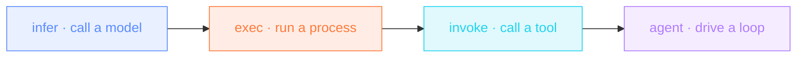

import { CANON } from "/snippets/_canon.mdx";
import { SHOWCASE } from "/snippets/_showcase.mdx";

If you do the same AI task twice, make it a workflow. Every example on
these pages is a complete one you can run right now. The whole gallery
ships inside the binary:

```bash
nika examples run showcase/t1-meeting-actions     # local · ollama/llama3.2:3b · zero key
```

No Ollama on this machine yet? Add `--model mock/echo` to preview any
example offline with zero setup, then come back with the real model.

The YAML you read here is projected verbatim from
[`nika-spec/examples/showcase/`](https://github.com/supernovae-st/nika-spec/tree/main/examples/showcase),
where each file passes the same conformance gate as the spec's own test
suite. If a file is on this page, it parses, and it runs.

These {SHOWCASE.count} workflows ({SHOWCASE.t1} starters · {SHOWCASE.t2} chains
· {SHOWCASE.t3} fan-outs · {SHOWCASE.t4} epics) plus the foundation set
exercise **all {CANON.builtins} builtins**, the {CANON.verbs} verbs, and
{CANON.providers} providers: cloud, local and mock.

<video autoPlay muted loop playsInline poster="/images/workflow-gallery.png" style={{ borderRadius: "0.75rem" }}>
  <source src="/videos/workflow-gallery.webm" type="video/webm" />
  <source src="/videos/workflow-gallery.mp4" type="video/mp4" />
</video>

## How to read a workflow diagram

Tasks are colored by verb, the same palette everywhere in the Nika
universe:



## T1 · Starters

Four tasks or fewer, one chain or one diamond. You can run one of these
in your first five minutes.

<Columns cols={2}>
  <Card title="Standup digest" icon="sunrise" href="/examples/standup-digest">
    **Engineering**: your standup note, written from what you actually
    committed yesterday.
  </Card>
  <Card title="Meeting actions" icon="list-check" href="/examples/meeting-actions">
    **Every office**: transcript in, tracker-ready typed action items
    out.
  </Card>
  <Card title="Price watch" icon="tag" href="/examples/price-watch">
    **E-commerce**: a price-drop alert with zero model calls.
  </Card>
  <Card title="OG images" icon="image" href="/examples/og-images">
    **Marketing**: brief in, OG variants on disk + a provenance
    manifest out — offline-testable with the mock provider.
  </Card>
  <Card title="Social repurpose" icon="share-nodes" href="/examples/social-repurpose">
    **Marketing**: one post becomes a thread, a LinkedIn post and a
    newsletter blurb, in parallel.
  </Card>
</Columns>

## T2 · Chains

Four to six tasks. Structured outputs, human gates, and the data
builtins start pulling their weight.

<Columns cols={2}>
  <Card title="Release notes" icon="rocket" href="/examples/release-notes">
    **Engineering / DevRel**: git log → typed notes → CHANGELOG edited
    in place → team pinged.
  </Card>
  <Card title="SEO content brief" icon="magnifying-glass-chart" href="/examples/seo-content-brief">
    **SEO / Content**: a brief grounded in what your competitor
    actually published.
  </Card>
  <Card title="Invoice chaser" icon="file-invoice-dollar" href="/examples/invoice-chaser">
    **Finance / Freelance**: reminders drafted, and NOTHING goes out
    until a human says yes.
  </Card>
  <Card title="Support triage" icon="headset" href="/examples/support-triage">
    **Customer support**: the overnight queue classified, first replies
    drafted, urgent ones escalated.
  </Card>
  <Card title="Contract guard" icon="scale-balanced" href="/examples/contract-guard">
    **Legal**: clause extraction on a LOCAL model. The contract never
    leaves the machine.
  </Card>
  <Card title="ETL quarantine" icon="filter" href="/examples/etl-quarantine">
    **Data engineering**: bad batches degrade to a quarantine file
    instead of killing the pipeline.
  </Card>
  <Card title="Release radar" icon="signal" href="/examples/release-radar">
    **DevOps**: dependency feeds diffed against last run. Only the
    NEW ships reach you.
  </Card>
</Columns>

## T3 · Fan-out

`for_each` over collections the workflow discovers at runtime, with
retry, bounded parallelism and jq fan-ins.

<Columns cols={2}>
  <Card title="Competitor radar" icon="satellite-dish" href="/examples/competitor-radar">
    **Strategy / PMM**: everything they shipped last week, read in parallel,
    one Monday brief.
  </Card>
  <Card title="Localization factory" icon="language" href="/examples/localization-factory">
    **Product / i18n**: the whole docs tree translated, voice intact,
    zero copy-paste.
  </Card>
  <Card title="Config drift sentinel" icon="shield-halved" href="/examples/config-drift-sentinel">
    **SRE / Platform**: only unsanctioned prod drift wakes anyone. jq
    decides; the model explains.
  </Card>
  <Card title="PR review fan-out" icon="code-pull-request" href="/examples/pr-review-fanout">
    **Engineering**: a read-only review agent per changed file. A
    swarm with a leash.
  </Card>
  <Card title="Resume screener" icon="user-check" href="/examples/resume-screener">
    **HR / Recruiting**: one local-model rubric per candidate, ranked
    deterministically. PII stays home.
  </Card>
</Columns>

## T4 · Epic

Multi-stage pipelines: agents under budget, human gates, runs that
report on themselves.

<Columns cols={2}>
  <Card title="Deep research brief" icon="microscope" href="/examples/deep-research-brief">
    **Research / VC**: plan → budgeted research agent → thinking-model
    synthesis. Auditable end to end.
  </Card>
  <Card title="Incident war room" icon="fire-extinguisher" href="/examples/incident-war-room">
    **SRE / On-call**: evidence in parallel, a typed timeline, and a
    recovery check before the draft.
  </Card>
  <Card title="CEO Monday brief" icon="briefcase" href="/examples/ceo-monday-brief">
    **Founders / Execs**: market + engineering + KPIs synthesized, and
    the ping tells you what the run cost.
  </Card>
  <Card title="Release train" icon="train" href="/examples/release-train">
    **DevOps / Release**: parallel gates, a human GO, a hold until the
    window. Time as a first-class citizen.
  </Card>
</Columns>

## Find the example that teaches X

Looking for one construct? This index is generated from the workflow
files, so it cannot go stale.

{/* showcase:coverage-begin */}
| Construct | Taught by |
|---|---|
| [fan-out over a collection](/concepts/workflows) | [image-fx-batch](/examples/image-fx-batch) · [bookmark-triage](/examples/bookmark-triage) · [competitor-radar](/examples/competitor-radar) · [localization-factory](/examples/localization-factory) · [pr-review-fanout](/examples/pr-review-fanout) · [resume-screener](/examples/resume-screener) |
| [bounded concurrency](/concepts/workflows) | [image-fx-batch](/examples/image-fx-batch) · [bookmark-triage](/examples/bookmark-triage) · [competitor-radar](/examples/competitor-radar) · [localization-factory](/examples/localization-factory) · [pr-review-fanout](/examples/pr-review-fanout) · [resume-screener](/examples/resume-screener) |
| [collect-errors batches](/concepts/workflows) | [bookmark-triage](/examples/bookmark-triage) · [competitor-radar](/examples/competitor-radar) · [localization-factory](/examples/localization-factory) · [pr-review-fanout](/examples/pr-review-fanout) · [resume-screener](/examples/resume-screener) |
| [CEL conditional gate](/concepts/workflows) | [price-watch](/examples/price-watch) · [etl-quarantine](/examples/etl-quarantine) · [invoice-chaser](/examples/invoice-chaser) · [release-radar](/examples/release-radar) · [support-triage](/examples/support-triage) · [config-drift-sentinel](/examples/config-drift-sentinel) · [resume-screener](/examples/resume-screener) · [incident-war-room](/examples/incident-war-room) · [release-train](/examples/release-train) |
| [transient-error retry](/reference/error-codes) | [bookmark-triage](/examples/bookmark-triage) · [competitor-radar](/examples/competitor-radar) · [config-drift-sentinel](/examples/config-drift-sentinel) · [incident-war-room](/examples/incident-war-room) · [release-train](/examples/release-train) |
| [task time-bound](/concepts/workflows) | [competitor-radar](/examples/competitor-radar) · [release-train](/examples/release-train) |
| [cleanup that always runs](/concepts/workflows) | [ceo-monday-brief](/examples/ceo-monday-brief) · [incident-war-room](/examples/incident-war-room) · [release-train](/examples/release-train) |
| [fallback recovery](/reference/error-codes) | [price-watch](/examples/price-watch) · [bookmark-triage](/examples/bookmark-triage) · [etl-quarantine](/examples/etl-quarantine) · [release-radar](/examples/release-radar) · [competitor-radar](/examples/competitor-radar) · [config-drift-sentinel](/examples/config-drift-sentinel) · [localization-factory](/examples/localization-factory) · [pr-review-fanout](/examples/pr-review-fanout) · [resume-screener](/examples/resume-screener) |
| [scoped aliasing](/concepts/bindings) | [social-repurpose](/examples/social-repurpose) · [resume-screener](/examples/resume-screener) |
| [jq output bindings](/concepts/bindings) | [price-watch](/examples/price-watch) · [release-radar](/examples/release-radar) · [seo-content-brief](/examples/seo-content-brief) · [competitor-radar](/examples/competitor-radar) · [ceo-monday-brief](/examples/ceo-monday-brief) |
| [typed (structured) output](/concepts/verbs) | [meeting-actions](/examples/meeting-actions) · [contract-guard](/examples/contract-guard) · [release-notes](/examples/release-notes) · [seo-content-brief](/examples/seo-content-brief) · [support-triage](/examples/support-triage) · [transcript-shownotes](/examples/transcript-shownotes) · [pr-review-fanout](/examples/pr-review-fanout) · [resume-screener](/examples/resume-screener) · [deep-research-brief](/examples/deep-research-brief) · [incident-war-room](/examples/incident-war-room) |
| [extended thinking budget](/concepts/verbs) | [ceo-monday-brief](/examples/ceo-monday-brief) · [deep-research-brief](/examples/deep-research-brief) · [incident-war-room](/examples/incident-war-room) |
| [vault-backed secrets](/reference/yaml-syntax) | [price-watch](/examples/price-watch) · [release-notes](/examples/release-notes) · [support-triage](/examples/support-triage) · [competitor-radar](/examples/competitor-radar) · [config-drift-sentinel](/examples/config-drift-sentinel) · [ceo-monday-brief](/examples/ceo-monday-brief) · [incident-war-room](/examples/incident-war-room) · [release-train](/examples/release-train) |
| [typed workflow inputs](/reference/yaml-syntax) | [meeting-actions](/examples/meeting-actions) · [bookmark-triage](/examples/bookmark-triage) · [contract-guard](/examples/contract-guard) · [model-bench](/examples/model-bench) · [seo-content-brief](/examples/seo-content-brief) · [config-drift-sentinel](/examples/config-drift-sentinel) · [deep-research-brief](/examples/deep-research-brief) · [release-train](/examples/release-train) |
| [typed workflow outputs (callable)](/reference/yaml-syntax) | [image-fx-batch](/examples/image-fx-batch) · [meeting-actions](/examples/meeting-actions) · [og-images](/examples/og-images) · [price-watch](/examples/price-watch) · [social-repurpose](/examples/social-repurpose) · [standup-digest](/examples/standup-digest) · [bookmark-triage](/examples/bookmark-triage) · [contract-guard](/examples/contract-guard) · [csv-chart-report](/examples/csv-chart-report) · [etl-quarantine](/examples/etl-quarantine) · [invoice-chaser](/examples/invoice-chaser) · [release-notes](/examples/release-notes) · [release-radar](/examples/release-radar) · [seo-content-brief](/examples/seo-content-brief) · [support-triage](/examples/support-triage) · [transcript-shownotes](/examples/transcript-shownotes) · [competitor-radar](/examples/competitor-radar) · [config-drift-sentinel](/examples/config-drift-sentinel) · [localization-factory](/examples/localization-factory) · [pr-review-fanout](/examples/pr-review-fanout) · [resume-screener](/examples/resume-screener) · [ceo-monday-brief](/examples/ceo-monday-brief) · [deep-research-brief](/examples/deep-research-brief) · [incident-war-room](/examples/incident-war-room) · [release-train](/examples/release-train) |
| [default-deny tool grants](/concepts/verbs) | [pr-review-fanout](/examples/pr-review-fanout) · [deep-research-brief](/examples/deep-research-brief) |
| [structured exec capture](/concepts/verbs) | [incident-war-room](/examples/incident-war-room) · [release-train](/examples/release-train) |
| [sovereign local model](/concepts/providers) | [meeting-actions](/examples/meeting-actions) · [social-repurpose](/examples/social-repurpose) · [standup-digest](/examples/standup-digest) · [contract-guard](/examples/contract-guard) · [invoice-chaser](/examples/invoice-chaser) · [model-bench](/examples/model-bench) · [release-notes](/examples/release-notes) · [release-radar](/examples/release-radar) · [seo-content-brief](/examples/seo-content-brief) · [support-triage](/examples/support-triage) · [transcript-shownotes](/examples/transcript-shownotes) · [competitor-radar](/examples/competitor-radar) · [config-drift-sentinel](/examples/config-drift-sentinel) · [localization-factory](/examples/localization-factory) · [pr-review-fanout](/examples/pr-review-fanout) · [resume-screener](/examples/resume-screener) · [ceo-monday-brief](/examples/ceo-monday-brief) · [deep-research-brief](/examples/deep-research-brief) · [incident-war-room](/examples/incident-war-room) |
{/* showcase:coverage-end */}

## The rules every example obeys

- **One verb per task** · `infer`, `exec`, `invoke` or `agent`.
- **Every reference is an edge** · `${{ tasks.X }}` anywhere requires
  `depends_on: [X]`. The DAG has no invisible edges.
- **Local by default** · every file leads `ollama/llama3.2:3b`: zero
  API keys, nothing leaves your machine. Cloud providers appear only as
  per-task overrides or swap hints, never as the envelope default.
- **Projection, not copy-paste** · these pages and the
  [nika.sh use-cases explorer](https://nika.sh/#use-cases) render the
  same files, projected by `showcase-projector.py`. Any drift fails CI.

Repeat an AI task weekly? Send it: [nika.sh/convert](https://nika.sh/convert).
We convert the best ones into showcase workflows, credited to you.

<Card title="Write your first workflow" icon="pen" href="/getting-started/first-workflow">
  Ready to write your own? Start from the guided first-workflow walk.
</Card>
