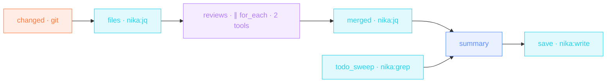

> **T3 · engineering**: `for_each` + `agent:` is the swarm pattern.
> Every changed file gets its own mini-agent with **read-only tools**
> (default-deny means exactly that), a turn budget and a token budget.
> jq flattens the typed findings; one model writes the summary.

## The job

Big PRs get shallow reviews because attention doesn't scale. Here it
does: each changed file is reviewed in isolation by an agent that can
READ and nothing else, in parallel, four at a time. A deterministic
`nika:grep` sweep counts the TODO debt beside the LLM pass, and the
final REVIEW.md ends with a verdict.

## The shape

{/* showcase:dag-begin pr-review-fanout.nika.yaml */}

{/* showcase:dag-end */}

Watch the graph execute: independent branches in parallel, the agent
fan-out at wave 3, and the join that waits for both branches before
`summary`:

<video autoPlay muted loop playsInline poster="/images/posters/dag-execution.png" style={{ borderRadius: "0.75rem" }}>
  <source src="/videos/dag-execution.webm" type="video/webm" />
  <source src="/videos/dag-execution.mp4" type="video/mp4" />
</video>

## The file

{/* showcase:begin pr-review-fanout.nika.yaml */}
```yaml pr-review-fanout.nika.yaml
nika: v1
workflow:
  id: pr-review-fanout
  description: "changed files → one read-only review agent each → merged REVIEW.md"

model: ollama/qwen3.5:4b   # local tool-calling model · swap for anthropic/claude-sonnet-4-6 for depth

const:
  base_ref: "main"
  review_root: "src/"      # the swarm's territory · keep in step with permits.fs.read

permits:
  tools: ["nika:done", "nika:grep", "nika:jq", "nika:read", "nika:write"]
  # The argv form (`exec.command:`) runs one named program with its arguments
  # and no shell between them, which is what makes a program allowlist mean
  # something. A `exec.shell:` task is refused against a list — measured:
  # `NIKA-SEC-004 · a shell-string command cannot be verified against a
  # permits.exec program allowlist (a pipeline can launch any program) — use
  # the array form`. Only `exec: true` admits a shell, and this workflow
  # deliberately never needs one.
  #
  # An allowlisted program is not an unconfined one: `git` runs inside the
  # `fs:` boundary below, which is why the header's second `Needs ·` line is
  # about git's global config rather than about git.
  exec: ["git"]
  fs:
    # `./src/**` covers the directory AND every descendant at any depth, which
    # is what both consumers need: `nika:grep` opens `./src` itself, and the
    # swarm reads files nested under it. A bare `./src` would cover only the
    # directory entry and refuse every file inside it.
    #
    # This bound is why `files` below filters the diff down to `const.review_root`:
    # `git diff` happily reports `Cargo.toml` or `.github/workflows/ci.yml`, and
    # an agent handed one of those would die `NIKA-SEC-004` mid-swarm. The claim
    # and the territory are kept equal on purpose.
    read: ["./src/**"]
    write: ["./REVIEW.md"]

tasks:
  # `--diff-filter=d` drops deletions: a file that no longer exists cannot be
  # reviewed, and asking an agent to read it just burns a turn on an error.
  changed:
    exec:
      command: ["git", "diff", "--name-only", "--diff-filter=d", "${{ const.base_ref }}...HEAD"]

  files:
    with:
      changed: ${{ tasks.changed.output }}
    invoke:
      tool: "nika:jq"
      args:
        input: "${{ with.changed }}"
        expression: >-
          split("\n")
          | map(select(length > 0))
          | map(select(startswith("${{ const.review_root }}")))

  # The deterministic pass. Debt does not need a model to be found, and this
  # runs whether or not anything changed.
  todo_sweep:
    invoke:
      tool: "nika:grep"
      args:
        pattern: "TODO|FIXME|HACK"
        path: "./src"

  reviews:
    with:
      files: ${{ tasks.files.output }}
    for_each: ${{ with.files }}
    max_parallel: 4                    # four reviewers in flight · not forty
    fail_fast: false                   # one reviewer's bad day is not the swarm's
    on_error:
      recover: null                    # a budget-exhausted review yields null · filtered below
    agent:
      system: >-
        You are a precise code reviewer. Read the file, then finish with ONLY
        the schema'd object ({file, findings: [{severity, message, line}]} ·
        severity exactly one of blocker|high|med|low), then call nika:done.
      prompt: "Review ${{ item }} · bugs first, then risky patterns. Read it before judging."
      tools:
        - "nika:read"                  # read-only swarm · least privilege
        - "nika:done"
      max_turns: 6                     # read · think · answer · a little slack
      max_tokens_total: 30000          # per reviewer · the swarm's ceiling is this × the file count
      # `additionalProperties: false` on BOTH object nodes. Without it on the
      # inner one, a provider may add keys to a finding and the sort below is
      # ordering a shape that changed between runs.
      schema:
        type: object
        additionalProperties: false
        required: [file, findings]
        properties:
          file: { type: string }
          findings:
            type: array
            items:
              type: object
              additionalProperties: false
              required: [severity, message]
              properties:
                severity: { type: string, enum: [blocker, high, med, low] }
                message: { type: string }
                line: { type: integer }

  # The fan-in.
  #   `. // []`      · a clean diff SKIPS the swarm (an empty for_each resolves
  #                    null), and the fan-in has to survive its own good news.
  #   `select(. != null)` · the reviewers that recovered leave here, by value.
  #   `.findings[] + {file}` · flatten [[finding]] → [finding], each carrying
  #                    the file it came from.
  #   the rank object · `sort_by(.severity)` would be ALPHABETICAL, which puts
  #                    `low` above `med`. Severity order is a decision, so it is
  #                    written down.
  merged:
    with:
      reviews: ${{ tasks.reviews.output }}
    invoke:
      tool: "nika:jq"
      args:
        input: "${{ with.reviews }}"
        expression: >-
          (. // [])
          | map(select(. != null))
          | map(.findings[] + { file: .file })
          | sort_by({ blocker: 0, high: 1, med: 2, low: 3 }[.severity])

  summary:
    with:
      merged: ${{ tasks.merged.output }}
      todo_sweep: ${{ tasks.todo_sweep.output }}
    infer:
      max_tokens: 2500                 # a review page · not the whole diff back
      prompt: |
        Merge these review findings into REVIEW.md · blockers first ·
        ${{ with.merged }}
        Open TODO debt found by grep ·
        ${{ with.todo_sweep }}
        End with a verdict · ship / fix-first / redesign.

  save:
    with:
      summary: ${{ tasks.summary.output }}
    invoke:
      tool: "nika:write"
      args:
        path: "./REVIEW.md"
        content: "${{ with.summary }}"

outputs:
  findings:
    value: ${{ tasks.merged.output }}
    description: "Every finding, blockers first, each attributed to its file"
  review:
    value: ${{ tasks.summary.output }}
    description: "The page a human reads · also written to ./REVIEW.md"
```
{/* showcase:end */}

## How it works

<Steps>
  <Step title="exec output becomes a collection">
    `git diff --name-only` is a string; the jq `split("\n")` turns it
    into the array the fan-out iterates. Workflows turn ANY tool output
    into a collection this way.
  </Step>
  <Step title="Each agent is least-privilege">
    `tools: ["nika:read", "nika:done"]`: the reviewer can read source
    and end its loop. It cannot write, fetch, or wander. Budgets
    (`max_turns: 6`, `max_tokens_total: 30000`) bound the worst case.
  </Step>
  <Step title="Typed findings merge deterministically">
    Every agent returns `{file, findings[]}` per its schema. The jq
    fan-in flattens and sorts: blockers surface first in REVIEW.md.
  </Step>
</Steps>

## Constructs you just used

| Construct | Where | Reference |
|---|---|---|
| `for_each` + `agent:` | `reviews` | [The 4 verbs](/concepts/verbs) |
| default-deny `tools:` | `reviews.agent.tools` | [The 4 verbs](/concepts/verbs) |
| `agent.schema:` | `reviews` | [The 4 verbs](/concepts/verbs) |
| `nika:grep` sweep | `todo_sweep` | [Builtins](/reference/builtins) |

## Make it yours

- Specialize the swarm: route `*.rs` files to a Rust-prompted agent and `*.sql` to a migrations-prompted one with two filtered fan-outs.
- Add `mcp:git/*` to the tools to let reviewers read blame and history (still no write).
- Fail CI on blockers: end with `nika:assert` on `size()` of the blocker slice.

<Card title="Level up · T4 epic" icon="microscope" href="/examples/deep-research-brief">
  Final tier: multi-stage pipelines. Plan, budgeted agent, thinking
  synthesis, self-reporting runs.
</Card>
