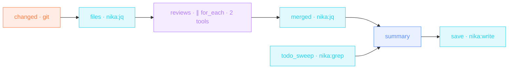

> **T3 · engineering** — `for_each` + `agent:` is the swarm pattern.
> Every changed file gets its own mini-agent with **read-only tools**
> (default-deny means exactly that), a turn budget and a token budget.
> jq flattens the typed findings; one model writes the summary.

## The job

Big PRs get shallow reviews because attention doesn't scale. Here it
does: each changed file is reviewed in isolation by an agent that can
READ and nothing else, in parallel, four at a time. A deterministic
`nika:grep` sweep counts the TODO debt beside the LLM pass — and the
final REVIEW.md ends with a verdict.

## The shape

{/* showcase:dag-begin t3-pr-review-fanout.nika.yaml */}

{/* showcase:dag-end */}

Watch the graph execute — independent branches in parallel, the agent
fan-out at wave 3, and the join that waits for both branches before
`summary`:

<video autoPlay muted loop playsInline poster="/images/posters/dag-execution.png" style={{ borderRadius: "0.75rem" }}>
  <source src="/videos/dag-execution.webm" type="video/webm" />
  <source src="/videos/dag-execution.mp4" type="video/mp4" />
</video>

## The file

{/* showcase:begin t3-pr-review-fanout.nika.yaml */}
```yaml t3-pr-review-fanout.nika.yaml
nika: v1
workflow: pr-review-fanout
description: "changed files → one read-only review agent each → merged REVIEW.md"

model: ollama/llama3.2:3b   # local tool-calling model · swap for anthropic/claude-sonnet-4-6 for depth

vars:
  base_ref: "main"

tasks:
  - id: changed
    exec:
      command: "git diff --name-only ${{ vars.base_ref }}...HEAD"

  - id: files
    depends_on: [changed]
    invoke:
      tool: "nika:jq"
      args:
        input: "${{ tasks.changed.output }}"
        expression: 'split("\n") | map(select(length > 0))'

  - id: todo_sweep
    invoke:
      tool: "nika:grep"
      args:
        pattern: "TODO|FIXME|HACK"
        path: "./src"

  - id: reviews
    depends_on: [files]
    for_each: ${{ tasks.files.output }}
    max_parallel: 4
    fail_fast: false
    on_error:
      recover: null                    # a budget-exhausted review yields null · the swarm lives
    agent:
      system: "You are a precise code reviewer. Read the file, then report findings."
      prompt: "Review ${{ item }} · bugs first, then risky patterns. Read it before judging."
      tools:
        - "nika:read"                  # read-only swarm · least privilege
        - "nika:done"
      max_turns: 6
      max_tokens_total: 30000
      schema:
        type: object
        required: [file, findings]
        properties:
          file: { type: string }
          findings:
            type: array
            items:
              type: object
              required: [severity, message]
              properties:
                severity: { type: string, enum: [blocker, high, med, low] }
                message: { type: string }
                line: { type: integer }

  - id: merged
    depends_on: [reviews]
    invoke:
      tool: "nika:jq"
      args:
        input: "${{ tasks.reviews.output }}"
        expression: 'map(select(. != null)) | map(.findings[] + {file: .file}) | sort_by(.severity)'

  - id: summary
    depends_on: [merged, todo_sweep]
    infer:
      prompt: |
        Merge these review findings into REVIEW.md · blockers first ·
        ${{ tasks.merged.output }}
        Open TODO debt found by grep ·
        ${{ tasks.todo_sweep.output }}
        End with a verdict · ship / fix-first / redesign.

  - id: save
    depends_on: [summary]
    invoke:
      tool: "nika:write"
      args:
        path: "./REVIEW.md"
        content: "${{ tasks.summary.output }}"

outputs:
  findings:
    value: ${{ tasks.merged.output }}
    type: array
    description: "All findings, severity-sorted, with file attribution"
  review: ${{ tasks.summary.output }}
```
{/* showcase:end */}

## How it works

<Steps>
  <Step title="exec output becomes a collection">
    `git diff --name-only` is a string; the jq `split("\n")` turns it
    into the array the fan-out iterates. Workflows turn ANY tool output
    into a collection this way.
  </Step>
  <Step title="Each agent is least-privilege">
    `tools: ["nika:read", "nika:done"]` — the reviewer can read source
    and end its loop. It cannot write, fetch, or wander. Budgets
    (`max_turns: 6`, `max_tokens_total: 30000`) bound the worst case.
  </Step>
  <Step title="Typed findings merge deterministically">
    Every agent returns `{file, findings[]}` per its schema. The jq
    fan-in flattens and sorts — blockers surface first in REVIEW.md.
  </Step>
</Steps>

## Constructs you just used

| Construct | Where | Reference |
|---|---|---|
| `for_each` + `agent:` | `reviews` | [The 4 verbs](/concepts/verbs) |
| default-deny `tools:` | `reviews.agent.tools` | [The 4 verbs](/concepts/verbs) |
| `agent.schema:` | `reviews` | [The 4 verbs](/concepts/verbs) |
| `nika:grep` sweep | `todo_sweep` | [Builtins](/reference/builtins) |

## Make it yours

- Specialize the swarm: route `*.rs` files to a Rust-prompted agent and `*.sql` to a migrations-prompted one with two filtered fan-outs.
- Add `mcp:git/*` to the tools to let reviewers read blame and history — still no write.
- Fail CI on blockers: end with `nika:assert` on `size()` of the blocker slice.

<Card title="Level up · T4 epic" icon="microscope" href="/examples/deep-research-brief">
  Final tier: multi-stage pipelines — plan, budgeted agent, thinking
  synthesis, self-reporting runs.
</Card>
