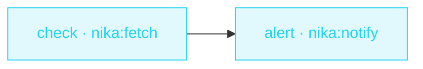

> **T1 starter · e-commerce / personal**: no `infer:` anywhere in this
> file. A workflow engine is not an LLM wrapper: the DAG, the tools and
> one CEL comparison do the whole job, deterministically, for free.

## The job

You're waiting for a price to drop. Checking the page every day is a
robot's job. This workflow pulls one structured field from the shop's
API, compares it to your target, and pings your webhook only when it's
time to buy.

## The shape

{/* showcase:dag-begin price-watch.nika.yaml */}

{/* showcase:dag-end */}

## The file

{/* showcase:begin price-watch.nika.yaml */}
```yaml price-watch.nika.yaml
nika: price-watch

const:
  product_api: "https://api.shop.example.com/v1/products/macbook-air"
  alert_below: 899

secrets:
  alerts_webhook:
    source: env
    key: ALERTS_WEBHOOK_URL
    egress:                       # sanction the one send · the secret IS the URL
      - to: "nika:notify"
        host_from_self: true
permits:
  tools: ["nika:fetch", "nika:notify"]
  net:
    # TWO hosts, for two different reasons.
    #
    # `api.shop.example.com` is what `const.product_api` names — a literal
    # `check` can read, so a mismatch here is caught before the run.
    #
    # `hooks.slack.com` is the ALERT host, and it is the entry people leave
    # out. `host_from_self:` above sanctions the FLOW (this secret may be the
    # URL) — it does not grant the capability. The host stays unknown at
    # check, so it is judged at RUN against this bound: name the escalation
    # host here or the send is refused mid-run, the first time the price
    # actually drops. Swap it for wherever YOUR webhook lives.
    http: ["api.shop.example.com", "hooks.slack.com"]

tasks:
  check:
    invoke:
      tool: "nika:fetch"
      args:
        url: "${{ const.product_api }}"
        mode: jq
        jq: "."
    extract:                           # named jq bindings over the raw response
      price: ".price"
      name: ".name"
    on_error:
      # Offline rehearsal · a sample ABOVE the target, so the gate below stays
      # closed and the dry run ends green with the alert skipped. The alert
      # path is therefore NOT exercised offline — which is exactly why the
      # `net:` bound above has to be right by reading, not by running.
      recover: { price: 949, name: "MacBook Air (offline sample)" }

  alert:
    with:
      price: ${{ tasks.check.price }}     # value edges · the named bindings cross the boundary here
      name: ${{ tasks.check.name }}
    when: ${{ with.price < const.alert_below }}
    invoke:
      tool: "nika:notify"
      args:
        channel: webhook
        target: "${{ secrets.alerts_webhook }}"
        message: "Price drop · ${{ with.name }} is now ${{ with.price }} (target ${{ const.alert_below }})"
        severity: info

outputs:
  price: ${{ tasks.check.price }}
```
{/* showcase:end */}

## How it works

<Steps>
  <Step title="Fetch ONE field, not a page">
    `mode: jq` extracts structured JSON from the API response, and the
    `extract:` block binds named fields: `${{ tasks.check.price }}` is a
    number, not a blob of HTML.
  </Step>
  <Step title="CEL gates the alert">
    The named binding crosses in `with:`
    (`price: ${{ tasks.check.price }}`), then
    `when: ${{ with.price < const.alert_below }}` is a plain CEL
    comparison. False → the task is skipped, not failed.
  </Step>
  <Step title="The webhook stays secret">
    `secrets:` declares a vault/env-backed reference. The URL is masked
    in logs: `${{ secrets.alerts_webhook }}` never appears in a trace.
  </Step>
</Steps>

## Constructs you just used

| Construct | Where | Reference |
|---|---|---|
| `nika:fetch` `mode: jq` | `check` | [Builtins](/reference/builtins) |
| `extract:` jq bindings | `check.price` | [Bindings](/concepts/bindings) |
| `when:` CEL comparison | `alert` | [Workflows](/concepts/workflows) |
| `secrets:` | envelope | [YAML syntax](/reference/yaml-syntax) |

## Make it yours

- Watch N products: lift the URL into a list input and `for_each` over it. See [Competitor radar](/examples/competitor-radar) for the fan-out pattern.
- Schedule it: workflow files describe a run. Your host's cron (or `nika serve`) decides when runs start.
- Add a second `when:` branch that notifies on price INCREASES above a ceiling.

<Card title="Next · Social repurpose" icon="share-nodes" href="/examples/social-repurpose">
  The last starter introduces the diamond: one source fanning into
  three parallel rewrites.
</Card>
