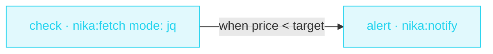

> **T1 starter · e-commerce / personal** — no `infer:` anywhere in this
> file. A workflow engine is not an LLM wrapper: the DAG, the tools and
> one CEL comparison do the whole job, deterministically, for free.

## The job

You're waiting for a price to drop. Checking the page every day is a
robot's job. This workflow pulls one structured field from the shop's
API, compares it to your target, and pings your webhook only when it's
time to buy.

## The shape



## The file

{/* showcase:begin t1-price-watch.nika.yaml */}
```yaml t1-price-watch.nika.yaml
nika: v1
workflow: price-watch
description: "Watch a product price, ping me when it drops below my target"

vars:
  product_api: "https://api.shop.example.com/v1/products/macbook-air"
  alert_below: 899

secrets:
  alerts_webhook:
    source: env
    key: ALERTS_WEBHOOK_URL

tasks:
  - id: check
    invoke:
      tool: "nika:fetch"
      args:
        url: "${{ vars.product_api }}"
        mode: jq
        jq: "."
    output:                           # named jq bindings over the raw response
      price: ".price"
      name: ".name"

  - id: alert
    depends_on: [check]
    when: ${{ tasks.check.price < vars.alert_below }}
    invoke:
      tool: "nika:notify"
      args:
        channel: webhook
        target: "${{ secrets.alerts_webhook }}"
        message: "Price drop · ${{ tasks.check.name }} is now ${{ tasks.check.price }} (target ${{ vars.alert_below }})"
        severity: info

outputs:
  price: ${{ tasks.check.price }}
```
{/* showcase:end */}

## How it works

<Steps>
  <Step title="Fetch ONE field, not a page">
    `mode: jq` extracts structured JSON from the API response, and the
    `output:` block binds named fields — `${{ tasks.check.price }}` is a
    number, not a blob of HTML.
  </Step>
  <Step title="CEL gates the alert">
    `when: ${{ tasks.check.price < vars.alert_below }}` is a plain CEL
    comparison. False → the task is skipped, not failed.
  </Step>
  <Step title="The webhook stays secret">
    `secrets:` declares a vault/env-backed reference. The URL is masked
    in logs — `${{ secrets.alerts_webhook }}` never appears in a trace.
  </Step>
</Steps>

## Constructs you just used

| Construct | Where | Reference |
|---|---|---|
| `nika:fetch` `mode: jq` | `check` | [Builtins](/reference/builtins) |
| `output:` jq bindings | `check.output` | [Bindings](/concepts/bindings) |
| `when:` CEL comparison | `alert` | [Workflows](/concepts/workflows) |
| `secrets:` | envelope | [YAML syntax](/reference/yaml-syntax) |

## Make it yours

- Watch N products: lift the URL into a list var and `for_each` over it — see [Competitor radar](/examples/competitor-radar) for the fan-out pattern.
- Schedule it: workflow files describe a run — your host's cron (or `nika serve`) decides when runs start.
- Add a second `when:` branch that notifies on price INCREASES above a ceiling.

<Card title="Next · Social repurpose" icon="share-nodes" href="/examples/social-repurpose">
  The last starter introduces the diamond — one source fanning into
  three parallel rewrites.
</Card>
