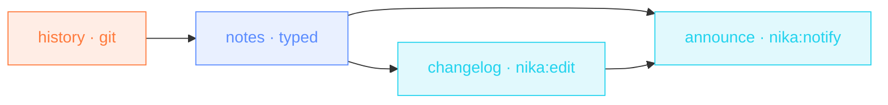

> **T2 chain · engineering / devrel**: the release-day ritual as one
> file: history in, a typed notes object out, the CHANGELOG updated
> **in place** with `nika:edit`, the team pinged with the headline.

## The job

Every release someone copy-pastes git log into a doc, rewrites it, pastes
it into the CHANGELOG, then announces it. Four manual steps, four chances
to drift. Here the git range is an input, the notes are a schema-typed
object, and the announcement quotes the same headline the CHANGELOG got.

## The shape

{/* showcase:dag-begin t2-release-notes.nika.yaml */}

{/* showcase:dag-end */}

## The file

{/* showcase:begin t2-release-notes.nika.yaml */}
```yaml t2-release-notes.nika.yaml
nika: v1
workflow: release-notes
description: "git log → typed release notes → CHANGELOG insert → team ping"

model: ollama/qwen3.5:4b   # local · zero key · swap for mistral/mistral-large

vars:
  since_tag: "v0.80.0"

secrets:
  team_webhook:
    source: env
    key: TEAM_WEBHOOK_URL
    egress:                       # sanction the one send · the secret IS the URL
      - to: "nika:notify"
        host_from_self: true

tasks:
  - id: history
    exec:
      command: "git log ${{ vars.since_tag }}..HEAD --oneline --no-merges"

  - id: notes
    depends_on: [history]
    infer:
      prompt: |
        Write release notes from these commits ·
        ${{ tasks.history.output }}
        Tone · plain, direct, no marketing fluff.
      schema:
        type: object
        required: [headline, body]
        properties:
          headline: { type: string }
          breaking: { type: array, items: { type: string } }
          body: { type: string }

  - id: changelog
    depends_on: [notes]
    invoke:
      tool: "nika:edit"
      args:
        path: "./CHANGELOG.md"
        find: "# Changelog"
        replace: |
          # Changelog

          ## ${{ vars.since_tag }}..HEAD · ${{ tasks.notes.output.headline }}

          ${{ tasks.notes.output.body }}

  - id: announce
    depends_on: [notes, changelog]
    invoke:
      tool: "nika:notify"
      args:
        channel: webhook
        target: "${{ secrets.team_webhook }}"
        message: "Release notes ready · ${{ tasks.notes.output.headline }}"
        severity: info

outputs:
  headline: ${{ tasks.notes.output.headline }}
  body: ${{ tasks.notes.output.body }}
```
{/* showcase:end */}

## How it works

<Steps>
  <Step title="The range is a var, not a hardcode">
    `${{ vars.since_tag }}..HEAD`: next release you change one input,
    or pass it at run time.
  </Step>
  <Step title="Typed notes · headline + breaking + body">
    The schema means `${{ tasks.notes.output.headline }}` is a real
    field downstream: in the CHANGELOG insert AND in the ping. One
    source, two consumers, no drift.
  </Step>
  <Step title="Edit-in-place, not overwrite">
    `nika:edit` finds the `# Changelog` heading and replaces it with
    itself + the new section: the file's history stays intact below.
  </Step>
</Steps>

## Constructs you just used

| Construct | Where | Reference |
|---|---|---|
| `exec:` with var interpolation | `history` | [The 4 verbs](/concepts/verbs) |
| `infer.schema:` | `notes` | [The 4 verbs](/concepts/verbs) |
| `nika:edit` find/replace | `changelog` | [Builtins](/reference/builtins) |
| `nika:notify` + `secrets:` | `announce` | [Builtins](/reference/builtins) |

## Make it yours

- Gate the announce behind a human: add a `nika:prompt` task between `changelog` and `announce`. The pattern is in [Invoice chaser](/examples/invoice-chaser).
- Add `breaking:` to the ping when `size(tasks.notes.output.breaking) > 0`.
- Render a public version too: a second `infer` task with a "user-facing tone" prompt, writing `docs/changelog/`.

<Card title="Next · SEO content brief" icon="magnifying-glass-chart" href="/examples/seo-content-brief">
  Chained fetch extractions (sitemap mode, then article mode) and CEL
  indexing into a binding.
</Card>
