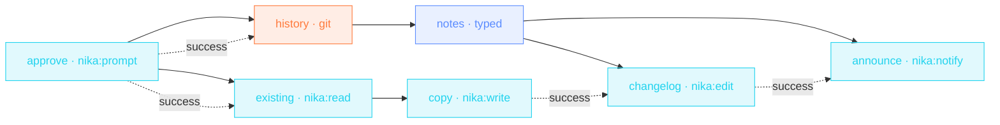

> **T2 chain · engineering / devrel**: the release-day ritual as one
> file: history in, a typed notes object out, the CHANGELOG updated
> **in place** with `nika:edit`, the team pinged with the headline.

## The job

Every release someone copy-pastes git log into a doc, rewrites it, pastes
it into the CHANGELOG, then announces it. Four manual steps, four chances
to drift. Here the git range is an input, the notes are a schema-typed
object, and the announcement quotes the same headline the CHANGELOG got.

## The shape

{/* showcase:dag-begin release-notes.nika.yaml */}

{/* showcase:dag-end */}

## The file

{/* showcase:begin release-notes.nika.yaml */}
```yaml release-notes.nika.yaml
nika: release-notes

# A NON-thinking local model, deliberately: a thinking model can spend the
# whole `max_tokens` budget in its think block and return before the JSON
# (engine#428). Schema showcases pick a model that answers directly.
model: ollama/llama3.2:3b

inputs:
  announce:
    type: bool
    default: false
    description: "Actually send the team ping (needs TEAM_WEBHOOK_URL)"

const:
  since_tag: "v0.80.0"
  changelog_src: "examples/fixtures/CHANGELOG.md" # point this at YOUR CHANGELOG.md
  changelog_out: "out/CHANGELOG.md"                        # the working copy this run edits

secrets:
  team_webhook:
    source: env
    key: TEAM_WEBHOOK_URL
    egress:                       # sanction the one send · the secret IS the URL
      - to: "nika:notify"
        host_from_self: true
permits:
  exec: ["git"]                   # the ONE program this workflow may run
  tools: ["nika:edit", "nika:notify", "nika:prompt", "nika:read", "nika:write"]
  net:
    # `host_from_self:` above sanctions the FLOW (the secret may be the URL) —
    # it does not grant the capability. The host stays unknown at check, so it
    # is judged at RUN against this bound: name the announce host here or the
    # send is refused mid-run, after the tokens are already spent.
    http: ["hooks.slack.com"]
  fs:
    # The workflow never edits your changelog in place — it copies it and
    # edits the copy, so you move the result when the diff looks right.
    #
    # The working copy appears in BOTH lists, and that is not redundancy:
    # `nika:edit` reads the file before it writes it, so a write-only grant
    # is refused with NIKA-SEC-004 · outside permits.fs.read. Every in-place
    # builtin owes both halves.
    read: ["examples/fixtures/CHANGELOG.md", "out/CHANGELOG.md"]
    write: ["out/CHANGELOG.md"]

tasks:
  # The human gate (NEP-0002 · v2.2). `git log` output is UNTRUSTED content —
  # a hostile branch writes its own commit subjects — and this workflow pairs
  # it with a private `fs.read` and a webhook: the lethal trifecta, unless a
  # human dominates the path. The gate comes FIRST and BOTH roots hang off it
  # (`history` carries the untrusted content, `existing` carries the private
  # read); a gate on a sibling branch dominates nothing. And each root
  # CONSUMES the answer affirmatively (NEP-0020 — a bare `after:` admits the
  # refusal: it settles success with value false), the downstream null-guards
  # passing the « no » along the value edges. Non-interactive runs answer it
  # in one pass with `--answer approve=true`.
  approve:
    invoke:
      tool: "nika:prompt"
      args:
        mode: "confirm"
        message: "read the git history since ${{ const.since_tag }}, rewrite the changelog copy, and ping the team if announce is on?"

  history:
    after: { approve: success }
    with:
      go: ${{ tasks.approve.output }}
    when: ${{ with.go == true }}       # « no » at the gate → no history read at all
    exec:
      command: ["git", "log", "${{ const.since_tag }}..HEAD", "--oneline", "--no-merges"]
    on_error:
      # No such tag here (or not a repo at all) → a sample log takes over and
      # the rest of the chain is exercised exactly as it would be on the day.
      recover: |
        a1b2c3d feat(api): pagination cursors on every list endpoint
        d4e5f6a fix(auth): refresh tokens no longer rotate on read
        7g8h9i0 refactor(store): drop the legacy write path

  notes:
    with:
      history: ${{ tasks.history.output }}
    when: ${{ with.history != null && size(with.history) > 0 }}  # a refused gate skips history (null) · an empty log has nothing to draft either
    infer:
      max_tokens: 1000
      prompt: |
        Write release notes from these commits ·
        ${{ with.history }}
        Tone · plain, direct, no marketing fluff.
      schema:
        type: object
        additionalProperties: false
        required: [headline, body]
        properties:
          headline: { type: string }
          breaking: { type: array, items: { type: string } }
          body: { type: string }

  # Copy-then-edit · `nika:edit` is strictly in place and throws when `find:`
  # matches nothing (NIKA-BUILTIN-EDIT-001), so its target must exist and must
  # carry the anchor. Read yours, write the working copy, edit THAT.
  existing:
    after: { approve: success }
    with:
      go: ${{ tasks.approve.output }}
    when: ${{ with.go == true }}       # the same « no » closes the private-read branch
    invoke:
      tool: "nika:read"
      args: { path: "${{ const.changelog_src }}" }

  copy:
    with:
      existing: ${{ tasks.existing.output }}
    when: ${{ with.existing != null && size(with.existing) > 0 }}  # a refused gate skips the read (null) · an empty file has nothing to copy
    invoke:
      tool: "nika:write"
      args:
        path: "${{ const.changelog_out }}"
        content: "${{ with.existing }}"
        create_dirs: true
        overwrite: true

  changelog:
    with:
      notes_headline: ${{ tasks.notes.output.headline }}
      notes_body: ${{ tasks.notes.output.body }}
    after:
      copy: success              # state, no data · the anchor is on disk before we edit
    invoke:
      tool: "nika:edit"
      args:
        path: "${{ const.changelog_out }}"
        find: "# Changelog"      # a LITERAL string · not a regex
        count: 1                 # the top anchor only · never every occurrence
        replace: |
          # Changelog

          ## ${{ const.since_tag }}..HEAD · ${{ with.notes_headline }}

          ${{ with.notes_body }}

  announce:
    with:
      notes_headline: ${{ tasks.notes.output.headline }}
    when: ${{ inputs.announce == true }}   # OFF by default · a rehearsal must not ping the team
    after:
      changelog: success
    invoke:
      tool: "nika:notify"
      args:
        channel: webhook
        target: "${{ secrets.team_webhook }}"
        message: "Release notes ready · ${{ with.notes_headline }}"
        severity: info

outputs:
  headline: ${{ tasks.notes.output.headline }}
  body: ${{ tasks.notes.output.body }}
```
{/* showcase:end */}

## How it works

<Steps>
  <Step title="The range is an input, not a hardcode">
    `${{ inputs.since_tag }}..HEAD`: next release you change one input,
    or pass it at run time.
  </Step>
  <Step title="Typed notes · headline + breaking + body">
    The schema means `${{ tasks.notes.output.headline }}` is a real
    field downstream: in the CHANGELOG insert AND in the ping. One
    source, two consumers, no drift.
  </Step>
  <Step title="Edit-in-place, not overwrite">
    `nika:edit` finds the `# Changelog` heading and replaces it with
    itself + the new section: the file's history stays intact below.
  </Step>
</Steps>

## Constructs you just used

| Construct | Where | Reference |
|---|---|---|
| `exec:` with input interpolation | `history` | [The 4 verbs](/concepts/verbs) |
| `infer.schema:` | `notes` | [The 4 verbs](/concepts/verbs) |
| `nika:edit` find/replace | `changelog` | [Builtins](/reference/builtins) |
| `nika:notify` + `secrets:` | `announce` | [Builtins](/reference/builtins) |

## Make it yours

- Gate the announce behind a human: add a `nika:prompt` task between `changelog` and `announce`. The pattern is in [Invoice chaser](/examples/invoice-chaser).
- Add `breaking:` to the ping when `size(tasks.notes.output.breaking) > 0`.
- Render a public version too: a second `infer` task with a "user-facing tone" prompt, writing `docs/changelog/`.

<Card title="Next · SEO content brief" icon="magnifying-glass-chart" href="/examples/seo-content-brief">
  Chained fetch extractions (sitemap mode, then article mode) and CEL
  indexing into a binding.
</Card>
