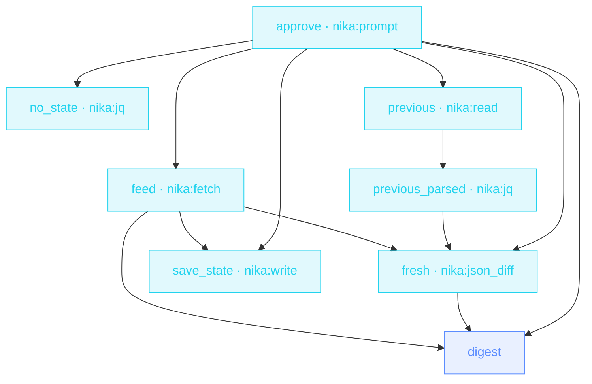

> **T2 chain · devops / dependency hygiene**: `mode: feed` parses
> RSS/Atom natively, and the **state-file pattern** (read last run →
> diff → write next state) means you only hear about what's new.

## The job

« Did anything we depend on ship this week? » Checking releases pages
is a robot's job. This workflow reads the Atom feed, diffs it against
what it saw last run (RFC 6902: empty patch means silence), digests
only the new entries, and saves the state for next time. First run?
The missing state file recovers to an empty list.

## The shape

{/* showcase:dag-begin release-radar.nika.yaml */}

{/* showcase:dag-end */}

## The file

{/* showcase:begin release-radar.nika.yaml */}
```yaml release-radar.nika.yaml
nika: release-radar

model: ollama/qwen3.5:4b   # local · zero key · swap for any provider in the catalog

const:
  releases_feed: "https://github.com/tokio-rs/tokio/releases.atom"
  state_path: "out/release-radar.json"
permits:
  tools: ["nika:fetch", "nika:jq", "nika:json_diff", "nika:prompt", "nika:read", "nika:write"]
  net:
    http: ["github.com"]   # the feed's host · net entries are exact names, never globs
  fs:
    # The state-file pattern touches exactly ONE path, on both sides: read
    # last run's state, write the next. `const.state_path` names it and a run
    # cannot move a const, so the same literal is the whole boundary —
    # `create_dirs:` makes out/ underneath it on the first run.
    read: ["out/release-radar.json"]
    write: ["out/release-radar.json"]

tasks:
  # The human gate first (NIKA-SEC-009 · NEP-0002, the Rule of Two as a
  # static check). This boundary permits all three legs — private read
  # (the state file) + untrusted ingress (the release feed) + egress
  # (the state write) — so a blocking prompt (no default:) dominates the
  # flow before a byte moves. Headless surfaces pause durably and resume
  # with `--resume <trace> --answer approve=true`.
  approve:
    invoke:
      tool: "nika:prompt"
      args:
        message: "This run fetches ${{ const.releases_feed }}, diffs against ${{ const.state_path }}, and rewrites that state file. Proceed?"

  # First run has no state file · recover to an empty list.
  no_state:
    with:
      go: ${{ tasks.approve.output }}
    when: ${{ with.go == true }}
    invoke:
      tool: "nika:jq"
      args: { input: [], expression: "." }

  previous:
    with:
      go: ${{ tasks.approve.output }}
    when: ${{ with.go == true }}
    invoke:
      tool: "nika:read"
      args: { path: "${{ const.state_path }}" }
    on_error:
      on_codes: [NIKA-BUILTIN-READ-001]   # not-found ONLY · a permission error still fails loudly
      recover: ${{ tasks.no_state.output }}

  feed:
    with:
      go: ${{ tasks.approve.output }}
    when: ${{ with.go == true }}
    invoke:
      tool: "nika:fetch"
      args:
        url: "${{ const.releases_feed }}"
        mode: feed
    extract:
      entries: "[.items[] | {title, link}]"
    on_error:
      # No network → this sample stands in for the RAW feed response: it
      # carries `items:` under the keys `mode: feed` actually returns
      # (probed live on this feed: title · link · id · author · content —
      # there is no `published` field), so the `extract:` jq above runs over
      # it unchanged. Recovering the BINDING's shape instead makes the jq
      # throw NIKA-VAR-004 — the recovery must mirror the response, never
      # the binding.
      recover:
        items:
          - { title: "tokio 1.48.0", link: "https://github.com/tokio-rs/tokio/releases/tag/tokio-1.48.0" }
          - { title: "tokio 1.47.1", link: "https://github.com/tokio-rs/tokio/releases/tag/tokio-1.47.1" }

  # `nika:read` hands back a STRING — a file is text until you parse it.
  # Measured: diffing the unparsed read against the entries array emits ONE
  # whole-document `replace` op at path "" on every run after the first,
  # so everything is reported as new, forever. The first-run recovery is
  # already an array; the guard keeps both shapes.
  previous_parsed:
    with:
      previous: ${{ tasks.previous.output }}
    invoke:
      tool: "nika:jq"
      args:
        input: "${{ with.previous }}"
        expression: 'if type == "string" then fromjson else . end'

  fresh:
    with:
      go: ${{ tasks.approve.output }}
      previous: ${{ tasks.previous_parsed.output }}
      entries: ${{ tasks.feed.entries }}
    when: ${{ with.go == true }}
    invoke:
      tool: "nika:json_diff"
      args:
        before: "${{ with.previous }}"
        after: "${{ with.entries }}"

  digest:
    with:
      go: ${{ tasks.approve.output }}
      fresh: ${{ tasks.fresh.output }}
      entries: ${{ tasks.feed.entries }}
    when: ${{ with.go == true && size(with.fresh) > 0 }}
    infer:
      max_tokens: 500
      prompt: |
        New releases appeared on our dependency radar (RFC 6902 patch
        against last run) ·
        ${{ with.fresh }}
        Full current feed · ${{ with.entries }}
        Write 3 bullets · what shipped · whether it looks breaking ·
        what to check in our code.

  save_state:
    with:
      go: ${{ tasks.approve.output }}
      entries: ${{ tasks.feed.entries }}
    when: ${{ with.go == true }}
    invoke:
      tool: "nika:write"
      args:
        path: "${{ const.state_path }}"
        content: "${{ with.entries }}"
        create_dirs: true
        overwrite: true

outputs:
  new_entries:
    value: ${{ tasks.fresh.output }}
    description: "RFC 6902 ops · empty = nothing new since last run"
  # Untyped on purpose: `digest` is `when:`-gated, so on a quiet week it is
  # SKIPPED and this reads null. Exporting it is also what keeps those tokens
  # from being dead spend — an infer whose output nothing consumes is paid for
  # and thrown away, and `check` says so.
  briefing: ${{ tasks.digest.output }}
```
{/* showcase:end */}

## How it works

<Steps>
  <Step title="feed mode does the parsing">
    `mode: feed` turns RSS/Atom into structured items: no scraping,
    no XML wrangling. The `extract:` binding keeps just title/url/date.
  </Step>
  <Step title="State makes it incremental">
    `previous` reads the state file (recovering to `[]` on first run) ·
    `nika:json_diff` against the fresh feed yields ONLY the new
    entries · `save_state` overwrites for next time.
  </Step>
  <Step title="Silence is the feature">
    The digest runs `when: size(...) > 0`: nothing new, no model
    call, no noise. Schedule it daily and forget it.
  </Step>
</Steps>

## Constructs you just used

| Construct | Where | Reference |
|---|---|---|
| `nika:fetch` `mode: feed` | `feed` | [Builtins](/reference/builtins) |
| state-file pattern | `previous` · `save_state` | [Bindings](/concepts/bindings) |
| `nika:json_diff` (RFC 6902) | `fresh` | [Builtins](/reference/builtins) |
| `on_error: recover:` first-run | `previous` | [Error model](/reference/error-codes) |

## Make it yours

- Watch N dependencies: lift the feed URL into a list and `for_each` the fetch ([Competitor radar](/examples/competitor-radar) shows the leash).
- Pipe breaking-change suspects into [PR review fan-out](/examples/pr-review-fanout)'s reviewer prompt.
- Swap the feed for your vendor's changelog RSS. The shape doesn't change.

<Card title="Next · Resume screener" icon="user-check" href="/examples/resume-screener">
  PII never leaves the machine: a local-model rubric per candidate,
  ranked deterministically.
</Card>
