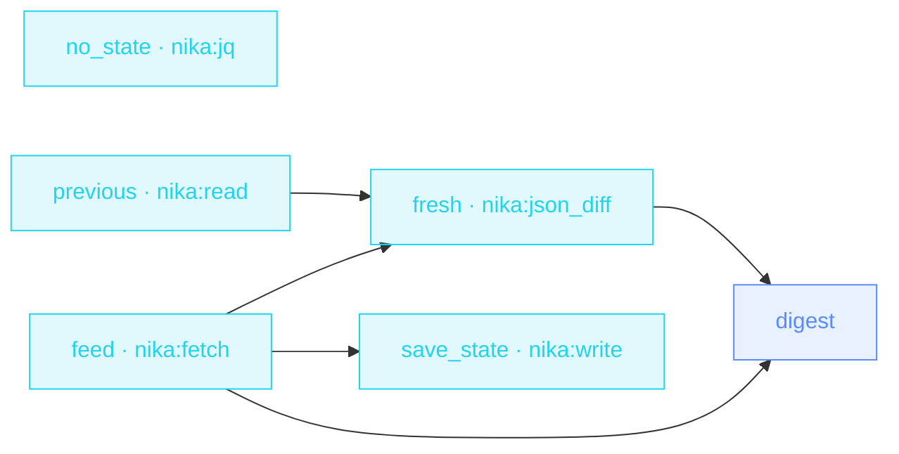

> **T2 chain · devops / dependency hygiene**: `mode: feed` parses
> RSS/Atom natively, and the **state-file pattern** (read last run →
> diff → write next state) means you only hear about what's new.

## The job

« Did anything we depend on ship this week? » Checking releases pages
is a robot's job. This workflow reads the Atom feed, diffs it against
what it saw last run (RFC 6902: empty patch means silence), digests
only the new entries, and saves the state for next time. First run?
The missing state file recovers to an empty list.

## The shape

{/* showcase:dag-begin t2-release-radar.nika.yaml */}

{/* showcase:dag-end */}

## The file

{/* showcase:begin t2-release-radar.nika.yaml */}
```yaml t2-release-radar.nika.yaml
nika: v1
workflow: release-radar
description: "dependency release feed → diff vs last run → only the NEW ships"

model: ollama/qwen3.5:4b   # local · zero key · swap for any provider in the catalog

vars:
  releases_feed: "https://github.com/tokio-rs/tokio/releases.atom"
  state_path: "./state/release-radar.json"

tasks:
  # First run has no state file · recover to an empty list.
  - id: no_state
    invoke:
      tool: "nika:jq"
      args: { input: [], expression: "." }

  - id: previous
    depends_on: [no_state]
    invoke:
      tool: "nika:read"
      args: { path: "${{ vars.state_path }}" }
    on_error:
      on_codes: [NIKA-BUILTIN-READ-001]   # not-found ONLY · a permission error still fails loudly
      recover: ${{ tasks.no_state.output }}

  - id: feed
    invoke:
      tool: "nika:fetch"
      args:
        url: "${{ vars.releases_feed }}"
        mode: feed
    output:
      entries: "[.items[] | {title, url, published}]"

  - id: fresh
    depends_on: [previous, feed]
    with:
      previous: ${{ tasks.previous.output }}
      entries: ${{ tasks.feed.entries }}
    invoke:
      tool: "nika:json_diff"
      args:
        before: "${{ with.previous }}"
        after: "${{ with.entries }}"

  - id: digest
    depends_on: [fresh, feed]
    with:
      fresh: ${{ tasks.fresh.output }}
      entries: ${{ tasks.feed.entries }}
    when: ${{ size(with.fresh) > 0 }}
    infer:
      prompt: |
        New releases appeared on our dependency radar (RFC 6902 patch
        against last run) ·
        ${{ with.fresh }}
        Full current feed · ${{ with.entries }}
        Write 3 bullets · what shipped · whether it looks breaking ·
        what to check in our code.

  - id: save_state
    depends_on: [feed]
    with:
      entries: ${{ tasks.feed.entries }}
    invoke:
      tool: "nika:write"
      args:
        path: "${{ vars.state_path }}"
        content: "${{ with.entries }}"
        create_dirs: true
        overwrite: true

outputs:
  new_entries:
    value: ${{ tasks.fresh.output }}
    description: "RFC 6902 ops · empty = nothing new since last run"
```
{/* showcase:end */}

## How it works

<Steps>
  <Step title="feed mode does the parsing">
    `mode: feed` turns RSS/Atom into structured items: no scraping,
    no XML wrangling. The `output:` binding keeps just title/url/date.
  </Step>
  <Step title="State makes it incremental">
    `previous` reads the state file (recovering to `[]` on first run) ·
    `nika:json_diff` against the fresh feed yields ONLY the new
    entries · `save_state` overwrites for next time.
  </Step>
  <Step title="Silence is the feature">
    The digest runs `when: size(...) > 0`: nothing new, no model
    call, no noise. Schedule it daily and forget it.
  </Step>
</Steps>

## Constructs you just used

| Construct | Where | Reference |
|---|---|---|
| `nika:fetch` `mode: feed` | `feed` | [Builtins](/reference/builtins) |
| state-file pattern | `previous` · `save_state` | [Bindings](/concepts/bindings) |
| `nika:json_diff` (RFC 6902) | `fresh` | [Builtins](/reference/builtins) |
| `on_error: recover:` first-run | `previous` | [Error model](/reference/error-codes) |

## Make it yours

- Watch N dependencies: lift the feed URL into a list and `for_each` the fetch ([Competitor radar](/examples/competitor-radar) shows the leash).
- Pipe breaking-change suspects into [PR review fan-out](/examples/pr-review-fanout)'s reviewer prompt.
- Swap the feed for your vendor's changelog RSS. The shape doesn't change.

<Card title="Next · Resume screener" icon="user-check" href="/examples/resume-screener">
  PII never leaves the machine: a local-model rubric per candidate,
  ranked deterministically.
</Card>
