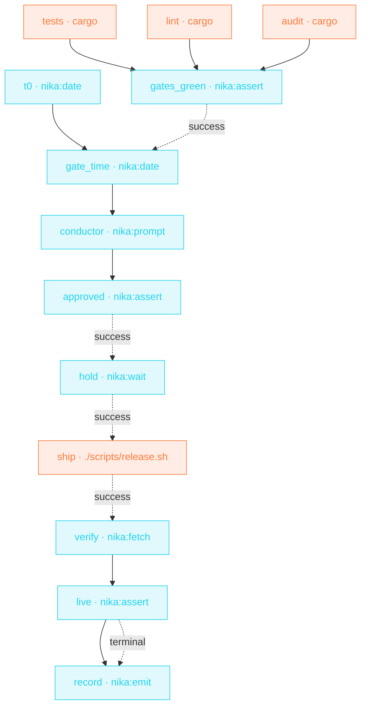

> **T4 epic · devops / release engineering**: time is a first-class
> citizen. The train holds with `nika:wait until:` (an absolute
> timestamp, not a sleep), the gates' duration is computed with
> `nika:date op: diff`, a human signs the departure, and the record
> lands in the journal **whether the ship success or not**.

## The job

Release day choreography: tests, lint and audit run as one parallel
wave; an assert refuses departure on any red; the conductor signs with
full information (« gates GREEN in 12 min · ship 1.4.0 in the 09:00Z
window? »); the train holds until the window; ships; re-polls prod
until it reports the new version; and `on_finally` files the departure
record either way.

## The shape

{/* showcase:dag-begin t4-release-train.nika.yaml */}

{/* showcase:dag-end */}

## The file

{/* showcase:begin t4-release-train.nika.yaml */}
```yaml t4-release-train.nika.yaml
nika: v1
workflow:
  id: release-train
  description: "parallel gates → human GO → hold until the window → ship · verify · record"

inputs:
  version:
    type: string
    required: true
    description: "The version to ship (e.g. 1.4.0)"
const:
  window: "2026-07-28T09:00:00Z"

secrets:
  team_webhook:
    source: env
    key: TEAM_WEBHOOK_URL
    egress:                       # sanction the on_finally ping · the secret IS the URL
      - to: "nika:notify"
        host_from_self: true
permits:
  tools: ["nika:notify", "nika:assert", "nika:date", "nika:emit", "nika:fetch", "nika:prompt", "nika:wait"]
  exec: ["./scripts/release.sh", "cargo"]
  net: { http: ["api.example.com"] }

tasks:
  t0:
    invoke:
      tool: "nika:date"
      args: { op: now }

  # ── the gate wave · all three run in parallel ──
  tests:
    exec:
      command: ["cargo", "test", "--workspace", "--quiet"]
      capture: structured
    timeout: "15m"

  lint:
    exec:
      command: ["cargo", "clippy", "--workspace", "--all-targets", "--", "-D", "warnings"]
      capture: structured
    timeout: "10m"

  audit:
    exec:
      command: ["cargo", "audit"]
      capture: structured
    timeout: "5m"
    retry:
      max_attempts: 2                  # advisory DB fetch can flake

  gates_green:
    with:
      all_green: ${{ tasks.tests.output.exit_code == 0 && tasks.lint.output.exit_code == 0 && tasks.audit.output.exit_code == 0 }}   # three value edges · one boundary expression
    invoke:
      tool: "nika:assert"
      args:
        condition: "${{ with.all_green }}"
        message: "A release gate is RED: the train does not depart"

  gate_time:
    with:
      t0: ${{ tasks.t0.output }}
    after:
      gates_green: success           # state, no data · the timing is only worth taking on a green board
    invoke:
      tool: "nika:date"
      args:
        op: diff
        start: "${{ with.t0 }}"
        end: "now"
        unit: minutes

  # ── the human signs the departure ──
  conductor:
    with:
      gate_time: ${{ tasks.gate_time.output }}
    invoke:
      tool: "nika:prompt"
      args:
        message: "Gates GREEN in ${{ with.gate_time }} min. Ship ${{ inputs.version }} in the ${{ const.window }} window?"
        default: false

  approved:
    with:
      signed: ${{ tasks.conductor.output == true }}   # the signature check crosses as ONE boundary expression
    invoke:
      tool: "nika:assert"
      args:
        condition: "${{ with.signed }}"
        message: "Departure not signed: train cancelled"

  # ── hold until the window · absolute time, not a sleep ──
  hold:
    after:
      approved: success
    invoke:
      tool: "nika:wait"
      args:
        until: "${{ const.window }}"
        timeout: "48h"

  ship:
    after:
      hold: success
    exec:
      command: ["./scripts/release.sh", "${{ inputs.version }}"]   # argv: the interpolation cannot break out
      capture: structured
    timeout: "30m"

  verify:
    after:
      ship: success
    invoke:
      tool: "nika:fetch"
      args:
        url: "https://api.example.com/v1/version"
        mode: jq
        jq: ".version"
    retry:
      max_attempts: 5
      backoff_strategy: exponential
      backoff_ms: 5000

  live:
    with:
      version_live: ${{ tasks.verify.output == inputs.version }}   # the whole check crosses as ONE boundary expression
    invoke:
      tool: "nika:assert"
      args:
        condition: "${{ with.version_live }}"
        message: "Prod does not report the shipped version: investigate before announcing"

  # the always-pattern · `after: {live: terminal}` admits every settled
  # state · this task runs whether `live` succeeded, failed, or was
  # cancelled by an upstream abort · a record that must land on EVERY
  # outcome is a terminal task, not a cleanup hook (03 §on_finally).
  record:
    after:
      live: terminal
    with:
      outcome: ${{ tasks.live.status }}   # observe the departure verdict · same pass-set as the after edge
    invoke:
      tool: "nika:emit"
      args:
        event_type: "release.train.departed"
        payload:
          version: "${{ inputs.version }}"
          status: "${{ with.outcome }}"
    on_finally:
      - invoke:
          tool: "nika:notify"
          args:
            channel: webhook
            target: "${{ secrets.team_webhook }}"
            message: "Release train ${{ inputs.version }} · ${{ with.outcome }}"
            severity: info

outputs:
  shipped: ${{ tasks.verify.output }}
```
{/* showcase:end */}

## How it works

<Steps>
  <Step title="until: is a hold, not a sleep">
    `nika:wait` with `until: 2026-07-28T09:00:00Z` parks the train at
    an ABSOLUTE time (capped by `timeout: 48h`). A relative `duration:`
    would drift with however long the gates took.
  </Step>
  <Step title="The human signs with full information">
    `nika:date op: diff` computes the gates' wall time, and the
    `nika:prompt` message carries it: the conductor decides knowing
    how fresh the green is. The assert after makes « no » terminal.
  </Step>
  <Step title="The record always lands">
    `verify` re-polls prod (retry × 5, exponential) until it reports
    the shipped version · the final assert refuses to claim success
    otherwise · `on_finally` emits the journal event + team ping with
    the REAL status, even on failure.
  </Step>
</Steps>

## Constructs you just used

| Construct | Where | Reference |
|---|---|---|
| `nika:wait` `until:` (absolute) | `hold` | [Builtins](/reference/builtins) |
| `nika:date` `op: diff` | `gate_time` | [Builtins](/reference/builtins) |
| parallel gate wave + asserts | `tests`/`lint`/`audit` → `gates_green` | [Workflows](/concepts/workflows) |
| `on_finally:` departure record | `live` | [Workflows](/concepts/workflows) |

## Make it yours

- Generate the notes on the same train: insert [Release notes](/examples/release-notes) between `approved` and `hold`.
- Canary first: duplicate `ship`/`verify` against staging, gate prod behind a second assert.
- The `config.window` dial makes this a scheduled artifact: your cron passes next Tuesday 09:00Z, the train handles the rest.

<Card title="Back to all examples" icon="rocket" href="/examples/overview">
  The full gallery: four tiers, every construct taught by a real job.
</Card>
