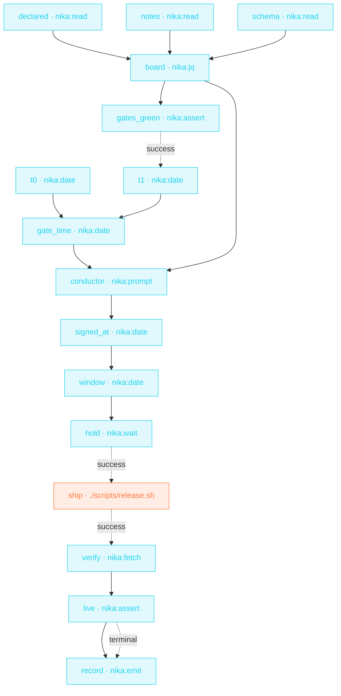

> **T4 epic · devops / release engineering**: time is a first-class
> citizen. The train holds with `nika:wait until:` (an absolute
> timestamp, not a sleep), the gates' duration is computed with
> `nika:date op: diff`, a human signs the departure, and the record
> lands in the journal **whether the ship success or not**.

## The job

Release day choreography: tests, lint and audit run as one parallel
wave; an assert refuses departure on any red; the conductor signs with
full information (« gates GREEN in 12 min · ship 1.4.0 in the 09:00Z
window? »); the train holds until the window; ships; re-polls prod
until it reports the new version; and `on_finally` files the departure
record either way.

## The shape

{/* showcase:dag-begin release-train.nika.yaml */}

{/* showcase:dag-end */}

## The file

{/* showcase:begin release-train.nika.yaml */}
```yaml release-train.nika.yaml
nika: v1
workflow:
  id: release-train
  description: "parallel gates → one verdict → human GO → hold until the window → ship · verify · record"

run:
  # Pin the clock out loud. Every `timeout:` and every absolute `until:` below
  # rides it; leaving it undeclared is the honest default (the ambient system
  # clock) but never a stated choice, and the checker says so ([run-clock]).
  # `clock: virtual` swaps in a simulated clock for tests (F-P3).
  clock: system

inputs:
  version:
    type: string
    required: true
    description: "The version you intend to ship · gate 1 checks it against ./VERSION"
  depart:
    type: bool
    default: false
    description: "Actually run the release script. OFF: the train rehearses and records that it stayed."
  hold_for:
    type: string
    default: "15m"
    description: "How far out the departure window sits, measured from the moment the departure is SIGNED"

permits:
  exec: ["./scripts/release.sh"]  # ONE program · the departure, and nothing else
  tools: ["nika:assert", "nika:date", "nika:emit", "nika:fetch", "nika:jq", "nika:prompt", "nika:read", "nika:wait"]
  net:
    # ONE host, exact — the post-ship version probe and nothing else. This train
    # deliberately owns no webhook: see the `record` task for why an
    # always-fires task must never be the one that leaves the machine.
    http: ["api.example.com"]
  fs:
    # Three files, read-only, named one by one. The gates below are the release
    # checks a spec repo can actually run; in a Rust shop they are `cargo test`
    # / `clippy` / `audit` under `exec:` with `capture: structured`, and the
    # `permits.exec` list grows instead. The WAVE and the fold are the lesson —
    # the identity of the three checks is yours to choose.
    read:
      - "./VERSION"
      - "./CHANGELOG.md"
      - "./schemas/workflow.schema.json"

tasks:
  t0:
    invoke:
      tool: "nika:date"
      args: { op: now }

  # ── the gate wave · three checks, one wave, no shared state ──
  declared:
    invoke:
      tool: "nika:read"
      args: { path: "./VERSION" }

  notes:
    invoke:
      tool: "nika:read"
      args: { path: "./CHANGELOG.md" }

  schema:
    invoke:
      tool: "nika:read"
      args: { path: "./schemas/workflow.schema.json" }

  # ── fold · three answers become one board, computed, not narrated ──
  board:
    with:
      declared: ${{ tasks.declared.output }}
      notes: ${{ tasks.notes.output }}
      schema: ${{ tasks.schema.output }}
    invoke:
      tool: "nika:jq"
      args:
        # The four inputs arrive as an ARRAY and are destructured by name, so
        # the expression reads like the checklist it is. Building the verdict in
        # jq rather than in a model keeps it deterministic and free.
        input:
          - "${{ with.declared }}"
          - "${{ with.notes }}"
          - "${{ with.schema }}"
          - "${{ inputs.version }}"
        expression: |
          . as [$declared, $notes, $schema, $asked]
          | { version_matches: (($declared | rtrimstr("\n")) == $asked),
              notes_present:   ($notes  | test("\\[" + $asked + "\\]")),
              schema_parses:   (try ($schema | fromjson | has("$id")) catch false) }
          | . + { all_green: (.version_matches and .notes_present and .schema_parses) }

  gates_green:
    with:
      board: ${{ tasks.board.output }}
    invoke:
      tool: "nika:assert"
      args:
        # A RED board stops the train here: everything downstream is cancelled,
        # and `record` below still lands the fact that it never left.
        condition: "${{ with.board.all_green }}"
        message: "A release gate is RED: the train does not depart · ${{ with.board }}"

  t1:
    after:
      gates_green: success           # state, no data · the clock stops on a green board
    invoke:
      tool: "nika:date"
      args: { op: now }

  gate_time:
    with:
      t0: ${{ tasks.t0.output }}
      t1: ${{ tasks.t1.output }}
    invoke:
      tool: "nika:date"
      args:
        # `start:`/`end:` want real ISO timestamps — the literal "now" is not a
        # value here and fails NIKA-BUILTIN-DATE-001. Take the reading in a task,
        # then pass it as data; that is also what makes the run replayable.
        op: diff
        start: "${{ with.t0 }}"
        end: "${{ with.t1 }}"
        unit: minutes

  # ── the human signs the departure ──
  conductor:
    with:
      gate_time: ${{ tasks.gate_time.output }}
      board: ${{ tasks.board.output }}
    invoke:
      # Blocking · no `default:`. The alternative shape is a `default: false`
      # prompt (see templates/human-gated-ship): fail-closed, never pauses, and
      # a yes can then only come from a TTY. This file blocks instead so the
      # decision can also be handed over — `--resume <trace> --answer
      # conductor=true` — which is how a release actually gets signed when the
      # person who ran it is not the person who approves it. Either way the
      # checker leaves a [headless-prompt] hint: that is the price of a gate.
      tool: "nika:prompt"
      args:
        message: |
          Board · ${{ with.board }}
          Green in ${{ with.gate_time }} min.

          Ship ${{ inputs.version }} · departure window opens in ${{ inputs.hold_for }}?
          (depart armed: ${{ inputs.depart }})

  # ── hold until the window · an absolute instant, computed AFTER the signature ──
  #
  # The window opens `hold_for` from the moment the departure was SIGNED, which
  # is why this reading is taken here and not reused from `t1`. Measured, and
  # the reason this task exists: the run pauses at the prompt, so `t1` is
  # minutes or hours old by the time a human answers — resuming with `t1+ 15m`
  # produced `NIKA-BUILTIN-WAIT-002 · until: … is in the past` on the very
  # first resume. An absolute instant must be computed from a reading taken
  # after the last thing that can block. (Resume it a SECOND time and this
  # reading is itself a cache hit — `--from signed_at` re-takes it.)
  signed_at:
    with:
      signed: ${{ tasks.conductor.output }}
    when: ${{ with.signed == true }}
    invoke:
      tool: "nika:date"
      args: { op: now }

  window:
    with:
      at: ${{ tasks.signed_at.output }}
    when: ${{ with.at != null }}
    invoke:
      tool: "nika:date"
      args:
        op: add
        base: "${{ with.at }}"
        duration: "${{ inputs.hold_for }}"

  hold:
    with:
      window: ${{ tasks.window.output }}
    when: ${{ with.window != null }}
    invoke:
      # `until:` is an INSTANT, not a nap: restart the run and it still targets
      # the same moment, where a `duration:` would start counting again. The
      # instant is computed from `t1` above precisely so this file cannot rot —
      # a literal `until: "2026-07-28T09:00:00Z"` is correct for one day and
      # then fails NIKA-BUILTIN-WAIT-002 · the timestamp is in the past.
      tool: "nika:wait"
      args:
        until: "${{ with.window }}"
        timeout: "48h"             # `timeout:` caps an absolute wait · until-only

  # ── the irreversible step · armed, and only after the hold ──
  ship:
    after:
      hold: success
    with:
      depart: ${{ inputs.depart }}
    when: ${{ with.depart == true }}   # dry-run by default · a rehearsal ships nothing
    exec:
      # argv, never a shell string: `${{ inputs.version }}` is substituted as ONE
      # argument and cannot break out into a second command.
      #
      # Default capture (stdout) on purpose. `capture: structured` would turn a
      # non-zero exit into DATA and this task would report success even when the
      # release script died — which is exactly what `after: {ship: success}`
      # below must not be lied to about. The checker flags that shape when
      # nothing reads `exit_code` ([swallowed-exit]); here the honest answer is
      # not to read the code but to let a failed release FAIL, NIKA-EXEC-001.
      command: ["./scripts/release.sh", "${{ inputs.version }}"]
    timeout: "30m"

  verify:
    after:
      ship: success                  # never probe prod for a release that did not go out
    invoke:
      tool: "nika:fetch"
      args:
        url: "https://api.example.com/v1/version"
        mode: jq
        jq: ".version"
    retry:
      # A GET is idempotent, so retrying it replays nothing — the checker warns
      # [retry-effects] when you retry something that is not.
      max_attempts: 5
      backoff_strategy: exponential
      backoff_ms: 5000

  live:
    with:
      version_live: ${{ tasks.verify.output == inputs.version }}   # the whole check crosses as ONE boundary expression
    invoke:
      tool: "nika:assert"
      args:
        condition: "${{ with.version_live }}"
        message: "Prod does not report the shipped version: investigate before announcing"

  # ── the departure record · lands on EVERY outcome ──
  #
  # `after: {live: terminal}` admits success · failure · skipped · cancelled, so
  # this runs when the train departed, when a gate was red, and when nobody
  # armed it. `nika:emit` is the right verb for a record that must never fail:
  # it crosses no boundary, needs no host, and cannot be refused mid-flight.
  #
  # It is also the only verb that can safely sit here, and that is a rule worth
  # keeping: AN ALWAYS-FIRES TASK MUST NOT BE THE ONE THAT LEAVES THE MACHINE.
  # A `terminal` edge admits `cancelled`, so the task is reachable along a path
  # where the human never answered — no gate can dominate it, and the moment
  # such a task can egress, NIKA-SEC-009 fires (measured: hanging a
  # `nika:notify` here turns this file RED, and moving the prompt to the root
  # does not save it). If you want the outcome on a webhook, put the send under
  # the signature — `ceo-monday-brief` shows that shape — and leave the
  # unconditional record to `emit`.
  record:
    after:
      live: terminal
    with:
      outcome: ${{ tasks.live.status }}   # observe the verdict · same pass-set as the after edge
    invoke:
      tool: "nika:emit"
      args:
        event_type: "release.train.departed"
        payload:
          version: "${{ inputs.version }}"
          departed: "${{ inputs.depart }}"
          # The engine's word, not a paraphrase: `cancelled` here means the
          # verification never got to run, which is the truth on a rehearsal and
          # on a red board alike. `departed:` above is what disambiguates them.
          status: "${{ with.outcome }}"

outputs:
  board:
    value: ${{ tasks.board.output }}
    description: "The gate board · one boolean per check plus the verdict that stopped or released the train"
  shipped: ${{ tasks.verify.output }}
```
{/* showcase:end */}

## How it works

<Steps>
  <Step title="until: is a hold, not a sleep">
    `nika:wait` with `until: 2026-07-28T09:00:00Z` parks the train at
    an ABSOLUTE time (capped by `timeout: 48h`). A relative `duration:`
    would drift with however long the gates took.
  </Step>
  <Step title="The human signs with full information">
    `nika:date op: diff` computes the gates' wall time, and the
    `nika:prompt` message carries it: the conductor decides knowing
    how fresh the green is. The assert after makes « no » terminal.
  </Step>
  <Step title="The record always lands">
    `verify` re-polls prod (retry × 5, exponential) until it reports
    the shipped version · the final assert refuses to claim success
    otherwise · `on_finally` emits the journal event + team ping with
    the REAL status, even on failure.
  </Step>
</Steps>

## Constructs you just used

| Construct | Where | Reference |
|---|---|---|
| `nika:wait` `until:` (absolute) | `hold` | [Builtins](/reference/builtins) |
| `nika:date` `op: diff` | `gate_time` | [Builtins](/reference/builtins) |
| parallel gate wave + asserts | `tests`/`lint`/`audit` → `gates_green` | [Workflows](/concepts/workflows) |
| `on_finally:` departure record | `live` | [Workflows](/concepts/workflows) |

## Make it yours

- Generate the notes on the same train: insert [Release notes](/examples/release-notes) between `approved` and `hold`.
- Canary first: duplicate `ship`/`verify` against staging, gate prod behind a second assert.
- The `config.window` dial makes this a scheduled artifact: your cron passes next Tuesday 09:00Z, the train handles the rest.

<Card title="Back to all examples" icon="rocket" href="/examples/overview">
  The full gallery: four tiers, every construct taught by a real job.
</Card>
