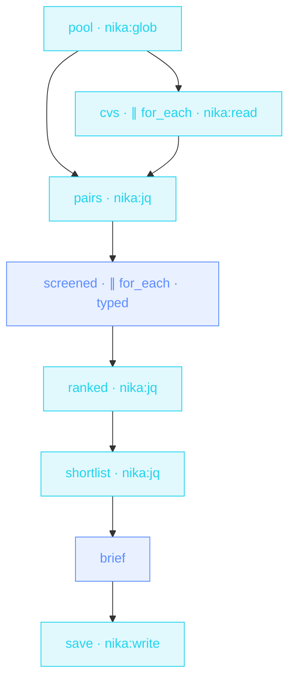

> **T3 fan-out · HR / recruiting**: CVs are PII, so the **whole
> screen runs on a local model**. One schema-enforced rubric for every
> candidate (enums kill « kinda-strong »), evidence quotes required,
> and the ranking is jq: deterministic, not model mood.

## The job

Forty CVs and a Friday deadline means the rubric drifts by CV #12.
Here glob discovers the pool, every candidate gets the SAME typed
rubric (fit enum, evidence quotes mandatory), two at a time so the
GPU breathes, weak fits drop, and jq sorts strong-first then by
relevant years. The shortlist brief quotes its evidence.

## The shape

{/* showcase:dag-begin resume-screener.nika.yaml */}

{/* showcase:dag-end */}

## The file

{/* showcase:begin resume-screener.nika.yaml */}
```yaml resume-screener.nika.yaml
nika: resume-screener

model: ollama/qwen3.5:4b   # PII stays on the machine · the whole screen is offline

const:
  role: "Senior Rust engineer"
  shortlist_size: 5
  # The committed rehearsal inbox. Point this at ./hiring/inbox (or wherever
  # your exports land) and change `permits.fs.read` to match, same edit.
  cv_glob: "./examples/fixtures/cvs/*.md"

permits:
  tools: ["nika:glob", "nika:jq", "nika:read", "nika:write"]
  # NO `net:` category. That absence is the whole sovereignty claim: with no
  # host granted, a CV that talks the model into exfiltrating itself still
  # has nowhere to go — the boundary refuses before the request is made.
  fs:
    # TWO entries, and both earn their place. `nika:glob` opens the ROOT of
    # its pattern before it lists anything, and a directory grant does not
    # cover its children while a child grant does not cover the directory —
    # so each is named. Measured: with only the second line, the run dies
    # `NIKA-SEC-004 · ./examples/…/cvs resolves outside permits.fs.read`
    # before a single CV is read.
    #
    # `*` is one segment and never crosses `/`, which is the right width
    # here: CVs land flat in the inbox. `cvs/**` would also work and would
    # additionally hand over every sub-tree someone drops in there.
    read:
      - "./examples/fixtures/cvs"      # the directory the glob opens
      - "./examples/fixtures/cvs/*"    # the CVs one level inside it
    # One brief, one path. Nothing else on this machine is writable by this
    # workflow — not `./hiring/**`, not a sibling of the brief.
    write: ["./hiring/shortlist-brief.md"]

tasks:
  # ── the pool is discovered at runtime · the count is never written down ──
  pool:
    invoke:
      tool: "nika:glob"
      args: { pattern: "${{ const.cv_glob }}" }

  cvs:
    with:
      paths: ${{ tasks.pool.output }}
    for_each:
      items: ${{ with.paths }}
      max_parallel: 8
      fail_fast: false                   # one unreadable CV must not stop the batch
    on_error:
      recover: null                    # null holds the index so the zip below stays aligned
    invoke:
      tool: "nika:read"
      args: { path: "${{ item }}" }

  # A for_each output is an array in ITEM ORDER, so `transpose` pairs each
  # path with its own text. The `select` is where the unreadable CVs leave.
  pairs:
    with:
      paths: ${{ tasks.pool.output }}
      texts: ${{ tasks.cvs.output }}
    invoke:
      tool: "nika:jq"
      args:
        input: ["${{ with.paths }}", "${{ with.texts }}"]
        expression: >-
          transpose
          | map(select(.[1] != null))
          | map({ path: .[0], text: .[1] })

  # ── one rubric, applied identically to everyone ────────────────────
  # `with.cv_path` reads `${{ item.path }}` — a pre-fan-out import that is
  # re-evaluated per iteration, which is how a loop-local reaches the prompt
  # under a name that means something.
  screened:
    with:
      pairs: ${{ tasks.pairs.output }}
      cv_path: ${{ item.path }}
    for_each:
      items: ${{ with.pairs }}
      max_parallel: 2                    # a local model shares one GPU · don't thrash it
      fail_fast: false
    on_error:
      recover: null
    infer:
      max_tokens: 1200                 # a rubric row, not an essay
      prompt: |
        Role · ${{ const.role }}
        Candidate file · ${{ with.cv_path }}
        CV ·
        ${{ item.text }}
        Score this candidate against the role. Quote evidence from the CV
        for every rating: no rating without a quote.
      # `additionalProperties: false` on EVERY object node — the top level and
      # each nested one. Without it a provider is free to add keys, and the
      # jq below would be sorting a shape that changes between runs.
      schema:
        type: object
        additionalProperties: false
        required: [file, fit, strengths, concerns]
        properties:
          file: { type: string }
          fit: { type: string, enum: [strong, possible, weak] }
          years_relevant: { type: integer }
          strengths: { type: array, items: { type: string } }
          concerns: { type: array, items: { type: string } }

  # ── the model judged · jq decides ──────────────────────────────────
  # Ranking lives HERE, not in a prompt, so the order is reproducible: same
  # scores in, same order out. `.fit != "strong"` sorts false (0) before true
  # (1), which puts the strong candidates first; `// 0` covers the candidates
  # whose CV never stated a number.
  ranked:
    with:
      screened: ${{ tasks.screened.output }}
    invoke:
      tool: "nika:jq"
      args:
        input: "${{ with.screened }}"
        expression: >-
          map(select(. != null))
          | map(select(.fit != "weak"))
          | sort_by(.fit != "strong", -(.years_relevant // 0))

  shortlist:
    with:
      ranked: ${{ tasks.ranked.output }}
    invoke:
      tool: "nika:jq"
      args:
        input: "${{ with.ranked }}"
        expression: ".[:${{ const.shortlist_size }}]"

  brief:
    with:
      shortlist: ${{ tasks.shortlist.output }}
    when: ${{ size(with.shortlist) > 0 }}   # nobody cleared the bar · spend nothing
    infer:
      max_tokens: 2000
      prompt: |
        Write the screening brief for these shortlisted candidates ·
        ${{ with.shortlist }}
        One paragraph each · lead with the evidence quotes · end with the
        suggested interview focus.

  save:
    with:
      brief: ${{ tasks.brief.output }}
    when: ${{ with.brief != null && size(with.brief) > 0 }}    # skipped (null) or an EMPTY answer · gate on the VALUE, both ways
    invoke:
      tool: "nika:write"
      args:
        path: "./hiring/shortlist-brief.md"
        content: "${{ with.brief }}"
        create_dirs: true

outputs:
  ranked:
    value: ${{ tasks.ranked.output }}
    description: "Everyone who was not scored weak · strong first, then by relevant years"
  shortlist:
    value: ${{ tasks.shortlist.output }}
    description: "The top `const.shortlist_size` of the ranking · what the brief covers"
```
{/* showcase:end */}

## How it works

<Steps>
  <Step title="Sovereignty is the requirement, not a preference">
    `model: ollama/llama3.2:3b` at the envelope: candidate data never
    touches a cloud API. Same file shape as any other workflow.
  </Step>
  <Step title="One rubric, enforced by schema">
    `fit: enum [strong, possible, weak]` + required evidence arrays:
    candidate #1 and #40 are judged on the same axes, and a rating
    without a quote fails validation.
  </Step>
  <Step title="The ORDER is deterministic">
    `sort_by(.fit != "strong", -(.years_relevant // 0))`: strong fits
    first, then by years. Re-run it: same input, same shortlist.
  </Step>
</Steps>

## Constructs you just used

| Construct | Where | Reference |
|---|---|---|
| local provider (PII) | envelope `model:` | [Providers](/concepts/providers) |
| `nika:glob` → `for_each` | `pool` · `screened` | [Workflows](/concepts/workflows) |
| schema enums + evidence | `screened` | [The 4 verbs](/concepts/verbs) |
| jq deterministic ranking | `ranked` · `shortlist` | [Builtins](/reference/builtins) |

## Make it yours

- Anonymize first: a pre-pass `infer` that strips names/photos before scoring. Bias mitigation in one task.
- Wire the shortlist into [Meeting actions](/examples/meeting-actions)' pattern to draft interview invites.
- The same shape screens vendor proposals, grant applications, conference talks: any « N documents, one rubric » job.

<Card title="Next · Release train" icon="train" href="/examples/release-train">
  Time as a first-class citizen: parallel gates, a human GO, and an
  absolute-time hold until the window.
</Card>
