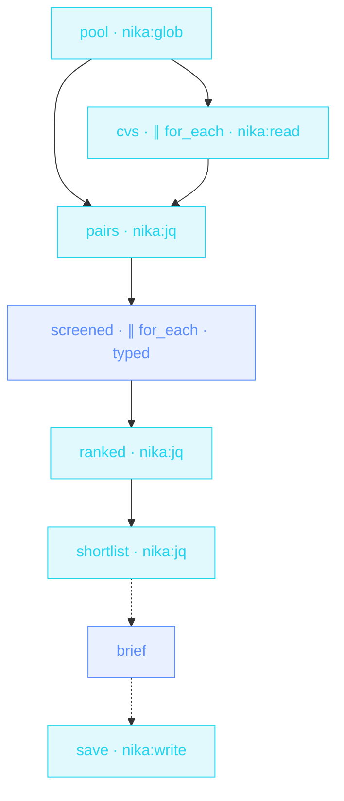

> **T3 fan-out · HR / recruiting** — CVs are PII, so the **whole
> screen runs on a local model**. One schema-enforced rubric for every
> candidate (enums kill « kinda-strong »), evidence quotes required,
> and the ranking is jq — deterministic, not model mood.

## The job

Forty CVs and a Friday deadline means the rubric drifts by CV #12.
Here glob discovers the pool, every candidate gets the SAME typed
rubric — fit enum, evidence quotes mandatory — two at a time so the
GPU breathes, weak fits drop, and jq sorts strong-first then by
relevant years. The shortlist brief quotes its evidence.

## The shape

{/* showcase:dag-begin t3-resume-screener.nika.yaml */}

{/* showcase:dag-end */}

## The file

{/* showcase:begin t3-resume-screener.nika.yaml */}
```yaml t3-resume-screener.nika.yaml
nika: v1
workflow: resume-screener
description: "glob CVs → local-model rubric per candidate → deterministic shortlist"

model: ollama/llama3.1      # PII stays on the machine · the whole screen is offline

permits:                    # the file IS the blast radius · no net category at all —
  fs:                       # CVs cannot leave this machine even if a prompt is hijacked
    read: ["./hiring/inbox/**"]
    write: ["./hiring/out/**", "./hiring/shortlist-brief.md"]
  tools: ["nika:glob", "nika:read", "nika:jq", "nika:write"]

vars:
  role: "Senior Rust engineer"
  cv_glob: "./hiring/inbox/*.md"
  shortlist_size: 5

tasks:
  - id: pool
    invoke:
      tool: "nika:glob"
      args: { pattern: "${{ vars.cv_glob }}" }

  - id: cvs
    depends_on: [pool]
    for_each: ${{ tasks.pool.output }}
    max_parallel: 8
    fail_fast: false                   # one unreadable CV must not stop the batch
    on_error:
      recover: null                    # null keeps the zip aligned · filtered later
    invoke:
      tool: "nika:read"
      args: { path: "${{ item }}" }

  - id: pairs
    depends_on: [pool, cvs]
    invoke:                            # zip path + content · order survived the nulls
      tool: "nika:jq"
      args:
        input: ["${{ tasks.pool.output }}", "${{ tasks.cvs.output }}"]
        expression: "transpose | map(select(.[1] != null)) | map({path: .[0], text: .[1]})"

  - id: screened
    depends_on: [pairs]
    for_each: ${{ tasks.pairs.output }}
    max_parallel: 2                    # local model · don't thrash the GPU
    fail_fast: false
    on_error:
      recover: null
    with:
      cv_path: ${{ item.path }}
    infer:
      prompt: |
        Role · ${{ vars.role }}
        Candidate file · ${{ with.cv_path }}
        CV ·
        ${{ item.text }}
        Score this candidate against the role. Quote evidence from the
        CV for every rating — no rating without a quote.
      schema:
        type: object
        required: [file, fit, strengths, concerns]
        properties:
          file: { type: string }
          fit: { type: string, enum: [strong, possible, weak] }
          years_relevant: { type: integer }
          strengths: { type: array, items: { type: string } }
          concerns: { type: array, items: { type: string } }

  - id: ranked
    depends_on: [screened]
    invoke:
      tool: "nika:jq"
      args:
        input: "${{ tasks.screened.output }}"
        expression: 'map(select(. != null)) | map(select(.fit != "weak")) | sort_by(.fit != "strong", -(.years_relevant // 0))'

  - id: shortlist
    depends_on: [ranked]
    invoke:
      tool: "nika:jq"
      args:
        input: "${{ tasks.ranked.output }}"
        expression: ".[:${{ vars.shortlist_size }}]"

  - id: brief
    depends_on: [shortlist]
    when: ${{ size(tasks.shortlist.output) > 0 }}
    infer:
      prompt: |
        Write the screening brief for these shortlisted candidates ·
        ${{ tasks.shortlist.output }}
        One paragraph each · lead with the evidence quotes · end with
        the suggested interview focus.

  - id: save
    depends_on: [brief]
    when: ${{ tasks.brief.output != null }}    # skip cascades by VALUE · a skipped brief is null
    invoke:
      tool: "nika:write"
      args:
        path: "./hiring/shortlist-brief.md"
        content: "${{ tasks.brief.output }}"
        create_dirs: true

outputs:
  shortlist:
    value: ${{ tasks.shortlist.output }}
    type: array
    description: "Ranked candidates · strong first, then by relevant years"
```
{/* showcase:end */}

## How it works

<Steps>
  <Step title="Sovereignty is the requirement, not a preference">
    `model: ollama/llama3.1` at the envelope — candidate data never
    touches a cloud API. Same file shape as any other workflow.
  </Step>
  <Step title="One rubric, enforced by schema">
    `fit: enum [strong, possible, weak]` + required evidence arrays —
    candidate #1 and #40 are judged on the same axes, and a rating
    without a quote fails validation.
  </Step>
  <Step title="The ORDER is deterministic">
    `sort_by(.fit != "strong", -(.years_relevant // 0))` — strong fits
    first, then by years. Re-run it: same input, same shortlist.
  </Step>
</Steps>

## Constructs you just used

| Construct | Where | Reference |
|---|---|---|
| local provider (PII) | envelope `model:` | [Providers](/concepts/providers) |
| `nika:glob` → `for_each` | `pool` · `screened` | [Workflows](/concepts/workflows) |
| schema enums + evidence | `screened` | [The 4 verbs](/concepts/verbs) |
| jq deterministic ranking | `ranked` · `shortlist` | [Builtins](/reference/builtins) |

## Make it yours

- Anonymize first: a pre-pass `infer` that strips names/photos before scoring — bias mitigation in one task.
- Wire the shortlist into [Meeting actions](/examples/meeting-actions)' pattern to draft interview invites.
- The same shape screens vendor proposals, grant applications, conference talks — any « N documents, one rubric » job.

<Card title="Next · Release train" icon="train" href="/examples/release-train">
  Time as a first-class citizen — parallel gates, a human GO, and an
  absolute-time hold until the window.
</Card>
