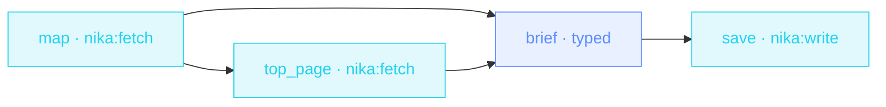

> **T2 chain · SEO / content marketing** — two `nika:fetch` extractions
> chained (`sitemap` mode, then `article` mode), a jq slice binding, CEL
> indexing, and a schema-typed brief at the end.

## The job

« Write something that ranks for X » usually starts with an hour of
tab-hopping through the competitor's site. This workflow maps their
sitemap, reads their best page on the topic, finds the gaps, and hands
your writer a typed brief: title, angle, outline, keywords.

## The shape

{/* showcase:dag-begin t2-seo-content-brief.nika.yaml */}

{/* showcase:dag-end */}

## The file

{/* showcase:begin t2-seo-content-brief.nika.yaml */}
```yaml t2-seo-content-brief.nika.yaml
nika: v1
workflow: seo-content-brief
description: "Competitor sitemap → top page → gap analysis → typed brief"

model: ollama/llama3.2:3b   # local · zero key · swap for openai/gpt-5.2

vars:
  competitor_sitemap: "https://competitor.example.com/sitemap.xml"
  topic:
    type: string
    required: true
    description: "The keyword/topic you want to rank for"

tasks:
  - id: map
    invoke:
      tool: "nika:fetch"
      args:
        url: "${{ vars.competitor_sitemap }}"
        mode: sitemap
    output:
      top: ".urls[:5]"

  - id: top_page
    depends_on: [map]
    invoke:
      tool: "nika:fetch"
      args:
        url: "${{ tasks.map.top[0] }}"
        mode: article

  - id: brief
    depends_on: [map, top_page]
    infer:
      prompt: |
        Topic to rank for · ${{ vars.topic }}
        Competitor's top URLs · ${{ tasks.map.top }}
        Their best page on it ·
        ${{ tasks.top_page.output }}

        Write a content brief that BEATS this page · find the gaps they
        missed · angle for search intent.
      schema:
        type: object
        required: [title, angle, outline, keywords]
        properties:
          title: { type: string }
          angle: { type: string }
          outline: { type: array, items: { type: string } }
          keywords: { type: array, items: { type: string } }

  - id: save
    depends_on: [brief]
    invoke:
      tool: "nika:write"
      args:
        path: "./briefs/${{ vars.topic }}.json"
        content: "${{ tasks.brief.output }}"
        create_dirs: true

outputs:
  brief:
    value: ${{ tasks.brief.output }}
    type: object
    description: "The typed content brief"
```
{/* showcase:end */}

## How it works

<Steps>
  <Step title="Sitemap mode + a jq slice">
    `mode: sitemap` returns the URL list; the `output:` binding
    `top: ".urls[:5]"` keeps just the head of it. Bindings are jq —
    slices, filters, everything.
  </Step>
  <Step title="CEL indexes into the binding">
    The second fetch reads `${{ tasks.map.top[0] }}` — index access is
    part of the CEL subset. The reference also requires
    `depends_on: [map]`: every reference is a visible edge.
  </Step>
  <Step title="The brief is a contract">
    title · angle · outline · keywords — your writer (or your next
    workflow) consumes fields, not a wall of prose.
  </Step>
</Steps>

## Constructs you just used

| Construct | Where | Reference |
|---|---|---|
| `mode: sitemap` → `mode: article` | `map` · `top_page` | [Builtins](/reference/builtins) |
| `output:` jq slice | `map.output.top` | [Bindings](/concepts/bindings) |
| CEL index access | `top_page.args.url` | [Workflows](/concepts/workflows) |
| `create_dirs: true` | `save.args` | [Builtins](/reference/builtins) |

## Make it yours

- Brief the top THREE pages instead of one: `for_each: ${{ tasks.map.top }}` — the fan-out tier shows how ([Competitor radar](/examples/competitor-radar)).
- Feed your own sitemap too and ask the model for internal-linking opportunities.
- Pipe the brief straight into a draft: a second `infer` consuming `${{ tasks.brief.output.outline }}`.

<Card title="Next · Invoice chaser" icon="file-invoice-dollar" href="/examples/invoice-chaser">
  CSV → JSON with `nika:convert`, a jq filter, and the three-line
  human-approval gate.
</Card>
