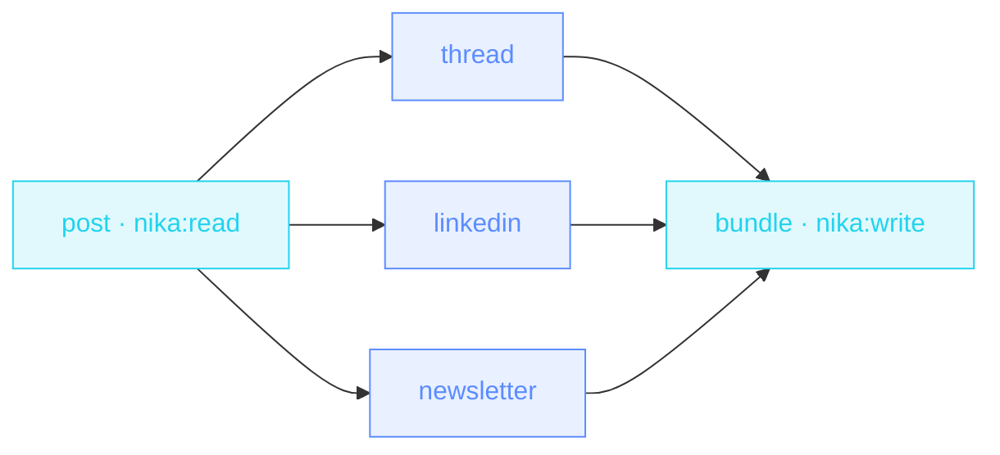

> **T1 starter · marketing / creators**: the diamond DAG. One read fans
> into three rewrites that run **concurrently**, and a single write
> merges the bundle. The craft lives in the prompts; the engine handles
> the choreography.

## The job

You wrote the post. Now it needs to be a thread, a LinkedIn version and
a newsletter blurb: same ideas, three voices. Sequential chatbot
sessions drift; this file keeps one source and rewrites it three ways at
once.

## The shape

{/* showcase:dag-begin social-repurpose.nika.yaml */}

{/* showcase:dag-end */}

## The file

{/* showcase:begin social-repurpose.nika.yaml */}
```yaml social-repurpose.nika.yaml
nika: social-repurpose

model: ollama/qwen3.5:4b   # local · zero key · swap for mistral/mistral-large or any provider

const:
  # The sample post ships with the repo. Point this at your own and move the
  # read permit with it — `permits:` cannot interpolate (NIKA-AUTH-007).
  post_path: "examples/fixtures/launch-post.md"
permits:
  tools: ["nika:read", "nika:write"]
  # One file in, one file out · each named exactly, no subtree granted.
  fs:
    read: ["examples/fixtures/launch-post.md"]
    write: ["out/social-bundle.md"]

tasks:
  post:
    invoke:
      tool: "nika:read"
      args: { path: "${{ const.post_path }}" }

  # Three rewrites · no deps between them · they run concurrently.
  thread:
    with:
      post: ${{ tasks.post.output }}
    infer:
      max_tokens: 700
      prompt: "Turn this post into a 6-tweet thread · keep the voice · ${{ with.post }}"

  linkedin:
    with:
      post: ${{ tasks.post.output }}
    infer:
      max_tokens: 500
      prompt: "Rewrite this post for LinkedIn · hook first · ${{ with.post }}"

  newsletter:
    with:
      post: ${{ tasks.post.output }}
    infer:
      max_tokens: 200
      prompt: "Write a 3-sentence newsletter blurb for this post · ${{ with.post }}"

  bundle:
    with:
      t: ${{ tasks.thread.output }}
      l: ${{ tasks.linkedin.output }}
      n: ${{ tasks.newsletter.output }}
    invoke:
      tool: "nika:write"
      args:
        path: out/social-bundle.md
        create_dirs: true
        # Prose artifact → a `content: |` block with interpolations is right
        # here. A `.json` artifact is the opposite case: one `${{ … }}` value,
        # never hand-typed braces (that emits unquoted fields).
        content: |
          # Social bundle

          ## Thread
          ${{ with.t }}

          ## LinkedIn
          ${{ with.l }}

          ## Newsletter
          ${{ with.n }}

outputs:
  bundle_path: ${{ tasks.bundle.output }}
```
{/* showcase:end */}

## How it works

<Steps>
  <Step title="Fan-out by omission">
    `thread`, `linkedin` and `newsletter` each depend only on `post`:
    no deps between them, so the engine runs all three at the same time.
  </Step>
  <Step title="with: keeps the merge readable">
    `bundle` aliases the three outputs to one-letter names. `with:` is
    optional sugar, but a template interpolating three long task paths
    is where you want it.
  </Step>
  <Step title="One multi-line write">
    The `content:` is a YAML block scalar with three interpolations:
    the bundle file is assembled by the engine, no model needed for glue.
  </Step>
</Steps>

## Constructs you just used

| Construct | Where | Reference |
|---|---|---|
| diamond fan-out / fan-in | the whole DAG | [Workflows](/concepts/workflows) |
| `with:` aliasing | `bundle` | [Bindings](/concepts/bindings) |
| block-scalar `content:` | `bundle.args` | [YAML syntax](/reference/yaml-syntax) |

## Make it yours

- Add a fourth branch (YouTube description, Mastodon, press blurb): it's three lines and it runs in the same wave.
- Pin a glossary: put your brand terms in a `const:` entry and interpolate it into each prompt.
- Want every language too? Chain this into [Localization factory](/examples/localization-factory).

<Card title="Level up · T2 chains" icon="rocket" href="/examples/release-notes">
  Next tier: typed outputs, in-place file edits and a webhook ping.
  Release day, automated.
</Card>
