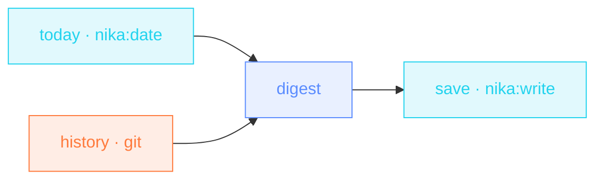

> **T1 starter · engineering / any team**: two data sources gathered in
> parallel, one model call, one file on disk. Your first taste of « the
> boring parts run themselves ».

## The job

Every morning you reconstruct yesterday from memory. Your git history
already knows. This workflow reads the commits since yesterday, stamps
the date from a builtin (not from the model's imagination), and writes
the three standup bullets in your tone. If Git fails or the sandbox refuses
the read, the workflow records “Git history unavailable” and tells the model
to invent no commit facts. This is distinct from an empty successful log.

## The shape

{/* showcase:dag-begin standup-digest.nika.yaml */}

{/* showcase:dag-end */}

## The file

{/* showcase:begin standup-digest.nika.yaml */}
```yaml standup-digest.nika.yaml
nika: standup-digest

model: ollama/qwen3.5:4b   # local · zero key · swap for groq/llama-3.3-70b (a fast one-liner job)

permits:
  exec: ["git"]              # the ONE program this workflow may run
  tools: ["nika:date", "nika:write"]
  fs: { write: ["out/standup-note.md"] }

tasks:
  # No deps between these two → the engine runs them in parallel.
  today:
    invoke:
      tool: "nika:date"
      args: { op: now }

  history:
    exec:
      command: ["git", "log", "--since=yesterday", "--oneline", "--no-merges"]
    on_error:
      recover: "Git history unavailable: the command failed or was refused. No commit facts were collected."

  digest:
    with:
      today: ${{ tasks.today.output }}
      history: ${{ tasks.history.output }}
    infer:
      max_tokens: 400          # a standup note is short · the ceiling says so
      prompt: |
        Date · ${{ with.today }}
        Commits since yesterday ·
        ${{ with.history }}

        Write my standup note · 3 bullets · done / doing / blocked.
        Plain words · no fluff. If history is unavailable, say that and invent no
        done / doing / blocked facts. Only an empty successful log means no commits.

  save:
    with:
      digest: ${{ tasks.digest.output }}
    invoke:
      tool: "nika:write"
      args:
        path: out/standup-note.md
        create_dirs: true
        content: "${{ with.digest }}"

outputs:
  history: ${{ tasks.history.output }}
  note: ${{ tasks.digest.output }}
```
{/* showcase:end */}

## How it works

<Steps>
  <Step title="Two tasks start together">
    `today` and `history` have no incoming edge: the engine runs them
    in parallel. Parallelism is the default, not an option you switch on.
  </Step>
  <Step title="Unavailable history stays visible">
    `on_error.recover` carries an explicit unavailable-history message into
    `outputs.history` and the note. It grants no extra filesystem access.
  </Step>
  <Step title="The digest waits for both">
    The two `with:` bindings make `digest` the merge point — each
    `${{ tasks.X.output }}` reference IS a data edge. The prompt reads
    the bindings (`${{ with.today }}` · `${{ with.history }}`).
  </Step>
  <Step title="The note lands on disk">
    `nika:write` takes an explicit `content:`. A write without content
    writes nothing. The workflow also returns the note via `outputs:`.
  </Step>
</Steps>

## Constructs you just used

| Construct | Where | Reference |
|---|---|---|
| implicit parallelism | `today` + `history` | [DAG shape](/concepts/workflows) |
| `exec:` | `history` | [The 4 verbs](/concepts/verbs) |
| `nika:date` · `nika:write` | `today` · `save` | [Builtins](/reference/builtins) |
| `outputs:` | envelope tail | [YAML syntax](/reference/yaml-syntax) |

## Make it yours

- Point `--since` at your sprint cadence (`--since=friday` for Monday standups).
- Keep the local model or choose another provider/model available in `nika catalog`.
- Add a `nika:notify` task to post the note straight into your team channel. See [Release notes](/examples/release-notes) for the pattern.

<Card title="Next · Meeting actions" icon="list-check" href="/examples/meeting-actions">
  Same tier, one new idea: structured output. The model returns typed
  JSON, not prose.
</Card>
