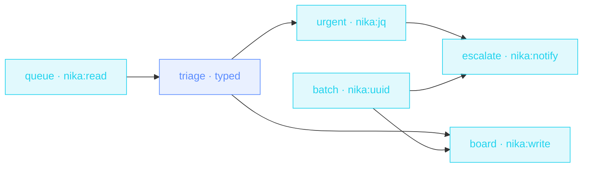

> **T2 chain · customer support**: one schema-typed call classifies the
> WHOLE queue (enums keep the categories honest), jq slices the urgent
> ones, and the escalation fires only when there's something to escalate.

## The job

It's 8:55. There are 40 tickets from overnight. Someone reads them all,
tags them, writes first replies, and pages on-call if anything's on
fire. This file does the reading, tagging and drafting (under a
sortable v7 batch id) and pages only when `urgent` is non-empty.

## The shape

{/* showcase:dag-begin support-triage.nika.yaml */}

{/* showcase:dag-end */}

## The file

{/* showcase:begin support-triage.nika.yaml */}
```yaml support-triage.nika.yaml
nika: v1
workflow:
  id: support-triage
  description: "Ticket queue → typed triage → urgent escalation → triage board"

# A NON-thinking local model, deliberately: a thinking model can spend the
# whole `max_tokens` budget in its think block and return before the JSON
# (engine#428). Schema showcases pick a model that answers directly.
model: ollama/llama3.2:3b   # local · zero key · swap for groq/llama-3.3-70b (triage wants speed)

const:
  queue_path: "examples/fixtures/support-queue.json"

secrets:
  oncall_webhook:
    source: env
    key: ONCALL_WEBHOOK_URL
    egress:                       # sanction the one send · the secret IS the URL
      - to: "nika:notify"
        host_from_self: true
permits:
  tools: ["nika:jq", "nika:notify", "nika:read", "nika:uuid", "nika:write"]
  fs:
    read: ["examples/fixtures/support-queue.json"]
    # One board per batch id. `*` matches a single segment and never crosses
    # `/`, so the uuid can never steer the write out of out/ — `out/**` would
    # let it.
    write: ["out/triage-*.json"]
  net:
    # `host_from_self:` above sanctions the FLOW (the secret may be the URL) —
    # it does not grant the capability. The host stays unknown at check, so it
    # is judged at RUN against this bound: name the escalation host here or the
    # send is refused mid-run, after the tokens are already spent.
    http: ["hooks.slack.com"]

tasks:
  batch:
    invoke:
      tool: "nika:uuid"
      args: { version: v7 }

  queue:
    invoke:
      tool: "nika:read"
      args: { path: "${{ const.queue_path }}" }

  triage:
    with:
      queue: ${{ tasks.queue.output }}
    infer:
      max_tokens: 1500                 # the whole queue in one call · a ceiling, not UNBOUNDED
      prompt: |
        Triage every ticket in this queue ·
        ${{ with.queue }}
        For each · classify category and urgency, draft a 2-sentence first reply.
      schema:
        type: object
        additionalProperties: false    # a deterministic shape across providers
        required: [tickets]
        properties:
          tickets:
            type: array
            items:
              type: object
              additionalProperties: false
              required: [id, category, urgency, first_reply]
              properties:
                id: { type: string }
                category: { type: string, enum: [billing, bug, how-to, account, other] }
                urgency: { type: string, enum: [low, normal, high, critical] }
                first_reply: { type: string }

  urgent:
    with:
      tickets: ${{ tasks.triage.output.tickets }}
    invoke:
      tool: "nika:jq"
      args:
        input: "${{ with.tickets }}"
        expression: 'map(select(.urgency == "high" or .urgency == "critical"))'

  escalate:
    with:
      urgent: ${{ tasks.urgent.output }}
      batch: ${{ tasks.batch.output }}
    when: ${{ size(with.urgent) > 0 }}
    invoke:
      tool: "nika:notify"
      args:
        channel: webhook
        target: "${{ secrets.oncall_webhook }}"
        message: "Urgent tickets in triage batch ${{ with.batch }} · ${{ with.urgent }}"
        severity: warning

  board:
    with:
      tickets: ${{ tasks.triage.output.tickets }}
      batch: ${{ tasks.batch.output }}
    invoke:
      tool: "nika:write"
      args:
        # A `.json` artifact takes ONE interpolated value as `content:` and
        # lets the engine serialize it. Typing `{ "tickets": ${{ … }} }` by
        # hand emits unquoted fields and the board stops being JSON.
        path: "out/triage-${{ with.batch }}.json"
        content: "${{ with.tickets }}"
        create_dirs: true

outputs:
  tickets:
    value: ${{ tasks.triage.output.tickets }}
    description: "The classified queue with drafted first replies"
```
{/* showcase:end */}

## How it works

<Steps>
  <Step title="Enums make classification honest">
    `category` and `urgency` are schema enums: the model cannot invent
    a « kinda-urgent » tier. Typed output means the jq filter downstream
    can trust the values.
  </Step>
  <Step title="jq slices, the model doesn't re-read">
    `urgent` filters `urgency == "high" or "critical"` out of the typed
    list: no second model call to ask « which ones were urgent? ».
  </Step>
  <Step title="v7 uuids sort by time">
    `nika:uuid version: v7` is timestamped: triage boards land on disk
    already in chronological order.
  </Step>
</Steps>

## Constructs you just used

| Construct | Where | Reference |
|---|---|---|
| schema enums over a list | `triage` | [The 4 verbs](/concepts/verbs) |
| `nika:jq` post-filter | `urgent` | [Builtins](/reference/builtins) |
| `nika:uuid` v7 | `batch` | [Builtins](/reference/builtins) |
| conditional `notify` | `escalate` | [Workflows](/concepts/workflows) |

## Make it yours

- Push the first replies as DRAFTS into your helpdesk via its API (`nika:fetch method: POST`): humans still hit send.
- Track sentiment over time: append each batch's stats to a CSV with `nika:write`.
- Speed matters at 9am: `groq/llama-3.3-70b` triages a 40-ticket queue in seconds.

<Card title="Next · Contract guard" icon="scale-balanced" href="/examples/contract-guard">
  The sovereignty example: a LOCAL model reads the contract, and a
  validate + assert pair refuses bad extractions.
</Card>
