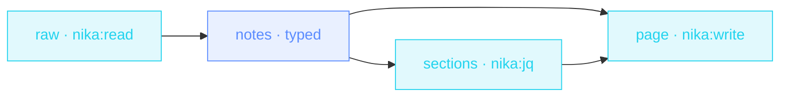

> **T2 chain · podcasts / meetings**: `nika:read` loads the raw
> transcript, ONE `infer:` with a strict `schema:` extracts chapters +
> pull-quotes + summary as typed data, `nika:jq` shapes the sections,
> and `nika:write` renders the publishable page. The model is called
> exactly once, and its output is schema-validated before anything
> downstream touches it.

## The job

Show-notes are the chore between "episode recorded" and "episode
published": an hour of scrubbing for chapter marks and quotes. This
workflow does the extraction in one bounded model call — bounded in
*shape* (the schema rejects free-form prose) and in *count* (one
infer, so the cost of an episode is the cost of one call, visible in
`nika check` before you run).

## The shape

{/* showcase:dag-begin t2-transcript-shownotes.nika.yaml */}

{/* showcase:dag-end */}

## The file

{/* showcase:begin t2-transcript-shownotes.nika.yaml */}
```yaml t2-transcript-shownotes.nika.yaml
nika: v1
workflow:
  id: transcript-shownotes
  description: "Raw transcript → typed show-notes (chapters · quotes · summary) · one bounded infer"

model: ollama/llama3.2:3b # local · zero key · deliberately NOT the qwen3.5 convention: a thinking model can burn max_tokens in its think block before the JSON (engine#428) — schema showcases pick a non-thinking model

vars:
  transcript: "./data/transcript.txt"

permits:
  exec: false
  fs:
    read: ["data/**"]
    write: ["out/**"]
  tools: ["nika:read", "nika:jq", "nika:write"]

tasks:
  raw:
    invoke:
      tool: "nika:read"
      args: { path: "${{ vars.transcript }}" }

  # ONE bounded model call · the schema is the contract, not a suggestion.
  notes:
    with:
      raw: ${{ tasks.raw.output }}
    infer:
      prompt: |
        Turn this transcript into show-notes. Ground every chapter title
        and quote in the text — invent nothing.

        Transcript ·
        ${{ with.raw }}
      max_tokens: 800
      schema:
        type: object
        additionalProperties: false # a deterministic shape across providers (the checker's strictness hint)
        required: [summary, chapters, quotes]
        properties:
          summary: { type: string }
          chapters:
            type: array
            items:
              type: object
              additionalProperties: false
              required: [title, gist]
              properties:
                title: { type: string }
                gist: { type: string }
          quotes:
            type: array
            items: { type: string }

  # Typed JSON → markdown lines · mechanical, zero second model call.
  sections:
    with:
      notes: ${{ tasks.notes.output }}
    invoke:
      tool: "nika:jq"
      args:
        input: "${{ with.notes }}"
        expression: >-
          {
            chapters: (.chapters | map("- **\(.title)** — \(.gist)") | join("\n")),
            quotes: (.quotes | map("> \(.)") | join("\n\n"))
          }

  page:
    with:
      notes_summary: ${{ tasks.notes.output.summary }}
      sections_chapters: ${{ tasks.sections.output.chapters }}
      sections_quotes: ${{ tasks.sections.output.quotes }}
    invoke:
      tool: "nika:write"
      args:
        path: out/show-notes.md
        content: |
          # Show notes

          ${{ with.notes_summary }}

          ## Chapters

          ${{ with.sections_chapters }}

          ## Pull quotes

          ${{ with.sections_quotes }}

          *Generated by [nika](https://nika.sh) · one bounded infer, typed output · the run's trace is the receipt.*

outputs:
  notes:
    value: ${{ tasks.notes.output }}
    description: "The typed show-notes · summary + chapters + quotes"
```
{/* showcase:end */}

## The model choice is part of the lesson

The envelope pins `ollama/llama3.2:3b` — deliberately NOT the
showcase's usual `qwen3.5` — because this is a strict-schema job and a
*thinking* model can burn the whole `max_tokens` budget inside its
think block before emitting the first JSON token (engine issue #428:
the output arrives empty yet the schema demanded content). The rule of
thumb this file encodes: **reasoning showcases pick a thinking model;
strict-schema extraction picks a non-thinking one.**

The typed seam is the other half: because `notes` is schema-shaped,
the jq step reads `.chapters[]` and `.quotes[]` as data — no regex
over model prose, no "hopefully it used the same markdown headings
this time".

## Run it

```bash
ollama pull llama3.2:3b
git clone https://github.com/supernovae-st/nika-spec && cd nika-spec
nika run examples/showcase/t2-transcript-shownotes.nika.yaml
open out/show-notes.md
```

<Note>
  This workflow is newer than the currently shipped engine pack:
  `nika examples run showcase/t2-transcript-shownotes` says
  `unknown example` until the next engine tag re-vendors the pack.
  Until then, run it from the spec checkout as above — the file is the
  same one the pack will embed, sha-pinned in the spec manifest.
</Note>

Feed it any meeting transcript instead: the schema does not care
whether the speakers were recording a podcast or arguing about a
roadmap.
