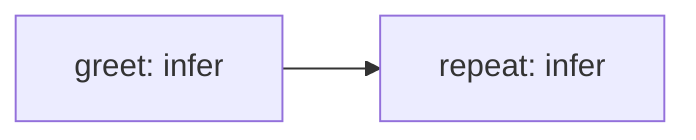

Your first run needs an installed `nika` binary, an empty working directory and
no API key or model server. The `mock/echo` provider returns a deterministic
response. It exercises execution; it does not answer a question with AI.

## 1. Write the workflow

Save this complete file as `hello.nika`:

```yaml hello.nika
nika: hello
model: mock/echo

tasks:
  greet:
    infer:
      prompt: "Hello, butterfly."
      max_tokens: 64

outputs:
  greeting: ${{ tasks.greet.output }}
```

- `nika:` names the workflow.
- `tasks:` maps task IDs to their verbs; `infer` calls the selected model.
- `outputs:` selects the results exposed to the caller.

No filesystem, shell or network effect is requested by this workflow. It needs
no `permits:` block. The engine still writes its execution evidence.

## 2. Check, run and compare the result

```bash
nika check hello.nika
nika run hello.nika --json
```

Check validates the workflow without executing its tasks. Run executes it.
The result's `greeting` must be exactly:

```text
mock(echo) · Hello, butterfly.
```

This comparison matters: a successful exit alone does not establish that a
workflow produced the intended result.

## 3. Verify the trace

```bash
nika trace verify
```

In this new working directory, this verifies the latest run's recorded chain.
It does not certify the meaning of the output or create an authenticated seal.
Keep the business-result comparison above as a separate check.

To understand the checked plan before another run:

```bash
nika explain hello.nika
nika inspect hello.nika --format mermaid
```

Cost reports distinguish a priced bound, a floor and unknown exposure. A local
model's missing price is not evidence that its compute is free. See
[Cost honesty](/guides/cost-honesty).

## 4. Add a dependency

Replace `hello.nika` with this complete file:

```yaml hello.nika
nika: hello-chain
model: mock/echo

tasks:
  greet:
    infer:
      prompt: "Hello, butterfly."
      max_tokens: 64
  repeat:
    with:
      greeting: ${{ tasks.greet.output }}
    infer:
      prompt: "Received: ${{ with.greeting }}"
      max_tokens: 128

outputs:
  greeting: ${{ tasks.greet.output }}
  repeated: ${{ tasks.repeat.output }}
```

```bash
nika check hello.nika
nika run hello.nika --json
nika trace verify
```

`repeated` must equal `mock(echo) · Received: mock(echo) · Hello, butterfly.`
The `with:` binding both names the input and establishes the dependency:
`greet` completes before `repeat` consumes its output. For an ordering without
consuming data, use `after: { greet: success }`.



## 5. Rehearse structured output

Save this as `structured.nika`:

```yaml structured.nika
nika: hello-structured
model: mock/echo

tasks:
  label:
    infer:
      prompt: "Return the label butterfly."
      max_tokens: 128
      schema:
        type: object
        properties:
          label:
            type: string
            enum: [butterfly]
        required: [label]
        additionalProperties: false

outputs:
  result: ${{ tasks.label.output }}
```

```bash
nika check structured.nika
nika run structured.nika --json
nika trace verify
```

The structured result is `{"label":"butterfly"}`. With a schema, the mock
synthesizes a conforming fixture. This demonstrates the schema and result path;
it does not demonstrate a real model's reasoning or extraction quality.

## 6. Choose a real model explicitly

For a local model, install and start [Ollama](https://ollama.com), then download
the model:

```bash
ollama pull qwen3.5:4b
```

Change the workflow's model to `ollama/qwen3.5:4b`, then check and run it again.
A real model can answer differently or fail. Nika validates structured responses
against the declared schema; an invalid response is a failure, not a guaranteed
answer. The exact mock strings above are no longer the business oracle.

For cloud models, choose the provider and configure its credentials as described
in [Providers catalog](/reference/providers-catalog). Review the cost and
execution authority before authorizing a run. A configured key alone does not
prove a working inference path.

## Continue

<CardGroup cols={2}>
  <Card title="Your machine" icon="stethoscope" href="/getting-started/your-machine">
    Distinguish configuration, a listening port, model listings and inference.
  </Card>
  <Card title="Bindings" icon="link" href="/concepts/bindings">
    Follow data and control dependencies between tasks.
  </Card>
  <Card title="Examples" icon="rocket" href="/examples/overview">
    Start from canonical examples and supply their declared inputs.
  </Card>
  <Card title="The four verbs" icon="play" href="/concepts/verbs">
    Learn infer, exec, invoke and agent.
  </Card>
</CardGroup>
