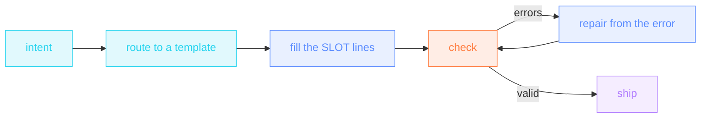

import { CANON } from "/snippets/_canon.mdx";

Agents are the primary authors of Nika. The language is built so
that the *path* carries the quality, not the model: a small closed
grammar ({CANON.verbs} verbs · {CANON.namespaces} namespaces · one
expression surface), one canonical way per intention, and a validator
whose errors prescribe their own fix.

## The protocol

<Steps>
  <Step title="Route: one intent, one template">
    The [templates](https://github.com/supernovae-st/nika-spec/tree/main/templates)
    are complete, valid skeletons (conformance-gated on every
    push). Match the outer shape of the job:

    | Intent sounds like… | Template |
    |---|---|
    | take data → produce words → save | `chain` |
    | watch X, act when Y | `gate-and-act` |
    | do this for every item | `fanout` |
    | only what changed · survive bad input | `etl-state` |
    | research / review / open-ended | `agent-loop` |
    | anything irreversible | `human-gated-ship` |
  </Step>
  <Step title="Instantiate: structure is copied, never invented">
    Copy the template, rename the workflow, fill every `# SLOT:` line.
    Creativity belongs only in prompts, jq expressions and paths. If
    the job needs a construct the template lacks, the
    [coverage matrix](/examples/overview#find-the-example-that-teaches-x)
    names the canonical example that exercises it: read it, don't
    guess.
  </Step>
  <Step title="Check: never ship unchecked">
    `nika check workflow.nika.yaml` (engine) or
    `python conformance/runner.py validate <file>` (spec oracle).
    Editors get the same truth live via the
    [JSON Schema](https://github.com/supernovae-st/nika-spec/blob/main/schemas/workflow.schema.json).
  </Step>
  <Step title="Repair: the error names its fix">
    Fix exactly what the code says, nothing else, then re-check:

    | Error | The fix |
    |---|---|
    | `NIKA-DAG-003` | you referenced `${{ tasks.X }}`: add `depends_on: [X]` |
    | `NIKA-DAG-001` | cycle: remove the back-edge |
    | `NIKA-VAR-001` | undeclared name: declare it in `vars:`/`secrets:` or fix the typo |
    | `NIKA-PROVIDER` | `model:` must be `<provider>/<name>` with a canonical prefix |
    | `NIKA-PARSE` (duplicate id) | two tasks share an id: rename one |
  </Step>
</Steps>

## The hard rules

These catch ~90% of LLM-written errors. The validator enforces all of
them; knowing them just saves round-trips:

1. **One verb per task** · `infer`, `exec`, `invoke` or `agent`.
2. **snake_case task ids** (CEL-safe) · **kebab-case `workflow:`**.
3. **Every `${{ tasks.X }}` reference requires `depends_on: [X]`** ·
   the DAG has no invisible edges.
4. **`when:` is a `${{ }}` CEL boolean or the literal `true`/`false`** ·
   `${{ vars.count }}` is not a condition; `${{ vars.count > 0 }}` is;
   a bare string without `${{ }}` is rejected; `when: true` is the
   always-pattern (run even when an upstream failed).
5. **`size()` is the only CEL function** · arithmetic and string
   functions live in jq, not in `${{ }}`.
6. **`nika:write` needs `content:`** · a write without it writes
   nothing.
7. **`nika:done` only inside `agent.tools`** · it is the loop
   sentinel, meaningless elsewhere.
8. **Fan-outs get the leash** · `max_parallel` + `fail_fast: false` +
   per-iteration `retry`/`timeout`.
9. **Native-first** · `invoke: nika:*` → `mcp:<server>/<tool>` →
   `exec:` last. An `exec:` a builtin covers earns a `native-first`
   hint; `nika check --native-strict` fails on any that remain, and a
   surviving `exec:` gets an exec-ledger row (task · command · why ·
   unlock) in the workflow header.

## After valid: the judgment layer

Validity is the floor. The [twelve patterns](/guides/patterns) are the
ceiling: deterministic core, typed boundaries, the right gate
(`when` = skip · `assert` = fail · `prompt` = human), sovereignty for
sensitive data, budgets on agents, `on_finally` evidence. Every
pattern links the canonical example that embodies it.

<Columns cols={2}>
  <Card title="The templates" icon="copy" href="https://github.com/supernovae-st/nika-spec/tree/main/templates">
    The skeletons, every decision point a slot, conformance-gated.
  </Card>
  <Card title="The twelve patterns" icon="compass-drafting" href="/guides/patterns">
    The judgment layer: why each locked choice is locked.
  </Card>
</Columns>
