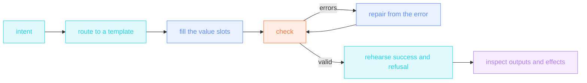

import { CANON } from "/snippets/_canon.mdx";

An authoring loop combines examples with the checker: read an existing
workflow when it matches the job, adapt its inputs and permits, then validate
and execute a controlled rehearsal. The grammar has {CANON.verbs} verbs;
passing a syntax check alone does not establish that the job was completed.

## The protocol

<Steps>
  <Step title="Route: one intent, one template">
    The [templates](https://github.com/supernovae-st/nika-spec/tree/main/templates)
    are complete, valid skeletons (conformance-gated on every
    push). Match the outer shape of the job:

    Use the [template catalog](/guides/templates) to choose a starting shape.
    For finite batches, validation, comparison, privacy boundaries and recovery,
    the [bounded examples](/examples/bounded-authoring) pair each skeleton with
    a filled workflow and observable success and refusal behavior.

    `nika new '?'` lists your installed templates. A native scaffold command
    includes the destination: `nika new chain workflow.nika.yaml`.
  </Step>
  <Step title="Adapt the example to the job">
    Copy the template and replace every `<SLOT: …>` value. Review the
    comments marking choices, including the model, paths and limits. Keep
    the source, validation, transformation and effect boundaries explicit.
    If the job needs a construct the template lacks, the
    [coverage matrix](/examples/overview#find-the-example-that-teaches-x)
    names the canonical example that exercises it: read it, don't
    guess.
  </Step>
  <Step title="Check: never ship unchecked">
    `nika check workflow.nika.yaml --native-strict` (engine) or
    `python conformance/runner.py validate <file>` (spec oracle).
    Editors get the same truth live via the
    [JSON Schema](https://github.com/supernovae-st/nika-spec/blob/main/schemas/workflow.schema.json).
  </Step>
  <Step title="Repair: the error names its fix">
    Fix exactly what the code says, nothing else, then re-check:

    | Error | The fix |
    |---|---|
    | `NIKA-VAR-021` | you referenced `${{ tasks.X.* }}` in a verb body, `when:` or `for_each:`: hoist it into `with:` and read `${{ with.<name> }}` (`nika check --fix` applies it) |
    | `NIKA-PARSE-024` | `depends_on:` is dead: data → a `with:` binding · control → `after: { x: success }` (`nika check --fix` migrates) |
    | `NIKA-DAG-001` | cycle: remove the back-edge |
    | `NIKA-DAG-005` | unknown `after:` predicate: the set is closed — `success` · `failure` · `skipped` · `terminal` (the participial `succeeded`/`failed` are dead spellings · `nika check --fix` respells them) |
    | `NIKA-VAR-001` | undeclared name: declare it under the authority its role commands — `inputs:` · `const:` · `secrets:` — or fix the typo |
    | `NIKA-PROVIDER` | `model:` must be `<provider>/<name>` with a canonical prefix |
    | `NIKA-PARSE` (duplicate id) | two tasks share an id: rename one |
  </Step>
</Steps>

## The hard rules

Use these checks when reviewing an authored workflow. The validator enforces
them; knowing them just saves round-trips:

1. **One verb per task** · `infer`, `exec`, `invoke` or `agent`.
2. **snake_case task ids** (CEL-safe) · **kebab-case `nika:` name**.
3. **`tasks.*` crosses a boundary through `with:` or `after:` only** ·
   the binding IS the edge, the body reads `${{ with.<name> }}` — the
   DAG has no invisible edges (`NIKA-VAR-021` otherwise, and
   `depends_on:` is dead: `NIKA-PARSE-024`).
4. **`when:` is a `${{ }}` CEL boolean or the literal `true`/`false`** ·
   `${{ inputs.count }}` is not a condition; `${{ inputs.count > 0 }}` is;
   a bare string without `${{ }}` is rejected. It reads local namespaces
   only (the value authorities `inputs` · `const` · `secrets`,
   plus `with` · `item`/`index`), post-gate; the always-pattern is
   `after: { x: terminal }`, never a `when:` trick.
5. **The CEL function set is closed** · `size()` · the `has()` presence
   macro · the `contains`/`startsWith`/`endsWith` string tests · the
   `?:` conditional (`cel-subset/0.1`). Everything else — arithmetic,
   regex, transforms — lives in jq, not in `${{ }}`.
6. **`nika:write` needs `content:`** · a write without it writes
   nothing.
7. **`nika:done` only inside `agent.tools`** · it is the loop
   sentinel, meaningless elsewhere.
8. **Fan-outs get the leash** · `max_parallel` + `fail_fast: false` +
   per-iteration `retry`/`timeout`.
9. **Native-first** · `invoke: nika:*` → `mcp:<server>/<tool>` →
   `exec:` last. An `exec:` a builtin covers earns a `native-first`
   hint; `nika check --native-strict` fails on any that remain, and a
   surviving `exec:` gets an exec-ledger row (task · command · why ·
   unlock) in the workflow header.
10. **Every value lands under one of three authorities** · `inputs:`
    (the caller supplies it · a deployment knob is an input with a
    `default:`) · `const:` (the file owns it) · `secrets:` (a governed
    store). `vars:`, `env:` and `config:` are dead envelope fields
    (`NIKA-VALUES-001` / `NIKA-VALUES-002` / `NIKA-PARSE-005`) —
    classify by the role the value plays, never
    rename in bulk.
11. **A body with effects carries `permits:`** · an absent block is
    **zero** authority, not a free pass: the check refuses with
    `NIKA-AUTH-006` before a token is spent, and the run refuses with
    `NIKA-SEC-004`. Write the block with `nika check --infer-permits`,
    which prints the tightest one and is paste-ready.
12. **Extract facts, then the law** · the model emits closed numeric
    facts (`type: integer` + a numeric `enum`). Scoring, routing,
    publish/abstain is `nika:jq` or `nika:decide`. A second infer to
    "pick the level" is the expensive mistake. The shape is
    `13-extract-then-law`. Prove the law on const fixtures
    (`unproven-law`). The named bundle is `14-decide-publish`.
    Check `--native-strict`, probe builtins on
    `mock/echo` (media: `17-tts-self` · `provider: mock`), freeze
    the schema type, pin the glob (`exclude: "**/README.md"`),
    then wire a paid model.
13. **`nika:inspect` is live** · `view: cost|records|dag_info|threads`.
    The runtime seeds the DAG at run start. Shape: `16-inspect-self`.
14. **`nika:compose` is loop-only** · grant it on `agent.tools` after
    `nika:done`. The model drafts YAML, gets the full `nika check`
    JSON, iterates until `valid`. A standalone `invoke:` is
    `NIKA-BUILTIN-COMPOSE-001`. Checking never executes. Shape:
    `15-compose-self-check`. Parent→child calls stay
    `10-compose-pipeline`.
15. **After valid, ask if there is a better one-way** · a green check
    is legal, not best. `nika check --json` reports `paid_ready`,
    `compiled` (the law is proven) and `next` (the first repair).
    `nika explain <file>` prints a **before a paid model** panel for
    the paid-run family. Hint `infer-as-law` fires when a prompt asks
    the model to assign a belt. Read a matching example when needed,
    decompose (`for_each` / a child workflow), and verify
    with jq, not a second infer. Handoff only when findings are gone
    AND `paid_ready` is true (or an honest-red note remains,
    CONVENTIONS §10). The MCP `nika_check` oracle fails
    `infer-as-law` and `digit-string-enum` by default.

## After valid: the judgment layer

Validity is the floor. The [twelve patterns](/guides/patterns) are the
ceiling: deterministic core, typed boundaries, the right gate
(`when` = skip · `assert` = fail · `prompt` = human), sovereignty for
sensitive data, budgets on agents, `unwind` evidence. Every
pattern links the canonical example that embodies it.

<Columns cols={2}>
  <Card title="The templates" icon="copy" href="https://github.com/supernovae-st/nika-spec/tree/main/templates">
    The skeletons, every decision point a slot, conformance-gated.
  </Card>
  <Card title="The twelve patterns" icon="compass-drafting" href="/guides/patterns">
    The judgment layer: why each locked choice is locked.
  </Card>
</Columns>

## Test the boundary as well as the happy path

Before connecting a paid model or a real destination, exercise the filled
workflow with `--model mock/echo`. Parse its declared outputs and compare
values, not just exit codes. For a guarded task, test an empty collection,
the exact size limit, one item over it, a wrong type and missing authority.
Inspect the trace to confirm a refusal happens before downstream model calls
or writes. See [bounded authoring examples](/examples/bounded-authoring) for
copyable guards and the limits each one can actually enforce.

A green mock run validates the wiring. Model quality, remote API behavior and
the consequences of an effect need their own evaluation before the workflow
is used for that purpose.
