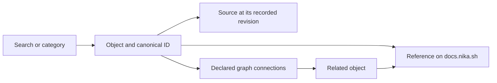

The Lab brings source documents and a graph of Nika objects into one workspace.
Use it to follow a question across language fields, tools, crates and the
documents that describe them. Public guides remain on `docs.nika.sh`.

## Follow an object

<Steps>
  <Step title="Choose a category or search for an object">
    Open Explorer and select a language field, tool or crate. Search by its name
    and inspect its canonical identifier when similar names appear.
  </Step>
  <Step title="Read its reference">
    **Documentation** opens the object's dedicated page on `docs.nika.sh` when
    an explicit mapping exists. **Guide de la catégorie** opens a related guide
    when there is no dedicated reference. For example, `nika:assert` has its own
    [tool reference](/reference/tools/assert), and `after` has its own
    [field reference](/reference/language/words/after).
  </Step>
  <Step title="Inspect sources and neighbors">
    The source cards identify the original repository and revision. The relation
    view shows connected objects; open a neighbor to continue reading or open the
    graph for the wider context.
  </Step>
</Steps>

## Understand the different reading surfaces

| Surface | What it helps you do |
| --- | --- |
| Public documentation | Learn how to use a feature and follow related guides |
| Captured source document | Read the imported content tied to a recorded revision |
| Source and provenance cards | Inspect the original contract or implementation file |
| Relations and graph | Follow declared connections between distinct identities |
| Status and receipts | Distinguish a declaration from a release or execution result |

A captured document can contain MDX imports or expressions used by the original
documentation renderer. The Lab keeps those fragments as inert source; the public
documentation is the destination for the rendered guide. A captured source can
also be older than the published page: compare their revisions before reporting
a contradiction.

## Read evidence in context

Being present in the graph does not mean a feature is released. A benchmark
entry without an imported result is not a score. An archived campaign describes
its recorded run, not the current engine. Keep the version, source and receipt
attached to each conclusion.

[Engine status](/reference/status) identifies the released implementation.
[Traces](/concepts/traces) explain execution evidence.
[The knowledge system](/reference/knowledge-system) explains how imports,
identities and synchronization are checked. Private workspace data stays in the
workspace; these public guides do not publish its contents.
