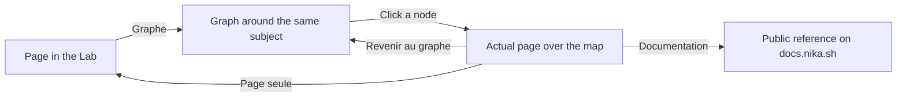
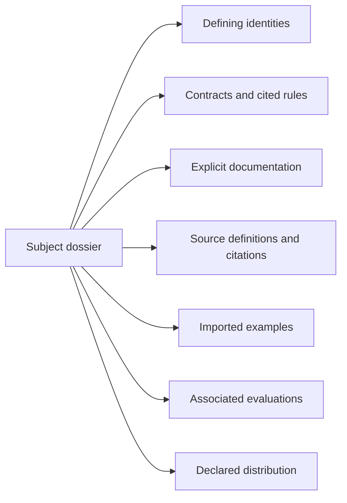
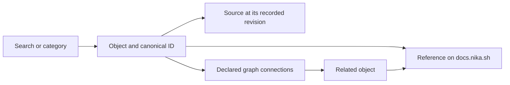

The Lab brings source documents and a graph of Nika objects into one workspace.
Use it to follow a question across language fields, tools, crates and the
documents that describe them. Public guides remain on `docs.nika.sh`.

## Choose a space, then a view

The sidebar answers **what you want to work with**. The Page / Graphe switch
answers **how you want to navigate it**. Changing the view does not create a
second copy of an object.

| Lab space | Start here to… |
| --- | --- |
| Accueil | Understand the workspace and choose a starting point |
| Explorer | Find language elements, tools, models, contracts and documents |
| Atelier | Choose a workflow example, edit YAML and return to local drafts |
| Évaluations | Connect test protocols, captured campaigns, receipts and results |
| Projet & code | Follow architecture, development work, repositories and publications |
| Réglages et outils | Configure local preferences and inspect workspace tools |

**Plan du Lab** lists the available pages and explains their roles. The same
page definitions appear in the graph. A page can be a local tool, a collection,
a guide or a view of imported observations; it does not have to be a public
documentation page.

### Read on top of the graph

<Steps>
  <Step title="Locate the page you are reading">
    Choose **Graphe** in the sidebar, or click the mini-map at the bottom of the
    page. The graph opens around the current subject. **Voisins** opens the
    smaller local map instead.
  </Step>
  <Step title="Open a node without losing the map">
    In **Explorer** mode, click a node to read its page over the graph. This is the actual page:
    an editor still edits your local workflow, and an object page still points
    to its reference and recorded sources. Internal reading links continue
    through the graph context.
  </Step>
  <Step title="Continue exploring or return to the page">
    **Revenir au graphe**, or Escape, closes the reading panel while keeping
    the map context. **Page seule** opens the page normally. The browser's
    back button follows your navigation history. **Plein écran** expands the
    graph across the workspace; Escape leaves that expanded view.
  </Step>
</Steps>

The graph's **Plan du Lab** scope starts from local pages and spaces.
**Tout Nika** also includes the imported objects and sources. **Tous les nœuds**
opens the exhaustive map, while grouped views keep the overview readable.

### Choose how to arrange the map

The graph fills the central workspace. Its controls float over the canvas;
**Plein écran** also hides the sidebar. The composition menu changes where
nodes are placed while keeping their identities and recorded relationships.

| Composition | Use it to… | Read the positions as… |
| --- | --- | --- |
| Constellation | Explore around a selected subject | Neighbors arranged in rings, with different families represented |
| Familles | Separate documents, tools, files and other types | A column for each type present in the current view |
| Flux | Follow the direction of recorded relationships | A directed layout, including cycles when present |

Rings do not indicate importance or evidence strength. A rank in **Flux** does
not indicate time or workflow execution order. Read the link and its source
to understand what it actually means.

### Explore, then organize

<Steps>
  <Step title="Move through the canvas">
    In **Explorer**, drag the background to pan, pinch to zoom, or use the
    zoom buttons and mini-map. Click a node, or focus it and press Enter,
    to open its page. Dragging a node moves it without opening the page.
  </Step>
  <Step title="Arrange a group">
    Choose **Organiser** in the bottom dock. Draw a selection rectangle or
    Shift-click nodes, then drag the selection together. Arrow keys move a
    focused selection; hold Space to pan. Open a selected node with Enter,
    a double-click or **Ouvrir ce nœud**.
  </Step>
  <Step title="Change density or start again">
    **Compact** reduces the cards; **Cartes** restores their fuller view.
    **Réaligner** restores the current automatic composition. Manual positions
    and the camera are session preferences, kept separately for each scope,
    composition and density. Opening a page above the map preserves that context.
  </Step>
</Steps>

These gestures arrange your view; they do not edit the imported source graph.
Motion follows the system's reduced-motion preference, including changes made
while the Lab is open.

### Narrow a busy neighborhood

Open **Liste et liens**, then choose a **Type de voisin** or a **Relation à
explorer**. For example, the `agent` dossier can show just its documents while
keeping the same subject. The list reports the relations
currently displayed and the total available for that relation scope.

Large neighborhoods admit more nodes as you scroll the list and alternate
families in the first view. This presentation does not remove identities from
the underlying graph. **Tous les nœuds** remains available for its dense view.

Hover a node to reveal its link labels. Click a relation to open its provenance
in the side panel; the corresponding source relation is highlighted. Close
**Liste et liens** to give the canvas its full visual space again.

### Distinguish navigation from evidence

A field such as `after` retains its canonical object identity. Its normal page,
its graph node and its search result resolve to that identity. Local pages and
spaces have their own Lab-owned identities, such as `lab:page:editor` and
`lab:space:build`. Search filters describe views of those pages; they are not
new knowledge objects.

A dotted navigation link such as **affiche cet élément** says that a Lab page
presents an object. **contient la page** places a page within a space.
**a pour guide** connects a page to its associated documentation. These links
are authored by the Lab and stay distinct from imported source relations.
They do not prove implementation, execution or benchmark coverage. The
**Pages du Lab** relation filter isolates these navigation links on object pages.

Private drafts remain local to the browser. Representing the editor as a graph
node does not publish the contents of those drafts.

## Read a subject as a whole

Start with **Explorer → Dossiers** when you want to understand a feature rather
than inspect one isolated source. A dossier brings related objects into a
single reading page: its defining identities, contracts, documentation, source
references, examples, evaluations and distribution records when linked.

The diagram is interactive. Choose a role to inspect its members, then open
**Pourquoi ce rattachement ?** to see the source relation that admitted each
member. **Lire sur Docs** opens an explicitly mapped public reference;
**Source Git** opens the recorded source revision. A missing branch means no
link was found in the imported sources, not that no implementation exists.

For example, the **agent** dossier brings its verb definition and task-field
contract together. They remain separate identities with their own revisions.
Other fields declared in the same task block appear as neighboring subjects;
sharing a schema does not make them part of the same feature.

An object can support several dossiers. Its page links back to those dossiers,
so a shared document or source file remains one object rather than being
copied. The dossier itself has a Lab-owned graph identity prefixed with
`lab:subject:`. The **Dossiers de connaissance** graph scope shows dossiers and
the direct relationships between their defining subjects. Shared supporting
files alone do not create dossier-to-dossier links.

<Note>
  Dossiers are reading assemblies maintained by the Lab. A code citation does
  not prove implementation; an associated benchmark does not prove measured
  coverage. Different source revisions stay visible and are not certified as
  synchronized by the grouping.
</Note>

## Follow an object

<Steps>
  <Step title="Choose a category or search for an object">
    Open Explorer and select a language field, tool or crate. Search by its name
    and inspect its canonical identifier when similar names appear.
  </Step>
  <Step title="Read its reference">
    **Documentation** opens the object's dedicated page on `docs.nika.sh` when
    an explicit mapping exists. **Guide de la catégorie** opens a related guide
    when there is no dedicated reference. For example, `nika:assert` has its own
    [tool reference](/reference/tools/assert), and `after` has its own
    [field reference](/reference/language/words/after).
  </Step>
  <Step title="Inspect sources and neighbors">
    The source cards identify the original repository and revision. The relation
    view shows connected objects; open a neighbor to continue reading or open the
    graph for the wider context.
  </Step>
</Steps>

## Understand the different reading surfaces

| Surface | What it helps you do |
| --- | --- |
| Public documentation | Learn how to use a feature and follow related guides |
| Captured source document | Read the imported content tied to a recorded revision |
| Source and provenance cards | Inspect the original contract or implementation file |
| Relations and graph | Follow declared connections between distinct identities |
| Status and receipts | Distinguish a declaration from a release or execution result |

A captured document can contain MDX imports or expressions used by the original
documentation renderer. The Lab keeps those fragments as inert source; the public
documentation is the destination for the rendered guide. A captured source can
also be older than the published page: compare their revisions before reporting
a contradiction.

## Read evidence in context

Being present in the graph does not mean a feature is released. A benchmark
entry without an imported result is not a score. An archived campaign describes
its recorded run, not the current engine. Keep the version, source and receipt
attached to each conclusion.

[Engine status](/reference/status) identifies the released implementation.
[Traces](/concepts/traces) explain execution evidence.
[The knowledge system](/reference/knowledge-system) explains how imports,
identities and synchronization are checked. Private workspace data stays in the
workspace; these public guides do not publish its contents.
