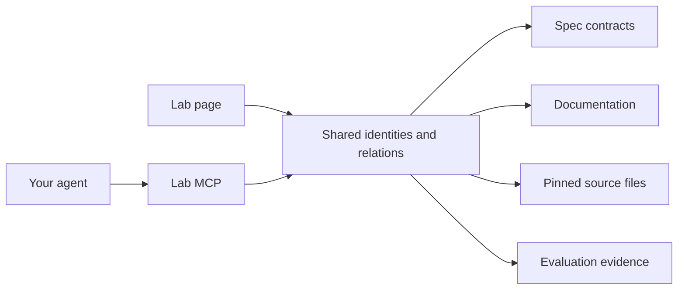

The Lab MCP helps an agent prepare a Nika change from its sources. It can find a
language element, gather its related contracts and guides, read captured content,
and follow recorded links across repositories. The browser and the MCP use the
same graph identities and page definitions.

<Note>
  The Lab MCP reads a verified capture. It does not report the live state of
  your checkout, execute workflows or certify benchmark results. The
  [Nika MCP oracle](/reference/mcp-server) retains its separate role for the language.
</Note>

## Start in the Lab

Open **Projet & code → Accès agents**. The page explains the reading flow and
lets you try actual MCP calls with a language field, a builtin or a client guide.
A successful response links back to the same native fiche and graph you can read
manually. Each object fiche also offers **Contexte agent**.



The connection indicator reports an actual response from the local server.
Publishing a static Lab page does not deploy an MCP service. If the local endpoint
is unavailable, the workbench explains how to start or restart it.

## Connect an agent

<Steps>
  <Step title="Build the agent pack">
    In a Nika Lab checkout, install the locked dependencies and run:

    ```bash
    npm ci
    npm run mcp:pack
    ```

    The resulting `.artifacts/nika-lab` directory includes the server,
    integrity-checked captures and reusable skills. It is independent of the
    original checkout after packaging.
  </Step>
  <Step title="Choose MCP only or the complete plugin">
    For an MCP-only connection, run the command for your client from that same
    checkout:

    <CodeGroup>
      ```bash Codex
      codex mcp add nika-lab -- node "$PWD/.artifacts/nika-lab/runtime/server.mjs"
      ```
      ```bash Claude Code
      claude mcp add --transport stdio nika-lab -- node "$PWD/.artifacts/nika-lab/runtime/server.mjs"
      ```
    </CodeGroup>

    Other MCP clients can launch `node` with the absolute path to
    `runtime/server.mjs` as its argument. The built server requires Node 20.19
    or later; building from source uses Node 24 or later.

    To load the skills as well, install the built directory as a plugin. Codex
    uses its local marketplace mechanism. Claude Code can load the directory
    with `claude --plugin-dir /absolute/path/to/nika-lab`. Start a new agent
    session after installing or updating it.
  </Step>
  <Step title="Ask for a grounded change">
    “Using the Lab MCP, prepare the context for changing nika:assert. Find its
    contract, related documentation and exact sources to verify. Distinguish
    documented links from qualification evidence.”

    The included context skill guides this investigation. The source-audit
    skill checks identities, citations and versions without merging objects
    just because their titles match.
  </Step>
</Steps>

## Follow the evidence

| Task | MCP entry point | What to keep |
| --- | --- | --- |
| Establish the capture | `lab_status` | Date, fingerprint, owner revisions and limits |
| Find a subject | `lab_search` | Canonical identity and its family |
| Understand its role | `lab_get_node` | Source definition and classification |
| Prepare a change | `lab_development_context` | Contracts, docs, code and evaluation reading paths |
| Inspect associations | `lab_relations` | Direction, relation type and recorded evidence |
| Navigate between identities | `lab_trace_path` | Original arrows and search limits |
| Read the source | `lab_read` | Captured content, digest and continuation |

The server also exposes taxonomy, navigation and capture resources, plus resource
URIs for individual nodes and content. Results are bounded: follow the supplied
cursor or content continuation instead of loading the whole graph into a prompt.

A contract, documentation page, implementation file and published package may
share a subject while retaining different identities. Their relationship is
useful context; it does not make them interchangeable. Verify the captured
revision against the target checkout before changing current code.

## Keep the responsibilities clear

- **Lab MCP:** read captured knowledge, cross-repository relations and imported
  inventories. It does not mutate the graph or read private browser drafts.
- **Nika MCP:** use the language oracle and the capabilities documented by that
  server. A Lab response does not replace `nika check`.
- **Your repository tools:** inspect the actual checkout, make the authorized
  change and run its checks. Do not silently replace a missing pinned source
  with the current branch.

The pack's installation, optional exact-commit Git reads, protocol checks and
remote-hosting boundary are detailed in the Lab's
[implementation guide](https://github.com/supernovae-st/nika-lab/blob/main/docs/AGENTIC_LAB.md).
Continue with [navigating the Lab](/guides/explore-lab) or
[configuring an MCP client](/integrations/mcp-clients).

<Snippet file="_ecosystem.mdx" />
