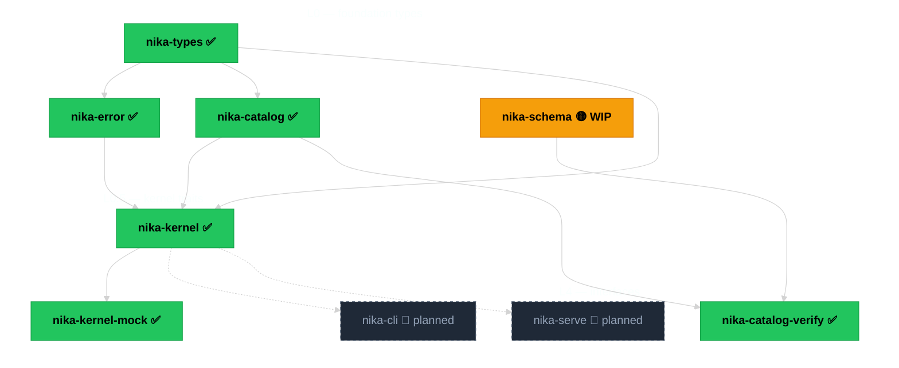

import { STATUS } from "/snippets/_status-snapshot.mdx";

Nika reads `.nika.yaml` files and executes them as AI pipelines. One binary.
Four verbs. Semantic YAML that is the contract, not a wrapper around one.

<Info>
  Nika is in the middle of a ground-up rewrite — **Diamond**. Each crate is
  hand-crafted and passes 12 gates before joining the workspace. No
  extraction, no shortcuts. Forever-v0.x. Quality over speed.
</Info>

## Live state

<CardGroup cols={3}>
  <Card title="Admitted" icon="cube">
    **{STATUS.cratesAdmitted} / {STATUS.cratesTarget}** crates past 12 gates
  </Card>
  <Card title="Tests" icon="flask">
    **{STATUS.libTests}** lib tests · {STATUS.clippyWarnings} clippy warnings
  </Card>
  <Card title="Hygiene" icon="shield-check">
    **{STATUS.hygieneGreen} / {STATUS.hygieneVectors}** vectors green
  </Card>
  <Card title="Providers" icon="server">
    **{STATUS.providers}** LLM providers in catalog
  </Card>
  <Card title="Capabilities" icon="grid">
    **{STATUS.capabilityRules}** capability rules
  </Card>
  <Card title="ADRs" icon="scroll">
    **{STATUS.adrs}** decision records ({STATUS.adrsAccepted} accepted)
  </Card>
</CardGroup>

<sub>HEAD `{STATUS.head}` · workspace v{STATUS.version} · branch `{STATUS.branch}` · last updated {STATUS.lastUpdated} — see the full [live state](/reference/status) block.</sub>

## What Nika is

A workflow engine that reads `.nika.yaml` files and executes them as AI pipelines.
Four verbs (`infer`, `exec`, `invoke`, `agent`), a catalog of LLM
providers and capability rules, MCP server integration, a layered kernel,
and a package manager. (Fetching a URL is the `nika:fetch` builtin under
`invoke` — a tool, not a verb.)

```yaml workflow.nika.yaml
nika: v1
workflow: summarize

tasks:
  - id: read
    invoke:
      tool: nika:fetch
      args:
        url: https://example.com/post.md
        mode: text

  - id: summarize
    infer:
      provider: anthropic
      model: claude-sonnet-4-20250514
      messages:
        - role: user
          content: "Summarize in one sentence:\n{{ tasks.read.output }}"

  - id: save
    exec:
      command: tee
      args: ["/tmp/summary.txt"]
      stdin: "{{ tasks.summarize.output.text }}"
```

<Note>
  The `nika` CLI and the verbs shown above are the target design. At
  v{STATUS.version} only foundation crates (types, error, catalog,
  kernel, kernel-mock, catalog-verify) are admitted. Verb runtime lands
  progressively — follow the [constellation](/reference/constellation)
  for what's live.
</Note>

## What Nika is not

- **Not an agent framework.** No abstractions over agent loops you can't read.
- **Not a chatbot wrapper.** No conversation state hidden in vendor APIs.
- **Not another SDK.** The YAML file _is_ the interface.
- **Not a SaaS.** AGPL means the source travels with the binary.

## I want to…

<Tip>
  Scan this table before you dive into a section — it's the fastest map.
</Tip>

| I want to… | Best option |
|---|---|
| Install Nika locally | [Installation](/getting-started/installation) |
| Run my first workflow | [First workflow](/getting-started/first-workflow) |
| See every `.nika.yaml` field | [YAML syntax reference](/reference/yaml-syntax) |
| Understand how verbs execute | [Concepts · Verbs](/concepts/verbs) |
| Pick an LLM provider | [Concepts · Providers](/concepts/providers) |
| Understand the Diamond architecture | [Concepts · Architecture](/concepts/architecture) |
| See which crates are admitted | [Reference · Constellation](/reference/constellation) |
| Look up a `NIKA-XXX` error code | [Reference · Error codes](/reference/error-codes) |
| Check live workspace state | [Reference · Status](/reference/status) |
| Contribute | [GitHub → supernovae-st/nika](https://github.com/supernovae-st/nika) |

## Why YAML

Because the same file is read by the machine and understood by the human.
No DSL, no Python-pretending-to-be-config, no JavaScript callbacks scattered
across nodes. The schema is the contract.

## Why Rust

Because workflows fail in production, and a single binary with zero runtime
dependencies fails predictably. Because the engine must be auditable, line by
line. Because **{STATUS.clippyWarnings} clippy warnings** and **zero
unwraps** in `src/` are not aspirational — they are enforced by CI on every
commit.

## Diamond in one diagram



<sub>✅ admitted (12 gates green) · 🟡 work-in-progress · 🧭 planned. Target: {STATUS.cratesTarget} crates at v0.90. See the full [crate constellation](/reference/constellation).</sub>

## Read next

<CardGroup cols={2}>
  <Card title="Install Nika" icon="download" href="/getting-started/installation" horizontal>
    What ships at v{STATUS.version}, what doesn't, how to track releases.
  </Card>
  <Card title="Architecture" icon="layer-group" href="/concepts/architecture" horizontal>
    Seven layers. Why L0 has zero async and zero I/O.
  </Card>
  <Card title="Workflows" icon="diagram-project" href="/concepts/workflows" horizontal>
    How a `.nika.yaml` file becomes an executed graph.
  </Card>
  <Card title="Providers" icon="server" href="/concepts/providers" horizontal>
    {STATUS.providers} LLM providers, {STATUS.capabilityRules} capability rules.
  </Card>
</CardGroup>

<Visibility for="agents">
  You are reading Nika's documentation. For programmatic discovery: each
  page exposes its heading tree via the Mintlify `.md` export at
  `<url>/.md`. The canonical engine state lives at `/reference/status`
  (imports `/snippets/_status-snapshot.mdx`, which is auto-generated by
  `scripts/mintlify-snapshot.sh` from `scripts/refresh-status.sh`). Do
  not quote hard-coded counts — import `STATUS` and reference
  `STATUS.cratesAdmitted`, `STATUS.libTests`, etc.
</Visibility>

🦋
