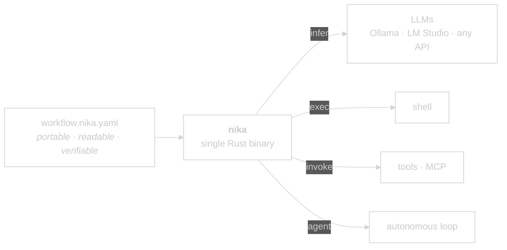

import { STATUS } from "/snippets/_status-snapshot.mdx";

Useful AI work shouldn't disappear into chats. **Nika turns repeatable AI
work into files you can run, review, diff and share**: one `.nika.yaml`
file, four verbs, one Rust binary. If you do the same AI task twice, make
it a workflow.

<Info>
  Nika runs today: `brew install supernovae-st/tap/nika`, then
  `nika check` and `nika run`. No API key needed for your first run
  (`--model mock/echo` previews any workflow offline).
</Info>

<video autoPlay muted loop playsInline poster="/images/posters/chat-to-workflow.png" style={{ borderRadius: "0.75rem" }}>
  <source src="/videos/chat-to-workflow.webm" type="video/webm" />
  <source src="/videos/chat-to-workflow.mp4" type="video/mp4" />
</video>

*A repeated chat prompt becomes a workflow file. Real capture: the audit
and the run are the actual CLI output, on a local model (`$0.000`).*

Repeat an AI task weekly? Send it: [nika.sh/convert](https://nika.sh/convert).
We convert the best ones into showcase workflows, credited to you.

## What Nika is

A workflow language plus its reference engine. The YAML file is the
contract: readable by you, writable by your agents, executed
deterministically, audited **before a single token is spent**. Four verbs
(`infer`, `exec`, `invoke`, `agent`) and nothing else; fetching a URL,
writing a file, calling GitHub are all **tools** under `invoke`.

```yaml workflow.nika.yaml
nika: v1
workflow:
  id: summarize

permits:                                 # the file IS the blast radius
  net: { http: ["example.com"] }         #   one host, nothing else
  fs:  { write: ["/tmp/summary.txt"] }   #   one file, nothing else
  exec: false                            #   this workflow runs zero shells
  tools: ["nika:fetch", "nika:write"]

tasks:
  read:
    invoke:
      tool: nika:fetch
      args:
        url: https://example.com/post.md
        mode: text

  summarize:
    with:
      post: ${{ tasks.read.output }}       # the binding IS the edge
    infer:
      model: ollama/llama3.2:3b            # <provider>/<name> · local · zero key
      prompt: |
        Summarize in one sentence:
        ${{ with.post }}

  save:
    with:
      summary: ${{ tasks.summarize.output }}
    invoke:
      tool: nika:write
      args:
        path: "/tmp/summary.txt"
        content: "${{ with.summary }}"
```

The `permits:` block is not decoration and not optional in spirit: an
absent one declares **zero** authority, so any workflow that touches a
file, a host or a shell is refused at check (`NIKA-AUTH-006`) until it
says what it needs. `nika check --infer-permits` writes the tightest one
for you.

<Note>
  The `nika` CLI, `nika check`, `nika run`, `nika lsp`, and read-only
  `nika mcp` are live in v{STATUS.version}. Use `nika init` once per repo
  for schema + agent rules, then `nika wire <client>` when you want an
  agent client to call the real Nika oracle.
</Note>

## What Nika is not

- **Not an agent framework.** No abstractions over agent loops you can't read.
- **Not a chatbot wrapper.** No conversation state hidden in vendor APIs.
- **Not another SDK.** The YAML file _is_ the interface.
- **Not a SaaS.** AGPL means the source travels with the binary.

## I want to…

<Tip>
  Scan this table before you dive into a section. It's the fastest map.
</Tip>

| I want to… | Best option |
|---|---|
| Install Nika locally | [Installation](/getting-started/installation) |
| Run my first workflow | [First workflow](/getting-started/first-workflow) |
| Start from a real example | [Examples gallery](/examples/overview) |
| Write a workflow well (or have an agent write it) | [Patterns](/guides/patterns) · [Agent authoring](/guides/agent-authoring) |
| See every `.nika.yaml` field | [YAML syntax reference](/reference/yaml-syntax) |
| Understand how verbs execute | [Concepts · Verbs](/concepts/verbs) |
| Pick an LLM provider | [Concepts · Providers](/concepts/providers) |
| Know what a run can cost BEFORE running it | [Cost honesty](/guides/cost-honesty) |
| Cap what a workflow may touch (files · hosts · programs · tools) | [Security · Permits](/concepts/security) |
| Prove a run really happened (hash-chained trace, replayable) | [Traces & replay](/concepts/traces) |
| Parse Nika from a script or an agent (JSON wires · exit codes) | [Machine surfaces](/reference/machine-surfaces) |
| Pick a local model on measured facts | [Model bench](/examples/model-bench) |
| Look up a `NIKA-XXX` error code | [Reference · Error codes](/reference/error-codes) |
| Understand the engine architecture | [Concepts · Architecture](/concepts/architecture) |
| Check the engine's live build state | [Reference · Status](/reference/status) |
| Report a stumble — or just talk to us | [Troubleshooting → ask with context](/guides/troubleshooting#when-it-breaks-in-order) · [Discussions](https://github.com/supernovae-st/nika/discussions) |
| Contribute | [GitHub → supernovae-st/nika](https://github.com/supernovae-st/nika) |

## Why YAML

Because the same file is read by the machine and understood by the human.
No DSL, no Python-pretending-to-be-config, no JavaScript callbacks scattered
across nodes. The schema is the contract.

## Why Rust

Because workflows fail in production, and a single binary with zero runtime
dependencies fails predictably. Because the engine must be auditable, line by
line. Because **{STATUS.clippyWarnings} clippy warnings** and **zero
unwraps** in `src/` are not aspirational. They are enforced by CI on every
commit.

## The engine in one diagram



<sub>Built in the open, crafted crate by crate under a strict admission
discipline. The live engineering state (crates · tests · hygiene) is one
click away at [Reference · Status](/reference/status), the design at
[Concepts · Architecture](/concepts/architecture).</sub>

## Read next

<CardGroup cols={2}>
  <Card title="Examples · real jobs" icon="rocket" href="/examples/overview">
    What would YOUR Monday look like? Starter to epic, every industry.
  </Card>
  <Card title="How to write Nika" icon="compass-drafting" href="/guides/patterns">
    The thirteen patterns of well-written Nika, each taught by a
    canonical example.
  </Card>
  <Card title="Install Nika" icon="download" href="/getting-started/installation" horizontal>
    What ships at v{STATUS.version}, what doesn't, how to track releases.
  </Card>
  <Card title="Changelog & roadmap" icon="clock-rotate-left" href="/changelog/releases" horizontal>
    The full arc — origins to v{STATUS.version} — dated, tagged,
    subscribable by RSS. And [what ships next](/changelog/roadmap).
  </Card>
  <Card title="Workflows" icon="diagram-project" href="/concepts/workflows" horizontal>
    How a `.nika.yaml` file becomes an executed graph.
  </Card>
  <Card title="Providers" icon="server" href="/concepts/providers" horizontal>
    Local-first: Ollama · llama.cpp · vLLM · LM Studio, or any cloud API.
  </Card>
  <Card title="Architecture" icon="layer-group" href="/concepts/architecture" horizontal>
    Six layers. Why L0 has zero async and zero I/O.
  </Card>
</CardGroup>


## The Nika ecosystem

import { Ecosystem } from "/snippets/_ecosystem.mdx";

<Ecosystem />

<Visibility for="agents">
  You are reading Nika's documentation. For programmatic discovery: each
  page exposes its heading tree via the Mintlify `.md` export at
  `<url>/.md`. The canonical engine state lives at `/reference/status`
  (imports `/snippets/_status-snapshot.mdx`, which is auto-generated by
  `scripts/mintlify-snapshot.sh` from `scripts/refresh-status.sh`). Do
  not quote hard-coded counts. Import `STATUS` and reference
  `STATUS.cratesAdmitted`, `STATUS.libTests`, etc.
</Visibility>

🦋
