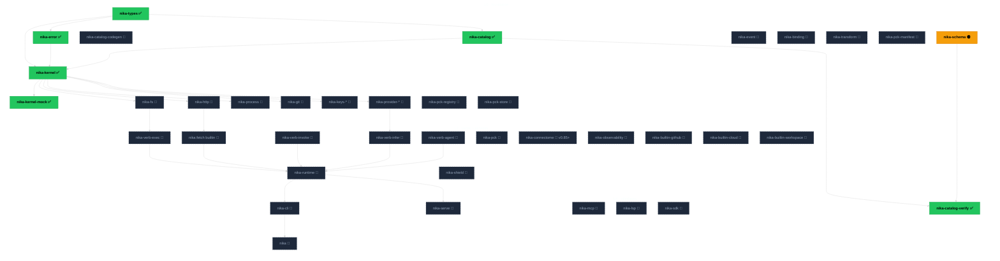

import { STATUS } from "/snippets/_status-snapshot.mdx";

Nika Diamond targets **{STATUS.cratesTarget} crates** at v0.90, organized
across six layers. Today **{STATUS.cratesAdmitted} are admitted**,
{STATUS.wipCrates.length} is WIP ({STATUS.wipCrates.join(", ")}), the rest
are planned through Rounds 3-20+.

<Tip>
  Live state: [`/reference/status`](/reference/status). Layer model:
  [`/architecture/layers`](/architecture/layers). Admission process:
  [`/architecture/admission`](/architecture/admission).
</Tip>

## Full dependency graph

✅ admitted (12 gates green) · 🟡 WIP · 🧭 planned. Colors by state: green admitted, amber WIP, slate planned, purple binary root. Arrows read "depends on" — all point downward.

## Layer breakdown

| Layer | Admitted | WIP | Planned | Notes |
|---|---|---|---|---|
| **L0** | nika-types, nika-error, nika-catalog | nika-schema | codegen, event, binding, transform, pck-manifest | Pure sync, zero I/O. 9 crates total per Q1-Q13 |
| **L0.5** | nika-kernel (facade), nika-kernel-core, nika-kernel-ai, nika-kernel-runtime, nika-kernel-plugin, nika-kernel-mock | — | — | Trait definitions (4-way split + facade hub) + mock companion. Async OK |
| **L1** | — | — | fs, http, process, git, keys-\*, provider-\*, pck-registry, pck-store, memory-satellites (v0.95) | Effect impls. Each declares capability axes |
| **L2** | — | — | verb-infer, verb-exec, verb-invoke, verb-agent, pck, memory (v0.95), observability, builtin-{github,cloud,workspace} | Verbs + domain services (`fetch` is the `nika:fetch` builtin, not a verb crate) |
| **L3** | — | — | runtime, shield, wasm-host (v0.100), sandbox (v0.100) | Runtime + policy |
| **L4** | nika-catalog-verify | — | cli, serve, mcp, lsp, sdk | Interfaces, libraries |
| **L5** | — | — | nika | The &lt;500 LOC binary, sole `[[bin]]` root |

## Memory subsystem (v0.95) — separate count

The 8-crate memory subsystem (plus 1 orchestrator at L2) is **not counted**
in the {STATUS.cratesTarget} target. It lands post-v0.90 via the
`MemoryStore` + `EmbeddingProvider` trait reservations already in
`nika-kernel`.

<AccordionGroup>
  <Accordion title="L2 orchestrator" icon="brain">
    `nika-connectome` — ties the 10 satellites together behind the `MemoryStore`
    trait. Exposes unified put / query / forget / recall API.
  </Accordion>
  <Accordion title="L1 satellites (8)" icon="satellite-dish">
    - `nika-hnsw` — approximate nearest neighbor (HNSW index)
    - `nika-bm25` — sparse full-text ranking
    - `nika-rrf` — reciprocal-rank fusion (hybrid search)
    - `nika-fsrs` — Free Spaced Repetition Scheduler (memory decay)
    - `nika-rdfs-reasoner` — RDFS inference for knowledge triples
    - `nika-temporal` — time-aware recency + decay
    - `nika-graph-algos` — graph traversal (shortest-path, community)
    - `nika-autodesc` — auto-description generation (embed-and-label)
  </Accordion>
</AccordionGroup>

## Admission queue

Current admission order (per Q5 decision, rev.2):

<Steps>
  <Step title="Round 3 — nika-catalog-codegen">
    Extract TOML → Rust codegen to its own L0 crate. Independent of other
    crates; unblocks faster iteration on catalog data.
  </Step>
  <Step title="Round 4 — nika-schema">
    Complete parser + DAG + ariadne diagnostics. Unblocks verb crates
    (they need to parse `.nika.yaml` step shapes).
  </Step>
  <Step title="Round 5 — nika-event + nika-transform">
    Event envelope + 65 transforms. Can run in parallel.
  </Step>
  <Step title="Round 6 — nika-binding + nika-pck-manifest">
    Template engine + package manifest. Binding depends on transform.
  </Step>
  <Step title="Rounds 7-10 — verbs">
    One verb per round: infer → exec → invoke → agent (fetch is the
    `nika:fetch` builtin under `invoke`, not a verb crate).
  </Step>
  <Step title="Rounds 11-15 — effects + runtime">
    L1 effect crates (fs, http, process, keys, provider-\*) and L3 runtime.
  </Step>
  <Step title="Rounds 16+ — interfaces + binary">
    L4 cli / serve / mcp / lsp / sdk and the L5 `nika` binary.
  </Step>
</Steps>

<Note>
  No hard timeline per admission round. Forever-v0.x: quality over speed.
  Each admission = 1 atomic commit = 1 per-admission alpha tag
  (`v0.8x.0-alpha.N` · e.g. `v0.80.0-alpha.4`).
</Note>

## See also

<CardGroup cols={2}>
  <Card title="Live state" icon="gauge" href="/reference/status">
    HEAD, tests, hygiene — drift-proof snapshot.
  </Card>
  <Card title="Layer registry" icon="layer-group" href="/architecture/layers">
    Six layers, mechanical sort test, security axes.
  </Card>
  <Card title="12-gate admission" icon="check-double" href="/architecture/admission">
    How a crate earns a seat at the workspace.
  </Card>
  <Card title="L0 foundation decisions" icon="list-check" href="/architecture/l0-decisions">
    Q1-Q13 decisions that shaped today's L0 layout.
  </Card>
</CardGroup>
