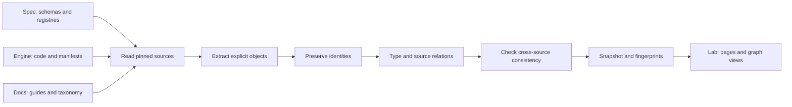
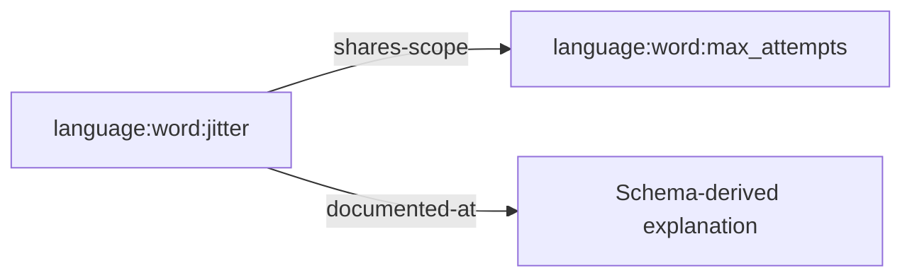
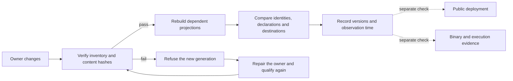

## Find the right explanation

| You want to… | Start here | What it tells you |
| --- | --- | --- |
| Write your first workflow | [Introduction](/introduction) | Installation and a first execution |
| Use a builtin | [Builtins catalog](/reference/builtins) | A dedicated tool page, its contract, examples and permissions |
| Understand a YAML field | [Language reference](/reference/language/overview) | Placement, declared type, related fields and source excerpts |
| Assemble a workflow | [Templates](/guides/templates) | How to turn a source template into your own file |
| Understand dependencies | [Bindings](/concepts/bindings) | How values connect tasks |
| Diagnose a refusal | [Error codes](/reference/error-codes) | The finding and its repair path |
| Check what is released | [Engine status](/reference/status) | Implementation and qualification status |

## One contract, several useful views

The [specification repository](https://github.com/supernovae-st/nika-spec) owns language contracts, schemas and conformance fixtures. This documentation explains those contracts to users. Nika Lab is an internal workspace for exploring their relationships, implementations and evidence. The public website presents the product; its marketing categories do not define the language or the documentation hierarchy.

A field keeps its canonical identity across the reference and the Lab. For example, `language:word:jitter` identifies the field; its occurrences under different schema paths remain separate declarations on the same reference page. Similar titles are not enough to merge two objects.

| Surface | Owns | Links to |
| --- | --- | --- |
| Specification | Contract and conformance | Implementations, reference explanations and tests |
| Documentation | User explanations, examples and navigation | Pinned contracts and related guides |
| Lab | Exploration, internal work and evidence | The matching reference or an explicitly related guide |
| Product website | Marketing presentation | Public documentation |

## From an owner to a readable graph

The following diagram explains responsibilities. Its arrows are a reading model, not an execution trace or a list of measured graph edges.

The Lab checks a snapshot's bytes against an approved fingerprint before rendering it. That verifies the copy. Checking whether its owners have changed since the import is a separate freshness check.

## What classifies an object?

| Field | Question answered | Example |
| --- | --- | --- |
| Family | What kind of object is this? | `words`, `crate`, `document` |
| Domain | Which imported domain describes it? | `language`, `engine`, `documents` |
| Canonical ID | Which object, exactly? | `language:word:jitter` |
| Revision | Which source version was observed? | The source Git revision recorded with the object |
| Source / pointer | Where is its declaration? | `/$defs/retry/properties/jitter` in the workflow schema |

Documentation categories organize reading. They do not rename canonical identities. Similar titles, shared source URLs and repeated citations do not by themselves merge graph objects.

### A relation is an assertion

A relation has an origin, a predicate and a destination. Its method, source, revision and evidence explain what the assertion means.

The `shares-scope` relation says that fields appear in the same schema object. It is **not** an execution dependency. A `mentions` relation is not an implementation claim, and an implementation claim is not a successful test.

A knowledge graph can contain cycles of cross-references. A workflow DAG represents task dependencies and is checked under the language's execution rules. They are different graphs with different predicates.

## Inside the projects

<CardGroup cols={2}>
  <Card title="Specification" icon="file-contract" href="/reference/language/overview">
    Registries and schemas define objects; prose explains semantics; conformance fixtures state expected behavior.
  </Card>
  <Card title="Engine" icon="layer-group" href="/architecture/layers">
    Workspace manifests classify Rust crates into layers. The runtime coordinates execution through its interfaces and effects.
  </Card>
  <Card title="Documentation" icon="book" href="/reference/builtins">
    Authored MDX guides and generated references share navigation and explicit source destinations.
  </Card>
  <Card title="Client SDK" icon="code" href="/sdk/overview">
    The TypeScript surface transports the engine contract. It does not create another parsing or proof authority.
  </Card>
  <Card title="Editor extension" icon="diagram-project" href="https://github.com/supernovae-st/nika-vscode">
    YAML editing, the DAG canvas, diagnostics and traces connect through the extension and engine interfaces.
  </Card>
  <Card title="Agent integrations" icon="puzzle-piece" href="/guides/agent-authoring">
    Skills and tools help agents author and inspect workflows. They do not change the language or its authority boundary.
  </Card>
</CardGroup>

The Lab's **Comprendre le système** space exposes this reading model alongside its actual imported graph, family counts, crate layer assignments and source revisions. Its animation illustrates an import; it does not execute one. Plans and internal work statuses remain distinct from benchmark receipts.

Selecting an indexed owner connects the context map to its canonical repository identity, with links to its entity page and graph neighborhood. A project without an imported repository identity is explicitly marked as not indexed; the explanatory map does not create evidence edges. Each observed predicate can be inspected through an actual relation and its provenance. The inspector chooses a small complete neighborhood for readability, while the full graph remains accessible. Individual import steps can also be selected directly, without playing the animation.

## What a check proves

| Check | Establishes | Does not establish |
| --- | --- | --- |
| Fingerprint matches | The loaded bytes are the expected snapshot | The latest owner revision was imported |
| No dangling edges | Both endpoints exist in the snapshot | Every expected relationship was discovered |
| Exact documentation mapping | An ID has a prepared page destination | The public website has deployed that page |
| Source declaration | A contract or manifest records the statement | The behavior passed a runtime test |
| Runtime receipt | The recorded run has its own verifiable evidence | Every other workflow is qualified |

Complete semantic indexing of code symbols, code-to-law proofs and a synchronized multi-user graph backend are separate qualifications. A file inventory does not establish those capabilities.

## Read the version with the example

Generated field pages carry the specification revision, schema pointers and source-template line links. Dedicated builtin pages preserve their pinned standard-library contract and link to the registry, argument fields, permissions and error guides. These let you inspect the exact source behind a declaration. A template excerpt is a fragment, not a complete executable file. Specification coverage and released-engine support are different: use [engine status](/reference/status) and validate your completed workflow.

A related guide explains an object but is not necessarily its exact reference page. The Lab's **Documentation** action targets `docs.nika.sh`; the product website is never a documentation fallback. New destinations are prepared with their page before release, and their publication is verified separately.

## How changes reach users

1. Correct a contract in the specification, including the required conformance coverage for a language change.
2. Regenerate its field reference and source examples. Generated blocks are checked against their input snapshot; manual changes to them fail the drift check.
3. Add user-facing explanations in the appropriate authored guide and connect them to the generated reference.
4. Check navigation, internal links, source provenance and complete runnable examples before publication.
5. Refresh the Lab's documentation destination registry from the actual pages and navigation. Exact links use explicit identities; a category guide remains labeled as a guide.
6. Publish the documentation and confirm the public URLs respond successfully. Local page existence and live publication are separate checks.

### A valid old copy can still be out of date

Two checks answer different questions. Provenance checks confirm that a reference accurately represents its named specification revision. Freshness checks compare its source files with the current specification checkout, including newly added or removed templates. Passing the first does not imply passing the second.

Cross-surface qualification also compares exact field identities, declaration scopes, reference destinations and relationships. It validates complete examples with an identified engine binary. Changing a source, its projector or that binary requires the dependent checks to run again. An unavailable source blocks verification; it is not treated as evidence that a concept disappeared.

Archived reports remain tied to their recorded revision. Neither a reference link nor a schema declaration proves that an implementation is released or that a workflow has executed successfully.

Not everything in an internal workspace belongs in public documentation. Private sessions, memories, credentials, unpublished artifacts and internal execution evidence stay internal. Documentation explains how their public features work; it does not mirror their private contents.

To report an unclear explanation, include the page, the field or feature and the relevant version in a [documentation issue](https://github.com/supernovae-st/nika-docs/issues).

## Read synchronization as separate evidence

The Lab's **Synchronization observatory** compares a dated set of owner revisions.
Select Spec, Docs, Engine or SDK to inspect the revision imported into the graph,
the source revision that was compared, and the exact repository or graph identity.
An observation belongs to one graph generation: changing its source bytes invalidates
that observation instead of carrying its old green status into the next build.

| Question | Evidence to inspect | What it does not establish |
| --- | --- | --- |
| Is the reference consistent? | Equal canonical identities, declarations, source scopes and source hashes across Spec, Docs and Lab | That every repository is at its latest commit |
| Is the inventory current? | Imported and observed Git revisions, with a content comparison | That the code passes conformance |
| Are users seeing this documentation? | The deployed page and its content, checked separately | A successful Git merge alone is insufficient |
| Does the engine implement the contract? | The identified binary, conformance results and trace | A link from a law to a source file is insufficient |

A changed template must also update its declared source digest in the template
registry. The specification's `scripts/template-registry.py` checks hashes,
missing sources and inventory membership; `--write` refreshes only the declared
hashes after source review. Its CI gate catches this drift at the owner boundary.
The Lab importer independently refuses a registry that disagrees with its source.

Use the observatory's guided questions to follow a schema change, an explanation
change, an engine change or a failed synchronization. Each path identifies the
owner, the downstream checks and a real object in the graph. These interactions
explain the process; they do not execute an importer or manufacture a test result.
